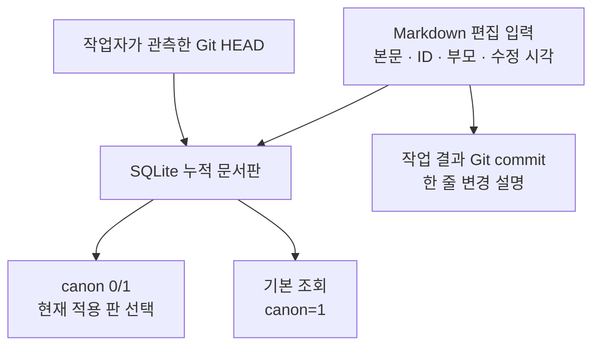

# 문서 계통과 확정 이력 설계

상태: **로컬 CLI와 전용 SQLite 운영, 2026-09-28 메타데이터 보수 반영**. 사용법은 [도구 안내](../../tools/document_harness/README.md)에 있다. Markdown은 본문·문서 메타데이터의 편집 입력이고 SQLite에는 과거·향후 개정판을 누적한다. **실제 적용 여부의 정본은 누적 SQLite 판 행의 `canon`**이며 문서의 나이·Git 최신 여부와 무관하다. 검색 인덱스는 누적판에서 다시 만들 수 있어도 누적판과 `canon` 선택을 Markdown·Git만으로 완전히 복원할 수 있다고 주장하지 않는다. Git commit은 작업 결과 이력이며 외부 게시나 작가 승인이 아니다. 기존 [시스템 설계](../systems/README.md)의 승인·작품 캐논 원장을 이 문서 상태로 대체하지 않는다. 2026-09-25에 `docs/`·`plan/` Markdown 99개를 파일별 독립 legacy 계통·`canon=false`로 비파괴 초기 적재했다. 이는 과거 개정판 전체 복원이나 99개 문서의 일괄 현행 채택이 아니다. [초기 적재 manifest](../../data/document_harness/initial-import-manifest.json)에 파일별 SHA-256을 보존한다.

## 정본과 식별자

| 항목 | 뜻과 정본 |
|---|---|
| `category_id` | 분야 ID. 같은 분야의 여러 독립 문서 계통이 공유하며, 한 category에 현행 문서도 여러 개 있을 수 있다. 분야를 옮겨도 계통 ID는 유지된다. |
| `lineage_id` | 같은 문서 계통의 불변 ID. 제목·경로·상위·내용이 바뀌어도 유지한다. 제목 일치만으로 동일 계통을 추정하지 않으며 신규 하위 문서는 새 계통 ID를 받는다. |
| `document_id` | 한 개정판의 고유 ID. 같은 계통을 개정할 때마다 새로 발급하고 과거 판의 ID를 다시 쓰지 않는다. |
| `parent_lineage_id` | **그 개정 시점** 문서 트리의 직계 상위 `lineage_id`. 루트는 `null`. 상위 이동에도 자기 `lineage_id`는 유지된다. |
| `commit_id` | 문서·SQL 기록 담당자가 작업 시점에 **관측한 Git HEAD**. 그 판의 본문이 해당 commit에 들어 있다는 증명이나 수정 시각이 아니다. 작업 후 만들어지는 Git commit은 결과 이력으로 별개다. Git 부모 관계는 문서 트리에 모델링하지 않는다. |
| 문서 개정판 | `document_id`로 식별하고 `lineage_id`로 같은 계통의 판을 묶어 SQLite에 누적한다. 과거 판의 본문도 보존·조회한다. 삭제된 파일의 본문·ID는 기존 적재판과, 이력이 남아 있다면 Git에서 찾는다. |
| `version` | 계통별 `MAJOR.MINOR.PATCH` 문자열. 같은 `lineage_id`에서 증가하며 `document_id`·Git `commit_id`와 별개다. 신규 관리 계통은 `0.0.1`로 시작한다. |
| `created_at` | 하네스가 확인한 **최초 비공백 본문 저장판**의 시각. 제목 한 줄도 내용이며 YAML 머리말·공백만 있으면 `null`이다. 내용이 생긴 판부터 계통에서 고정한다. 기존 관리판의 `null`은 보존된 최초 내용판 `updated_at`으로 한 번 보완하고 근거를 기록한다. 이는 옛 파일의 실제 탄생 시각 발견이 아니다. 근거 없는 legacy 원자료는 `null`로 둔다. |
| `updated_at` | 그 문서의 본문·관리 메타데이터를 **실제로 수정한 시각**. 신규 문서는 `created_at`과 같다. 과거판의 실제 수정 시각이 불명이면 `null`로 두며 Git commit·재색인·수입 시각에서 추론하지 않는다. |
| `tags` | 탐색용 문자열 배열. Markdown 머리말에서 편집하고 SQLite에는 JSONB 논리값으로 파생 저장한다. |
| `canon` | **SQLite가 선택 정본**이고 관리 Markdown의 YAML `canon: true/false`는 그 파일이 가리키는 `document_id` 판의 표시다. 신규·미분류는 `false`, 명시적으로 채택한 판만 `true`다. 계통당 현재 `true`는 최대 한 판이며 오래된 판도 선택할 수 있다. |

문서의 편집 메타데이터는 해당 Markdown의 **YAML front matter 한 곳**에 둔다. 관리 문서의 필수 필드는 `category_id`, `lineage_id`, `document_id`, `parent_lineage_id`, `abstract`, `version`, `created_at`, `updated_at`, `tags`, 불리언 `canon`이다. `purpose`(규범·계획·조사·실행 근거·검토 등)는 필요할 때 명시한다. `canon`은 중복 표시이며 선택권은 SQLite와 명시적 `finalize`에만 있다. 수동 YAML 변경으로 채택할 수 없고 일반 수입·최종화에서 파일·DB 불일치는 거부한다. 기존 필드 없는 관리판은 DB 판과 본문·다른 메타데이터가 일치할 때 표시를 추가하고, 표시값만 다른 파일은 명시적 `sync-metadata`에서 DB값으로 복구·기록할 수 있다. 별도 `lifecycle` 필드는 두지 않는다. `canon=true`는 문서의 사실성·검토 완료·사용자 승인·역사표 잠금·작품 캐논을 뜻하지 않으며 기존 권위 순서를 바꾸지 않는다.

```yaml
---
category_id: "분야 ID"
lineage_id: "새 문서 계통의 불변 ID"
document_id: "이 개정판의 새 ID"
parent_lineage_id: null
abstract: "무엇을 담고 언제 읽는지"
version: "0.0.1"
created_at: "2026-09-24T09:00:00Z"
updated_at: "2026-09-24T09:00:00Z"
tags: ["역사", "온톨로지"]
canon: false
---
```

위 시각은 형식 예시다. 시각은 UTC ISO 8601 문자열로 적고, 알려진 두 값에는 `created_at <= updated_at`을 검사한다. `create`는 제목을 처음 저장하므로 두 값을 같게 시작한다. `manage`는 본문이 있는 파일에 관리판을 실제 저장한 시각을 최초 확인 시각으로 기록한다. 직접 작성한 관리판의 `import`는 비어 있지 않은 본문에 `created_at`이 없으면 그 판의 유효한 `updated_at`을 사용하고, 그마저 없으면 실제 등록 시각을 두 값에 기록한다. 이전의 빈 판은 `created_at: null`로 남는다. 기존 원자료의 최초 생성 시각과 과거판의 수정 시각에 근거가 없으면 `null`을 유지하며 파일 mtime·Git commit에서 추정하지 않는다.

| 변경 등급 | 해당 문서의 다음 `version` | 최소 판정 |
|---|---|---|
| 작은 변경 | `0.3.4 → 0.3.5` | 오탈자·표현·링크·태그 수정처럼 의미와 절차가 유지됨 |
| 중간 변경 | `0.3.4 → 0.4.0` | 기존 정의와 양립하는 내용·절 추가; PATCH를 0으로 재설정 |
| 큰 변경 | `0.3.4 → 1.0.0` | 핵심 정의·규칙·적용 절차 변경; MINOR와 PATCH를 0으로 재설정 |

이는 이 프로젝트의 문서 개정 규칙이며 일반 SemVer API 호환성을 주장하지 않는다. 한 변경 묶음에서 같은 계통은 가장 높은 등급으로 **한 번만** 올리고 다른 계통은 독립적으로 판단한다. `lineage_id`는 유지하고 실제 새 본문·관리 메타데이터 판에는 새 `document_id`를 발급한다. `canon` 표시 동기화·최초 내용 시각의 근거 있는 1회 보완은 새 본문판이 아니므로 ID·`version`·`updated_at`을 올리지 않는다. 보완은 이전 날짜·파일 hash, 첫 내용판 ID·`updated_at`을 작업 기록과 사전 백업에 남긴다. `source_hash`는 파일 표시 변경 때 그 파일을 가리키는 판에서 바뀔 수 있으나, 누적 `body`와 FTS 본문은 그대로 둔다. 과거판의 원래 hash는 작업 기록에 남긴다. 문서를 실제 수정할 때 그 수정 시각을 기록한다. 재색인·단순 수입·Git commit 시각만으로 버전이나 문서 시각을 올리지 않는다.

`tags`는 임의 JSON 객체가 아닌 문자열 배열로 시작한다. 각 태그는 NFC 정규화와 앞뒤 공백 제거 후 빈 값과 중복을 버리고, 없으면 `[]`로 적는다. 의미를 추론해 자동 분류하거나 문서 간 그래프 관계를 만들지 않는다. SQLite의 `version`, `created_at`, `updated_at`은 각각 문자열 컬럼(두 시각은 미상일 때 NULL), `canon`은 현재 선택값을 담는 정수 `0/1`, `tags`는 JSONB 논리 컬럼이다. SQLite 3.45.0부터의 JSONB는 내부 **BLOB** 형식이며 PostgreSQL JSONB와 바이너리 호환되지 않는다. 실제 적재는 `jsonb()`로 만든 BLOB이고 선언 타입 이름만으로 형식을 보장하지 않는다. `json_each(tags)`로 정확한 배열 멤버십을 조회할 수 있다. JSONB 자체가 자동 검색 인덱스나 빠른 멤버십 조회를 보장하지 않는다. 운영 SQLite 버전과 JSONB 지원은 구현 전에 확인한다. [SQLite JSON 함수](https://www.sqlite.org/json1.html#jsonb)

별도 레거시 테이블은 만들지 않는다. SQLite에는 과거·향후 판을 `document_id`별로 누적하고, 기본 목록은 **누적 판 중 `canon=1`**만 반환한다. 한 category에는 여러 현행 계통이 가능하지만 한 `lineage_id`의 `canon=1`은 최대 한 판이다. 더 높은 `version`의 `canon=0` 판을 적재해도 오래된 `canon=1` 판은 그대로 적용된다. 판을 교체할 때 한 SQLite 트랜잭션에서 이전 판을 `0`, 새 판을 `1`로 바꾼다. 과거 판의 본문·ID·태그는 계속 조회할 수 있고 비정본 결과에는 `canon=0`을 표시한다. 기본 목록 밖의 검토·승인 증거도 출처 확인 시 직접 열 수 있다. `version`·날짜·관측 Git HEAD로 `canon=1`을 추론하지 않는다. 이는 누적 적재의 **설계**이며 전체 과거 문서가 이미 DB에 들어 있다는 뜻이 아니다.

구현할 `documents`에는 `document_id` 고유·`NOT NULL`, `lineage_id NOT NULL`, `canon INTEGER NOT NULL DEFAULT 0 CHECK (canon IN (0, 1))`를 둔다. 계통당 적용판 최대 하나는 다음 **부분 고유 인덱스**로 DB에서 강제한다. 계통에 적용판이 0개인 상태와 서로 다른 계통의 적용판은 허용한다. 기존 중복 때문에 인덱스 생성이 실패하면 그 사실을 보고하고 임의의 최신판을 고르지 않는다. [SQLite 부분 고유 인덱스](https://www.sqlite.org/partialindex.html#unique_partial_indexes)

```sql
CREATE UNIQUE INDEX documents_one_canon_per_lineage
ON documents(lineage_id) WHERE canon = 1;
```

```sql
SELECT d.document_id FROM documents AS d
WHERE d.canon = 1
  AND EXISTS (SELECT 1 FROM json_each(d.tags) AS tag
              WHERE tag.type = 'text' AND tag.value = '역사');
```

`abstract`는 **현재 문서가 무엇을 담고 언제 읽는지**를 앞 문장에 적는 탐색용 1~2문장이다. 공백을 포함해 **최대 300자**로 시작하되, 이는 조정 가능한 초기 운영 제안이며 학술적 최적값이나 모델의 읽기 한계가 아니다. Unicode NFC로 정규화한 뒤 코드포인트 수로 세고 UTF-8 바이트·단어·토큰 수와 구별한다. 초과하면 의미를 유지해 다시 쓰며 기계적으로 자르거나 빈 자동 요약을 넣지 않는다. 제목·상태는 별도 메타데이터와 원문에서 확인하고, abstract만으로 전문 독해나 승인·실행 확인을 주장하지 않는다. commit message의 짧은 한 줄에는 별도의 300자 상한을 자동 적용하지 않는다.

`500단어`를 LLM 독해 한계로 볼 근거도 없다. 이를 주장하는 [SEO Engico 글](https://seoengico.com/blog/chatgpt-citations-first-500-words-study-2026)은 본문에서 해당 수치의 1차 자료를 추적하지 못했고 500단어를 경험칙이라고 설명한다. [Kevin Indig의 공개 글](https://www.linkedin.com/posts/kevinindig_for-two-decades-seo-strategies-prioritized-activity-7429151317702397952-uIEI)은 18,012개 인용 중 44.2%가 본문 **앞 30%**에 있다고 보고하므로 고정 500단어 규칙과 다르며 방법·데이터 재현은 별도 검증하지 않았다. [Lost in the Middle](https://arxiv.org/abs/2307.03172)의 실험은 관련 정보가 앞이나 뒤에 있을 때 성능이 높고 중간에서 낮아질 수 있음을 보였지, 500자·500단어를 넘으면 읽지 못한다는 결과가 아니다. 실제 목록의 최초 문서 찾기 성공률과 [모델별 입력 토큰 수](https://ai.google.dev/gemini-api/docs/tokens)를 측정해 300자 제안을 조정한다.

## `canon` 선별 기준

기본은 적용 계통을 늘리지 않는 것이다. 문서의 생성·완료·검토 통과·장기 보존이나 PRD·설계·운영 규칙이라는 이름만으로 `canon=true`가 되지 않는다. 후속 판단이나 실행에서 반복 적용할 기준으로 필요하고, 독립 계통으로 유지할 효용이 기본 검색 노출·판 동기화·모순 관리 비용을 감수할 이유가 있을 때 채택한다. 연수·문서 수 상한이나 점수 임계치로 기계적으로 결정하지 않는다.

새 계통을 채택하기 전에 기존 적용 계통의 개정 또는 핵심 결정 통합과 원문 링크로 충분한지 본다. 단, 서로 다른 책임과 변경 주기를 한 문서에 무리하게 합쳐 기준을 흐리게 만들지 않는다. 별도 적용 계통이 필요하면 그 경계와 이유를 짧게 설명한다. 실행 계획·단발 감사·일회성 작업 체크포인트는 보통 `canon=false`로 보존하고, 반복 사용할 결론만 적합한 기존 기준에 반영한다. `canon=false` 문서도 원문과 검토 근거로 직접 조회할 수 있으며, 보존 필요성과 기본 캐논 검색 노출은 다른 판단이다. 사용자의 명시적 선택을 우선하고 이미 승인된 범위의 가역 작업을 다시 묻지 않는다. 기존 `finalize` 이력의 message와 완료 보고에 선택 이유를 짧게 남기면 충분하며, 이 기준을 이유로 기존 문서를 일괄 재분류하지 않는다.

## 트리와 변경



한 문서판의 부모는 `parent_lineage_id` **한 개**이며 루트만 `null`이다. 문서를 작성할 때 해당 부모 계통의 `canon=1` 판을 기준으로 삼는다. 부모 존재, 자기참조, 순환, 서로 다른 개정판이나 계통에 같은 판 ID를 재사용했는지 검사한다. 이미 작성된 판은 당시 부모를 보존한다. 부모 계통에 `canon=1` 판이 없어질 때만 현행 자식을 유효한 부모로 옮기거나 함께 비현행으로 처리하며, 같은 부모 계통의 적용판 교체에서는 자식 연결을 유지한다. 현재 자식 목록은 `parent_lineage_id` 일치 조회, 하위 전체는 제한된 recursive CTE로 충분하다. 일반 지식 그래프·다중 부모·분할/병합 자동 추적은 만들지 않는다. 문서 간 근거·대체 관계는 원문 링크와 문장으로 보존한다. 문서 부모와 관측 Git HEAD는 별개다.

## 개정과 적용 조회

1. 소유자는 같은 `lineage_id`의 Markdown을 수정해 새 `document_id`·`version`을 부여하고, 실제 수정 시각을 `updated_at`에 쓴다. 날짜별 별도 사본과 매번 새 변경 로그·ADR·보고서 파일을 만들지 않는다.
2. 문서·SQL 기록을 다룰 때 작업자가 그 시점의 Git HEAD를 `commit_id`로 관측한다. 이 값으로 `canon`이나 수정 시각을 추론하지 않는다. 한 변경 묶음의 Git commit은 작업 결과이며 한 줄 변경 설명이면 충분하다. 예: `문서 태그 검색 기준 추가`, `현행 역사 설계 문서 교체`, `작가 분석 링크 수정`. [Git 변경 기록](https://git-scm.com/book/en/v2/Git-Basics-Recording-Changes-to-the-Repository)
3. 단일 writer가 Markdown에서 본문·메타데이터를 받아 판별 ID로 SQLite에 누적한다. `canon` 교체는 한 SQLite 트랜잭션에서 이전 판 `0`·새 판 `1`로 전환하고, 파일이 현재 가리키는 판의 YAML 표시만 갱신한다. 다른 판이 같은 경로에 있거나 파일이 없으면 과거 본문을 파일에 덮지 않는다. 파일 내용·ID·비표시 메타데이터가 DB와 다르면 동기화를 멈춘다. 명시적 `sync-metadata`만 표시값 불일치를 DB 선택으로 복구하며, 날짜 근거가 없으면 날짜만 보류하고 표시 복구는 계속한다. `finalize`와 동일 ID 재수입에서 `source_hash`가 바뀌면 선택 로그에 이전·새 해시를 같은 DB 트랜잭션으로 기록하고, 선택 유지 중의 표시 변경도 로그로 남긴다. 파일 쓰기 실패는 가능한 원본 복원과 DB rollback으로 처리하지만 파일시스템과 SQLite의 완전한 원자성을 주장하지 않는다. 본문 재수입 실패는 지난 성공 상태를 `stale`로 드러내고 직접 Markdown·기존 적재판을 확인하게 한다. 누적판은 검색 재생성 때 삭제하지 않는다.
4. 기본 조회는 누적판의 `canon=1`만 보여준다. 비정본·과거판 조회는 따로 제공하고 그 지위를 표시한다. 목록 도구는 요청 필드 전체와 잘림 여부·실제 반환 토큰 예산을 밝힌다. abstract로 문서를 고른 뒤 필요한 본문 절을 확인한다.

관리 대상 문서를 생성·개정·가져오는 **모든 작업**은 그 작업의 산출 문서 목록을 적재한 뒤 `canon` 최종화와 DB 재조회를 완료 조건으로 둔다. 이는 각 작업의 필수 후처리이며 독립 문서 묶음마다 진행할 수 있다. 새 부모와 자식을 만들 때는 부모 생성·적용 선택을 먼저 마친 뒤 그 `canon=1` 부모를 기준으로 자식을 작성한다. 생성 담당 Sol/Luna는 각 `document_id`·`lineage_id`와 채택 또는 기존 선택 유지의 근거를 보고한다. 루트는 기존 권한 범위에서 작업 대상만 취합하고, 단일 DB writer가 최종화한다. 새 판은 자동 채택하지 않는다. 여러 문서와 같은 계통의 여러 후보가 있어도 채택은 계통당 최대 한 판이며, 초안 `0`과 기존 판 `1`의 유지도 유효한 결과다. 이 단계가 저장소 전체 재분류나 새 사용자 승인 절차는 아니다.

writer는 한 SQLite 트랜잭션에서 대상 ID의 존재·계통 일치·부모의 적용 상태와 필요한 조건을 **먼저** 확인하고, 변경이 필요할 때만 기존 `1`을 `0`으로 내린 뒤 선택 판을 `1`로 올린다. 선택 판 UPDATE의 실제 변경 행 수가 1인지 검사하고, 같은 트랜잭션에서 계통별 중복과 의도한 선택 결과를 확인한 후 commit하고 커밋된 DB를 다시 조회한다. 대상이 없거나 다른 계통이거나 최종 검증이 실패하면 기존 선택을 끄지 않거나 전체 rollback으로 복원한다. 중단·재시도는 암묵적 채택이나 이력 삭제 없이 처리하며 이미 원하는 상태면 no-op으로 끝낼 수 있다. 완료 보고에는 산출 목록, 채택·유지 결과와 재조회 증거를 붙인다. 구현 검증 시나리오는 두 번째 `1` 거부, 다른 계통의 `1` 허용, 한 계통 `0`개 허용, 교체 실패 시 rollback, 새 `0` 적재 후 기존 `1` 유지다. CLI에 이 경로를 구현했다. 초기 legacy 적재는 모두 기존 선택 유지로 완료했다. 이후 이 설계·하네스 안내·세션 결정·체크포인트의 관리판과 도구 안내를 명시 채택했으며, 나머지 legacy 문서의 현행 여부는 미선별이다.

## 수동 문서 정리 유틸리티 계획

사용자가 원할 때 공용 유틸리티로 같은 계통의 `canon=1` 판보다 `updated_at`이 늦은 `canon=0` 판을 찾는다. 이는 의도적으로 보류한 초안도 포함하는 **미채택 후보 목록**이며 오류나 자동 채택 신호가 아니다. category·lineage 등으로 좁혀 현재판과 후보판의 ID·version·시각·abstract를 보고, 필요한 본문과 차이를 확인한 뒤 사용자가 후보 채택 또는 기존 선택 유지를 정한다. 적용판이 없는 계통과 `updated_at IS NULL`인 판은 날짜 비교에서 빠지므로 별도 조회한다. 채택 시에는 위의 단일 writer·트랜잭션·부분 고유 인덱스·커밋 후 재조회 경로를 공용으로 사용하고 임의의 직접 토글로 우회하지 않는다. 자동 승격이나 주기 작업은 두지 않으며, 이 수동 정리는 각 문서 작업 후의 필수 `canon` 최종화를 대체하지 않는다. CLI의 `candidates`, `no-canon`, `unknown-date`, `show`, `diff`, `finalize`로 이 절차를 사용할 수 있다.

비교 가능한 UTC 시각 형식으로 정규화한 `updated_at`을 전제로 한 조회 예시는 아래와 같다. 비정본 판의 계통·시각 인덱스를 검토해 전체 판끼리의 쌍 비교를 피하는 설계이며 성능은 실측하지 않았다.

```sql
SELECT n.document_id, n.lineage_id, n.updated_at
FROM documents AS n
JOIN documents AS c ON c.lineage_id = n.lineage_id AND c.canon = 1
WHERE n.canon = 0 AND n.updated_at > c.updated_at;

CREATE INDEX documents_noncanon_by_lineage_date
ON documents(lineage_id, updated_at) WHERE canon = 0;
```

2026-09-24 설계 전 읽기 전용 집계는 98개였고, 2026-09-25 초기 적재 직전 목록은 99개·1,178,728 bytes였다. 이번 적재는 그 시점의 문서 본문과 해시만 보존하며 과거 Git 이력을 소급 생성하지 않는다. 기존 경로·승인 증거·검토 기록은 유지했다. 소설 원문 DB와 Git commit은 변경하지 않았다.

SQLite 판 누적과 Git 결과 이력의 저장량은 늘 수 있지만 날짜별 Markdown 사본을 계속 새 문서로 만드는 것과 다르다. 읽기 부담은 계통별 개정, 실제 채택 판의 `canon=1` 필터, abstract 선택 읽기를 함께 쓸 때 줄어든다. 모든 새 판을 `1`로 남기면 효과가 없다. 독립 계통 교체 때도 기존 적용 판 `0`·새 판 `1`의 선택과 본문의 대체 이유·출처 링크를 맞춘다.

## 남은 결정

- CLI는 SQLite backup API로 누적 본문판과 현재 `canon`을 함께 백업·복원하며 복원본 무결성을 검사한다. 장기 보관 위치·주기와 legacy 현행 채택 범위는 미결정이다. Markdown·Git만으로 누적판과 선택을 완전 재생성할 수 있다고 할 수 없다.
- 최대 300자 초기 제안이 실제 문서 찾기 성공률과 목록 토큰 비용에 맞는지 확인하고 필요하면 조정한다.
- 작은 집합에서 실제 질문으로 원문 찾기, 적용/비정본 구별, 이동·삭제 뒤 stale 표시, 누적 DB 백업·복구, 실제 입력 토큰을 확인한 뒤 검색 인덱스·FTS 방식을 결정한다.
