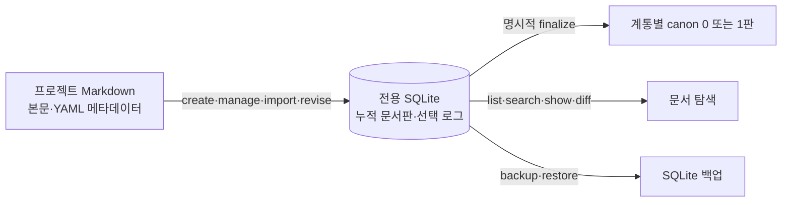

# 문서 하네스 이식 가이드

기준: 현재 [CLI 구현](../../tools/document_harness/harness.py)과 [테스트](../../tools/document_harness/test_harness.py). 2026-09-25 로컬 `dev` HEAD `bff644087cb75d8691fa2f92f9b7552734ff982d`에서 새 프로젝트 임시 경로의 `create → adopt → revise(retain) → adopt → search/show → health/verify → backup/restore`와 **당시** 테스트 7건을 확인했다. 2026-09-28에는 최초 내용 시각과 YAML `canon` 표시 보수를 독립 검토·18건 테스트·격리 사본 전환으로 확인했다. 이 문서는 현재 구현을 다른 저장소에 적용하는 방법이지만 모든 운영 환경·자료의 이식 완료를 뜻하지 않는다. 소설 프로젝트의 역사표 승인·작품 캐논, Astra/Sol/Luna 역할 배정, 세션 결정은 이 문서 하네스의 필수 구성요소가 아니다.

## 최소 구성과 데이터 흐름

새 저장소의 `tools/document_harness/harness.py`에 **CLI 파일 하나**를 같은 상대경로로 복사한다. 검증에는 `tools/document_harness/test_harness.py`도 복사한다. 이 가이드는 운영 참고용이다. 기존 저장소의 `docs/harness/` 전체, `AGENTS.md`, `.codex/`, `data/document_harness/documents.sqlite3`, 백업, `canon` 선택·세션 결정은 복사하지 않는다. 대상 프로젝트의 Markdown을 새 DB에 등록한다.



Markdown은 작성·수정 입력이며, **누적 본문판과 현재 `canon` 선택의 정본은 SQLite**다. Git은 별도의 파일 이력이다. SQLite가 기록한 `observed_commit_id`는 등록 시 관측한 Git HEAD일 뿐 해당 판이 그 commit에 들어 있다는 증명이 아니다. `canon=1`은 이 문서 탐색에서 적용할 판이라는 뜻이며, 사실성·검토 수락·사용자 승인까지 보증하지 않는다.

| 필드 | 의미 |
|---|---|
| `category_id` | 분야 ID. 여러 독립 계통이 공유할 수 있다. |
| `lineage_id` | 한 문서 계통의 불변 ID. 제목·경로·상위가 바뀌어도 유지한다. |
| `document_id` | 개정판 하나의 고유 ID. 새 판마다 새로 발급한다. |
| `parent_lineage_id` | 그 판을 작성할 때의 직계 상위 **계통** ID. 루트는 `null`; 상위에는 채택판이 필요하다. |
| `abstract`, `version`, `created_at`, `updated_at`, `tags` | 탐색 요약(1~300자), 계통별 `MAJOR.MINOR.PATCH`, UTC 최초 비공백 내용판·수정 시각 또는 근거가 없을 때 `null`, 문자열 태그 배열. 신규 관리 계통은 `0.0.1`로 시작한다. |
| `canon` | SQLite가 선택 정본이고 YAML의 필수 `true/false`는 해당 파일 판의 표시. 한 `lineage_id`에서 `1`은 최대 한 판이며 0판도 가능하다. |

관리 Markdown의 YAML 머리말에는 위 표의 모든 필드가 들어간다. CLI의 `create`·`manage`·`revise`가 ID·판·시각을 발급하고, `import`는 기존 머리말을 검사한다. 옛 파일에 `canon`이 없으면 같은 DB 판의 다른 메타데이터·본문이 일치할 때만 표시를 추가한다. 표시값만 잘못된 파일은 명시적 `sync-metadata`에서 DB값으로 복구할 수 있으나 YAML을 손으로 바꾸어 채택할 수 없다. 같은 `document_id`에 다른 본문이나 경로를 덮어씌울 수 없다. 새 판 등록은 기존 채택판을 자동 교체하지 않는다.

## 새 저장소에서 시작하기

Python **3.10+**, `PyYAML`, Python이 연결한 **SQLite 3.45+의 JSONB와 FTS5**가 필요하다. 이 저장소에서는 Python 3.14.3·SQLite 3.51.0·PyYAML 6.0.3으로 코드를 확인했다. `PyYAML`이 없다면 대상 프로젝트에서 아래처럼 가상환경을 활성화해 설치한다. 모든 CLI·테스트 명령에 **같은 Python 인터프리터**를 사용한다. 작업 디렉터리를 바꾸면 다른 `python3`가 선택될 수 있으므로 `command -v python3`로 경로를 확인한다. 가상환경도 기반 Python의 SQLite를 사용하므로 이어서 버전을 확인한다.

```sh
python3 -m venv .venv
. .venv/bin/activate
command -v python3
python3 -m pip install PyYAML
```

새 환경에서 다음 명령으로 의존성과 CLI를 확인한다.

```sh
python3 -c 'import sys, sqlite3, yaml; print(sys.version.split()[0], sqlite3.sqlite_version, yaml.__version__)'
python3 tools/document_harness/harness.py init
python3 tools/document_harness/harness.py health
python3 -m unittest discover -s tools/document_harness -p 'test_*.py' -v
```

CLI는 **파일 자신의 위치에서 두 단계 위**를 프로젝트 루트로 잡고 기본 DB를 그 루트의 `data/document_harness/documents.sqlite3`로 고정한다. 다른 디렉터리에서 명령을 실행해도 루트는 바뀌지 않는다. 반면 문서 경로, `--db PATH`, 백업·복원 경로의 상대경로는 실행하는 셸의 현재 디렉터리 기준이다. 혼동을 피하려면 프로젝트 루트에서 실행하고, 문서 파일은 그 루트 안에 둔다. 루트 밖 원본은 등록할 수 없다. `--db`를 쓸 때는 `harness.py --db PATH search ...`처럼 **명령 앞**에 둔다. Git 저장소가 아니면 관측 HEAD는 `null`일 수 있다.

새 DB는 `init`으로 만들고 기존 데이터 DB를 가져오지 않는다. 현재 구현의 legacy UUID 입력에는 `novel/` 문자열이 고정돼 있다. legacy `lineage_id`는 이 문자열과 상대경로만으로, `document_id`는 상대경로와 본문 SHA-256까지 넣어 만든다. 따라서 서로 다른 프로젝트의 DB를 합치면 **같은 상대경로는 내용이 달라도 lineage가 충돌**할 수 있다. 프로젝트별 분리 DB 사용에는 지장이 없다. 이 CLI는 범용 패키지나 DB 병합 도구로 추출된 상태가 아니다.

## 등록·선택·조회 순서

새 빈 프로젝트에서는 아직 없는 경로에 `create`로 시작판을 만든다. **본문을 실제 편집한 뒤** `revise --bump patch|minor|major`로 새 판을 등록한다. 이미 존재하는 미관리 Markdown은 내용을 검토해 **선택한 파일만** `manage`한다. 이는 파일에 새 YAML 머리말을 쓰고 관리판 `0.0.1`을 등록한다. 원본을 손대지 않고 보존부터 하려면 `import --legacy`를 먼저 쓴다. 그 판은 날짜 미상, `canon=0`으로 남으며 같은 파일·해시 재수입은 멱등이다. 이후 `manage`하면 같은 계통의 새 관리판이 된다. 직접 준비한 완전한 관리 머리말은 `import`로 등록할 수 있다. 부모가 있는 새 문서는 부모 계통을 먼저 등록·채택한 다음 `--parent-lineage`를 지정한다. 다음 예제는 **상황별 대안**이며 `docs/overview.md`·`docs/old-note.md`는 해당 파일이 이미 있을 때만 실행한다.

```sh
python3 tools/document_harness/harness.py create docs/new.md --category design --title '새 문서' --abstract '새 문서의 목적과 읽을 시점'
# docs/new.md 본문을 편집한 다음:
python3 tools/document_harness/harness.py revise docs/new.md --bump patch
```

```sh
# 이미 존재하는 미관리 문서를 바로 관리하는 경우:
python3 tools/document_harness/harness.py manage docs/overview.md --category design --abstract '현재 설계를 확인할 때 읽는다'
# 다른 기존 문서를 원본 보존판으로 먼저 수입하는 경우:
python3 tools/document_harness/harness.py import --legacy docs/old-note.md
# 그 legacy 파일을 관리 대상으로 바꿀 때는 같은 경로를 쓴다:
python3 tools/document_harness/harness.py manage docs/old-note.md --category notes --abstract '기존 기록을 확인할 때 읽는다'
python3 tools/document_harness/harness.py list --all
```

각 등록 결과의 `lineage_id`·`document_id`·`finalization`·`canon_document_id`를 확인하고 `list --all`로 재조회한다. 등록은 기존 선택을 **유지(`retain`)**하며, 새 판은 `canon=false`다. 관련 본문과 이전 판을 확인하고 채택·기존 선택 유지·철회를 명시적으로 결정한다. 등록 시 자동 `retain`은 `selection_log`에 행을 쓰지 않는다. 명시적 `finalize --action retain`과 동일 ID 재수입은 파일 표시·`source_hash` 변경이 없으면 로그를 쓰지 않고, 변경이 있으면 원·신 해시를 같은 DB 트랜잭션에 기록한다. 선택이 실제 바뀌는 `adopt`·`withdraw`도 선택 로그에 기록하며 표시 변경 해시를 함께 남긴다. 아래 셸 변수에는 **실제 출력의 ID**를 넣는다. 채택·철회 시 `--expected-current`는 직전 조회에서 본 ID 또는 선택이 없을 때 `none`이다. 다른 작업이 먼저 선택을 바꾸면 명령이 실패하므로 다시 조회한다.

```sh
LINEAGE_ID='실제 lineage_id'
DOCUMENT_ID='실제 document_id'
python3 tools/document_harness/harness.py show "$DOCUMENT_ID" --body
python3 tools/document_harness/harness.py finalize "$LINEAGE_ID" --action adopt --document-id "$DOCUMENT_ID" --expected-current none --message '현행 설계 채택'
python3 tools/document_harness/harness.py list --lineage "$LINEAGE_ID"
python3 tools/document_harness/harness.py finalize "$LINEAGE_ID" --action retain
```

기존 채택판을 교체할 때는 `--expected-current`에 **그 기존 판 ID**를 넣는다. `withdraw`도 기존 판 ID를 요구하며 채택된 자식이 있으면 거부한다. `finalize`는 한 트랜잭션에서 선택을 교체하고 커밋 뒤 다시 조회한다. 등록·개정도 커밋 뒤 선택과 새 판을 재조회한다. 어떤 판을 채택할지는 프로젝트의 기존 권한·검토 규칙으로 정한다.

```sh
python3 tools/document_harness/harness.py list
python3 tools/document_harness/harness.py search '설계'
python3 tools/document_harness/harness.py search '설계' --all
python3 tools/document_harness/harness.py candidates
python3 tools/document_harness/harness.py no-canon
python3 tools/document_harness/harness.py unknown-date
python3 tools/document_harness/harness.py list --lineage "$LINEAGE_ID" --history
python3 tools/document_harness/harness.py diff OLD_DOCUMENT_ID NEW_DOCUMENT_ID
```

`list`·`search` 기본값은 `canon=1`만 반환한다. `--all`·`--history`는 미채택·과거판도 표시하므로 그 지위를 확인한다. `candidates`는 채택판보다 `updated_at`이 늦은 미채택판만 찾으며 오류 목록이나 자동 승격 대상이 아니다. 채택판 없는 계통과 날짜 미상판은 `no-canon`·`unknown-date`로 따로 본다. 검색은 제목·요약·본문 부분 문자열과 FTS5를 사용하며 의미 검색이나 결과의 정확성 검증은 하지 않는다.

## AGENTS.md에 병합할 최소 운영 규칙

대상 저장소의 기존 `AGENTS.md`에 아래 내용을 **병합**한다. 경로를 바꿨다면 함께 고친다. 다른 프로젝트의 모델 이름·소설 분석 역할·승인 원장은 그대로 옮기지 않는다.

```md
## 프로젝트 문서 탐색과 개정

프로젝트 설계·문서 정리·문서 질문은 이 지침을 읽은 뒤 `python3 tools/document_harness/harness.py search '검색어'`로 SQLite의 `canon=1` 문서를 먼저 찾는다. 필요한 판은 `show DOCUMENT_ID --body`로 원문을 확인한다. 결과가 부족하면 `search '검색어' --all`로 넓히고 `canon=0` 지위를 표시한다. DB·CLI가 없거나 미적재 자료라면 저장소의 문서 목차와 필요한 원자료를 한정해서 확인한다. 검색 결과는 출처·승인 근거를 대체하지 않는다.

문서를 새로 만들거나 바꿀 때 단일 DB writer가 Markdown을 CLI에 등록하고 산출 ID를 기록한다. 새 판은 자동 채택하지 않는다. 프로젝트의 결정권자가 정한 채택·기존 선택 유지·철회를 `finalize`로 처리하고 DB를 재조회한다. 문서 `canon`은 적용할 탐색판이며 내용의 사실성·검토 완료·사용자 승인을 뜻하지 않는다. 재개 시 산출 파일, 원자료·hash, 채택 상태와 미결정을 확인한다.
```

## 이식 확인과 운영 경계

1. 대상의 Python·SQLite·PyYAML 조건을 확인하고, 코드와 선택적으로 테스트 파일을 지정 경로에 복사한다. 새 DB를 `init`하고 `health`로 확인한다.
2. 기존 자료의 범위·카테고리·채택 결정권자를 정한다. 필요한 파일만 새 프로젝트 DB에 `manage` 또는 `import --legacy`로 등록한다. 기존 저장소의 관리 front matter를 새 프로젝트 계통 ID로 무심히 재사용하지 않는다.
3. `list --all`로 등록 결과를 보고, 적용할 판만 `finalize --action adopt`로 명시 채택한다. `list`, `search`, `show`로 실제 적용판과 본문을 재확인한다. 보류한 초안은 `canon=0`으로 유지한다.
4. `health`와 아래 백업·복원 시험을 수행한다. DB writer를 한 명으로 두고 백업 보존 위치·주기와 원본 Markdown/Git 보존 방식을 프로젝트에서 결정한다.

```sh
python3 tools/document_harness/harness.py health
python3 tools/document_harness/harness.py backup data/document_harness/backup.sqlite3
python3 tools/document_harness/harness.py --db data/document_harness/restored.sqlite3 restore data/document_harness/backup.sqlite3
python3 tools/document_harness/harness.py --db data/document_harness/restored.sqlite3 verify
```

`health`와 기본 `verify`는 SQLite `integrity_check`, 계통별 `canon` 중복, JSONB 태그 유효성, 문서판 수와 FTS 행·본문·제목 일치를 확인한다. `verify --files`는 존재하는 관리 Markdown의 현재 판 ID·메타데이터·본문·YAML `canon`·전체 파일 SHA를 DB와 대조하고 없는 파일을 열거한다. `sync-metadata --report NEW.json`은 관리 계통의 과거 날짜 보완 근거·기존 hash·충돌을 기록하며 현재 파일에 표시를 반영한다. 운영 전 SQLite 백업과 사본 리허설을 권장한다. 미관리 legacy 본문과 근거 없는 날짜는 자동 보완하지 않는다. 원본을 삭제해도 기존 DB 판 본문은 남지만 파일을 통한 후속 개정에는 원본이 필요하다. `backup`은 **SQLite만** 복사하고 Markdown·Git·코드는 포함하지 않는다. `restore`는 다른, 아직 없는 DB 경로에 복사하므로 뒤이어 `verify`와 실제 `search`로 확인한다. 기존 백업·복원 목적지는 덮어쓰지 않는다.

이 저장소는 `.gitignore`에서 `data/document_harness/**/*.sqlite3`와 `*.sqlite3-*`를 제외한다. 대상 프로젝트도 DB를 Git에서 제외한다면 별도 백업을 보존해야 한다. Git clone이나 Markdown만으로 누적판·채택 선택을 완전히 복구할 수 없다. 초기 구현에는 파일 변경 감시, 자동 재적재·자동 채택, 프로젝트 간 DB 병합, 백업 보존 일정이 없다. 새 프로젝트의 채택 권한·legacy 선별 범위·백업 정책은 이식 시 결정할 사항이다.
