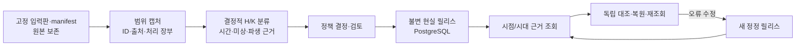

# YAGO 기반 역사전표 SoT 구축 방법론

이 문서는 새 역사 범위에 [현실 역사·지식 변환기 PRD](../prd/wikipedia-history-ontology.md)의 요구를 적용할 때 사용할 절차다. [시스템 설계](../systems/README.md)의 공용 원역사와 작품 분리 원칙을 따른다. 아래에서 **현재 구현**은 YAGO 4.6의 고정 다섯 대상 파일럿 v1/r2/r3에 한정한다. 범위를 늘리거나 Wikidata·위키 원문·Gemma를 더하는 절차는 **일반화할 규칙/후속 구현**으로 표시한다. 방법론은 제품 요구의 대체판도, 개별 릴리스의 검증 보고도 아니다. 이 계통을 문서 검색에서 채택해도 현실 주장의 역사적 참, 작품별 사용 적격, 작가 역사표가 승인되는 것은 아니다.



## 1. 입력판과 작업 범위를 먼저 고정한다

1. 사용 목적에 필요한 기간·지역·선행 배경·대상·질문을 먼저 적는다. YAGO 배포판, 파일 경로·해시·라이선스·스키마, 추출에 사용한 코드/정책판과 입력 DB 또는 캡처의 SHA-256을 manifest로 고정한다. 원본 파일은 변경하지 않고, 구조화 캡처·매핑 결과·검토 결정을 별도 보존한다. 원본 파일의 실제 읽기 또는 이전에 검증된 manifest와 캡처의 연결을 명시한다. 해시가 어긋나면 릴리스 발행을 막는다.
2. 주제·술어·객체의 원 진술과 YAGO 사실/분류 파일, 행 좌표, raw triple, 연결된 RDF* `Meta`의 부모 ID·원 시간 어휘를 별도 보존한다. 프로젝트 안정 ID와 YAGO ID의 판별 대응표를 만든다. 이름·별칭·QID만으로 동명이인이나 `same` 병합을 확정하지 않는다. 매핑·제외·미매핑·실패 사유와 분모를 남기며, Meta 없는 진술에 시간값을 만들지 않는다. 같은 YAGO 유래 Wikidata 진술은 독립 증언 두 건으로 가산하지 않는다.
3. **후속 구현:** 새 범위에는 Wikidata의 고정 full statement와 rank·qualifier·reference·원 시간값, 위키백과의 고정 dump와 독립 page/revision/slot 인벤토리를 각각 보존한다. 위키 기본 원문 단위를 겹치지 않게 회계하고 후보 0..N개와 실패·보류를 연결한다. KG 진술 좌표를 위키 byte span으로 가장하지 않는다. 이는 [PRD의 입력·증거 계약](../prd/wikipedia-history-ontology.md#4-산출-정보의-최소-계약)이며 이번 다섯 대상 릴리스에서 전량 실행된 단계가 아니다.

[첫 파일럿](../research/20260929-yago-history-sot-pilot.md#원천과-변환-범위)은 기존 foundation SQLite SHA-256 `640261c0eea9d3b064aba865f78c6d3c905098d63635fb8ea3deebfc0d551b14`와 [YAGO 원본 manifest](../../data/research/yago-storage-20260928/manifest-final.json)에 결박됐다. 캡처는 entity 5, 진술 152(매핑 130: 별칭 70·외부 ID 10·구조 50, 제외 22), Meta 40(부모 연결 24·outgoing orphan 5·incoming observation 11)이었다. 원본 약 78GB 재처리나 전체 역사 포괄의 분모가 아니다.

## 2. 주장 종류와 세 시간 층을 분리한다

고정된 매핑 규칙으로 원 진술마다 주장의 종류·원천·정책판을 기록한다. 현재 다섯 대상 규칙의 구조 50건은 `H_state` 12건(자체 시작·끝 Meta가 모두 있는 왕·태자 유형 또는 배우자 관계), `H_event` 6건(생몰일), `knowledge_or_taxonomy` 9건, `temporal_unknown` 23건이다. 분류 자체를 전부 사건으로 세지 않는다. 생몰일은 지속 상태가 아니다. 한글의 `"1443"^^xsd:gYear`는 r2에서 K 기원 **후보**의 raw·year 정밀도·원 달력 `unknown`을 보이도록 새 claim/decision 판을 발행했다. 1450년 실제 사용, 사람의 인지, 보급이나 B 연결로 승격하지 않았다. 이 절편은 H 일부와 K/분류 후보를 다루며 H/K/B/F 34종의 전체 구현은 아니다. F는 원 진술·Meta·정책 결정에 대한 추적 근거로 부분 구현됐다.

시간은 다음 세 층의 의미가 다르다. 어느 층이든 원 `xsd:date`/`xsd:gYear`의 어휘값, YAGO 날짜 어휘상 정밀도, 명목 비교값, **원 달력 미상**을 함께 보존한다. 명목 ISO 비교 결과를 사료의 달력이나 정확한 역사 날짜로 해석하지 않는다. 원 자료의 구간 시작/끝 포함 규칙과 반복 재임은 별도 원판 대조 전까지 미상이다.

| 층 | 만드는 조건과 용도 | 금지할 승격 |
|---|---|---|
| 명시 `valid_time` (`time`) | 해당 주장 자체의 날짜 또는 연결된 자체 Meta 구간. 상태·사건의 명목 시점 조회에 사용한다. | YAGO 단일 구간을 모든 재임·관계의 완전한 역사로 취급하지 않는다. |
| `inferred_event_bound` | 시간 미상 출생지/사망지 주장에 같은 주체의 별도 출생일/사망일을 의미상 결합한 **사건 후보**. 근거 claim/source ID와 파생 규칙을 남긴다. | 장소와 날짜를 한 원 진술의 직접 증언, 독립 역사 사실로 쓰지 않는다. |
| `context_range` | 시간 미상 인물 주장에 같은 주체의 유효한 생몰 근거로 붙인 **시대 발견 힌트**. | 부모·성별·국적·언어·직업·사후 칭호가 생애 내내 유효했다거나 조회 시점의 현재 상태라고 말하지 않는다. |

숫자 시대 버킷은 `[start_year, end_year_exclusive)` 반열림으로 저장한다. 예컨대 사망 연도 1457을 **포함**하려고 끝은 1458로 둔다. 사람이 보는 전표는 `1441 ~ 1457년`처럼 포함 끝을 표시한다. 원 날짜가 일 정밀도여도 시대 검색 범위는 **연도 버킷**이고, day 어휘값·raw·미상 달력은 근거에 남는다. 출생·사망 앵커가 없거나 무효·역전이면 `time={}`와 `temporal_unknown`을 유지하고 `missing_or_invalid_same_subject_life_anchors` 같은 사유를 기록한다. 파생 범위를 억지로 채우지 않는다. 인물 장소 주장은 더 좁은 사건 후보를 시대 검색에서 우선 적용하여 넓은 생애 문맥과 중복 계수하지 않는다. 이 규칙의 실제 적용과 격리 시험은 [r3 보고](../research/20260929-yago-history-temporal-ledgers.md)에 있다.

다음은 [r3 운영 readback](../../data/analysis/private/yago-sot-temporal-20260929/pg-readback.json)에서 단종 사망지 `facts:47318075`의 **핵심 필드만 발췌**한 레코드다. 두 날짜 근거는 같은 YAGO 원천 계열이다.

```json
{
  "claim_id": "sot:claim:facts:47318075:r3",
  "source_statement_id": "facts:47318075",
  "lane": "temporal_unknown",
  "time": {},
  "context_range": {
    "start_year": 1441, "end_year_exclusive": 1458,
    "basis_source_statement_ids": ["facts:47318066", "facts:47318067"],
    "precision": "year_bucket", "calendar": "unknown",
    "status": "derived_context_only"
  },
  "inferred_event_bound": {
    "start_year": 1457, "end_year_exclusive": 1458,
    "basis_source_statement_id": "facts:47318067",
    "precision": "year_bucket", "calendar": "unknown",
    "status": "derived_occurrence_candidate"
  }
}
```

## 3. 정책 결정으로 발행하고 판을 보존한다

후보마다 source ID·Meta ID·매핑 이유, 정책판과 수락/보류/제외 사유를 분리한다. 파일럿의 50건은 모두 `source_grounded_pilot_include`라는 **출처 결박 정책 수락**이며 사람의 역사적 진실 검토는 `not_performed`, 작품 범위 심사도 `not_performed`다. 원 Wikidata full statement와 위키 원문을 열지 않은 채 모델의 `same` 제안을 받아 위키 잔여 후보를 삭제하거나 동일성을 확정하지 않는다. 후속 Gemma 추출은 고정 원문 span을 붙인 H/K/B/F **후보**로만 받고, 출처·모델 해석·검토 결정을 구별한다. 이번 v1/r2/r3에는 새 GPU 추론이 없었다.

단일 발행자가 입력 해시·소스와 Meta 연결·선택 범위의 주장 수 및 소스별 매핑·제외·미매핑·실패 분모(이번 파일럿의 구조 주장 50건)·정책 결정·시간 규칙을 확인한 뒤 고유 `RealityRelease` ID로 PostgreSQL에 발행한다. 원천 해시가 다르거나 같은 ID에 다른 payload가 오면 발행을 거절한다. 재실행이 동일하면 새 판을 만들지 않는다. 발행판의 claim·decision·member·공유 source는 수정/삭제하지 않는다. 정정은 `supersedes_release_id`와 변경 이유, 새 claim/decision revision을 가진 **새 릴리스**로 낸다. 같은 source ID와 릴리스별 멤버 차이를 따라 정정을 재구성한다. 작품은 명시적으로 특정 현실 릴리스를 참조하고, 새 릴리스가 기존 작품 참조를 자동 교체하지 않는다.

| 파일럿 판 | 실제 변경 | 보존·확인할 것 |
|---|---|---|
| v1 `reality:yago46:five:640261c0eea9d3b0` | 고정 YAGO 5대상 구조 주장 첫 발행 | 각 릴리스 claim·decision·member 50건, 출처/Meta 추적과 1450 시점 질의 |
| r2 `…:r2` | 한글 `facts:46623039`만 raw `gYear`·year·원 달력 미상을 가진 K 기원 후보로 수정 | 공통 49 claim/decision, source/entity/Meta 전건 및 v1 readback 바이트 동일. B 사용 전표 없음. [델타 대조](../../data/analysis/private/yago-sot-pilot-20260929/v2/delta-verification.json) |
| r3 `…:r3` | 원 시간 미상 23건에 `context_range`, 그중 장소 6건에 `inferred_event_bound` 추가 | 23 claim/decision만 새 판; 나머지 27쌍은 r2와 동일. v1/r2 readback 바이트 동일. [r3 최종 독립 수락](../../data/analysis/private/yago-sot-temporal-20260929/independent-review/final-acceptance.json) |

## 4. 조회는 질문의 의미에 맞게 나눈다

**시점 상태** 조회는 릴리스 ID·entity·`as_of`를 고정한다. `1450`은 1450년 전체 구간이지 1월 1일이 아니다. 명시 날짜의 `supported_nominal`, 연도 안 전환의 `possible_nominal`, 하루 경계의 `possible_boundary`를 구분하고 미래 상태·미래 사건·과거·시간 미상·K/분류를 다른 lane에 둔다. `supported_nominal`도 YAGO의 날짜 문자열을 같은 명목 달력으로 비교한 상태일 뿐 확정 역사 사실이 아니다. 실제 r2에서는 문종 왕/태자 1450 전환이 둘 다 possible, 단종·세조 왕은 future였다. Bloomery의 분류만으로 1450 제철 공정 사용 B를 만들지 않았다. [r2 질의와 근거](../research/20260929-yago-history-sot-pilot.md#1450-질의의-양성과-경계).

**시대 발견** 조회는 기간과 릴리스 ID를 고정하고 `explicit_dated_overlap`, `inferred_occurrence_candidate`, `contextual_era_match`, `no_temporal_basis`, `outside_period`를 분리한다. K/분류는 사건 매치에서 제외하고 수를 별도 표시한다. r3 [1400–1499 질의](../../data/analysis/private/yago-sot-temporal-20260929/era-1400-1499.json)의 시간 미상 23건은 장소 사건 후보 6/일반 문맥 17, [1450 질의](../../data/analysis/private/yago-sot-temporal-20260929/era-1450.json)는 0/17, 1200·1890은 0/0이었다. K/분류 제외는 9건이다. 1450 단종 사망지는 `temporal_unknown`이고 1457 파생 발생은 `future` 메타데이터다. 이를 1450의 현재 상태로 넣지 않는다. 지식 기획 조회는 현실 당시 상태 조회와 별도로 두고, 후대 K의 존재를 당시 사람의 인지·사용으로 옮기지 않는다.

기존 승인 H200 세션의 아래 명령은 **현재 다섯 대상 고정 CLI**로 r3를 재조회하는 예다. 다른 범위를 넣는 범용 수집·발행 CLI라고 해석하지 않는다. 접속 DB·세션이 없으면 명령의 성공을 주장하지 않는다. v1/r2를 보려면 각각 완전한 이전 릴리스 ID를 명시한다. [실행 환경·원형 명령](../research/20260929-yago-history-temporal-ledgers.md).

```sh
cd /home/work/novel-toy-tune/reality-sot-pilot-20260929
export PYTHONPATH=src
export SOT_DSN='host=/tmp/novel-ontology-pg-1100 port=55432 dbname=reality_sot_pilot_20260929'
PY=/home/work/novel-toy-tune/venv-gemma4/bin/python
$PY -m novel_factory.reality.sot_cli --dsn "$SOT_DSN" era --release-id reality:yago46:five:640261c0eea9d3b0:r3 --period 1400..1499
$PY -m novel_factory.reality.sot_cli --dsn "$SOT_DSN" ledgers --release-id reality:yago46:five:640261c0eea9d3b0:r3 --format markdown
$PY -m novel_factory.reality.sot_cli --dsn "$SOT_DSN" query --release-id reality:yago46:five:640261c0eea9d3b0:r3 --entity trial:yago46:Danjong_of_Joseon --as-of 1450
```

## 5. 산출물과 수락 기준

새 범위의 배치를 마칠 때는 다음 산출물과 검사 결과를 함께 남긴다. **현재 검증** 열은 다섯 대상의 관측 범위다. 나머지는 [PRD의 수락 기준](../prd/wikipedia-history-ontology.md#7-수락검사와-요구-추적)에 맞춰 구현·검토해야 한다.

| 산출물 | 수락 검사 | 현재 검증과 경계 |
|---|---|---|
| 고정 입력 manifest·원본 Storage·캡처 및 ID/원천/Meta·처리 장부 | 파일/캡처 SHA·원 진술 좌표·매핑/제외/실패 분모, 끊어진 근거 0, 해시 불일치 시 발행 차단 | 5 entity/152 source/40 Meta와 구조 50. 전체 YAGO·Wikidata/위키 분모 아님. [입력 점검](../../data/analysis/private/yago-sot-pilot-20260929/mechanical-review/input-inventory.json) |
| H/K 후보·시간 근거·정책 decision | 종류·원 raw/정밀도/달력/Meta·파생 basis·미상 사유 및 claim↔decision↔source 대조 | v1/r2 50건, r3 23 context·6 좁은 사건. [r3 기계 점검](../../data/analysis/private/yago-sot-temporal-20260929/mechanical-review/final-output-check.json) |
| 발행 전 로컬 회귀 검사 | 시간 경계·연도 구간, 누락/무효 생몰 앵커의 미상·사유 보존, 미래 상태 누출 금지, 범위 밖 시대 반례를 확인한다. 새 범위의 입력·규칙판에 맞는 독립 의미 검사도 필요하다. | 고정 파일럿 테스트 `PYTHONPATH=src python3 -m pytest -q tests/novel_factory/test_reality_sot.py` 10/10 통과([r3 최종 수락](../../data/analysis/private/yago-sot-temporal-20260929/independent-review/final-acceptance.json)). 이번 문서 작업에서 재실행하지 않았다. |
| 불변 `RealityRelease`와 릴리스별 readback | 명시 ID 재조회, 정확한 재발행 멱등, 같은 ID 다른 내용과 발행 후 변조 거부, 이전판 바이트 대조 | r3 시점 전역 entity5/source152/Meta40/claim74/decision74/member150/release3/scope3, 릴리스별 claim·decision·member 50. [PG r3 검증](../../data/analysis/private/yago-sot-temporal-20260929/pg-verification.json) |
| 근거 패킷·시대 전표·복원 영수증 | 시점/시대 lane와 미래 누출 검사, PG 새 프로세스 재조회, 백업·별도 DB 복원 뒤 판별 hash 대조 | r3 readback SHA `71161cba74d438dc7f0bef10875ba4f8022048fd9cb7316e0b43e649f7d60ed2`. v1/r2는 같은 Storage의 `pg_dump -Fc` 별도 DB 복원 readback 일치; r3 새 복원 시험은 없음. [복원 기록](../../data/analysis/private/yago-sot-pilot-20260929/v2/restore-receipt.json) |
| 독립 의미·운영 검토와 작품 범위 판정 | 다른 검토자가 원천·정책·질의·불변성 범위를 대조한다. 작품 사용에는 별도 `ReviewScope`의 기간/배경 미검토 0건·잔여 제한을 확인한다. | [v1/r2](../../data/analysis/private/yago-sot-pilot-20260929/independent-review/final-acceptance.json)와 [r3](../../data/analysis/private/yago-sot-temporal-20260929/independent-review/final-acceptance.json)는 범위 한정 제품 운영을 수락. 역사적 참·작품 `ReviewScope`·작가 승인/잠금은 미수행. |

이번 검증은 새 GPU·원본 78GB 재스캔·원 Wikidata 전체 statement/원 달력/반복 기간 복원·위키 원문 전수·A40 독립 백업을 포함하지 않았다. 생몰 앵커를 쓴 이 규칙을 다른 역법·기원전 연대·기관/활동기·반복 기간에 그대로 적용할 근거도 없다. 이런 범위는 시간 표현·파생 규칙·독립 확인 자료를 추가 구현하고 검증해야 한다. 실물 읽기와 모델 보강을 추가해도 모델 출력은 출처가 붙은 후보이며, 동일성·인과·상충과 당시 인지/실행 가능성은 따로 검토한다. 범위 안 미검토가 남은 작품에는 릴리스가 있다는 이유만으로 사용 가능 상태를 주지 않는다. 보정할 때는 입력·정책·코드 판과 영향받은 claim/decision을 다시 고정하고 새 릴리스를 발행해 구판·구작품 참조·근거 패킷을 재조회한다.

방법론의 문서 채택은 [문서 생애주기](../harness/document-lifecycle.md#canon-선별-기준)를 따른다. 이 계통의 반복 절차는 제품 목표를 정하는 PRD 및 날짜별 결과·한계를 기록하는 비캐논 [첫 실행](../research/20260929-yago-history-sot-pilot.md)·[r3 실행](../research/20260929-yago-history-temporal-ledgers.md)과 변경 책임이 달라 별도 검색판으로 유지한다. 새 문서도 초안 `canon=false`로 등록하고 독립 내용 검토 뒤 단일 writer가 `finalize`로 선택한 다음 DB 재조회·`verify --files`로 파일과 DB hash를 대조한다. 이는 현실 릴리스나 작품 캐논의 승인 절차와 독립이다.
