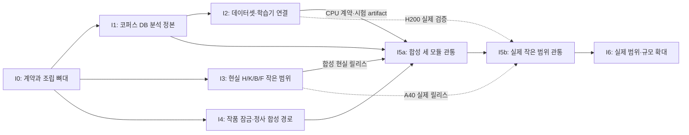

# 통합 시스템 구현 플랜

- 갱신: 2026-09-27. 상태: **실행 준비 계획, 구현 미착수.** 이 문서의 단계·수락검사는 앞으로 할 일이며 실행 결과가 아니다.
- 기준: [핵심 시스템 설계 v1.0.0](../systems/README.md), [집필 PRD](../PRD.md), [현실 역사 온톨로지 PRD](../prd/wikipedia-history-ontology.md). 문체 학습의 기존 구현·실행 경계는 [toy-tune 설계](20260914-toy-tune-architecture-and-backendai-bootstrap-plan-v0-1.md)를 참고하되 통합 계약과 충돌하면 핵심 시스템 설계를 따른다.
- 목표: 한 사람이 현실 역사·지식 구축, 문체 학습, 작품 설계·집필을 한 제품의 공개 유스케이스로 운영한다. 모듈 내부는 느슨하게 결합하고 자료·승인 상태의 정본을 분명히 한다.
- 권한: 사용자가 **플랜 작성**을 요청했다. 이 문서 작성으로 코드, 코퍼스/운영 DB, 덤프, 모델, GPU 작업을 실행하지 않는다. 후속 구현이 승인되면 가역 작업은 단계마다 다시 묻지 않고 진행한다. 역사표 잠금·취향 채택·작품 정사·외부 게시의 작가 결정은 별도다.
- 완료 목표: 합성 자료와 선택한 작은 실제 범위에서 세 모듈의 한 흐름을 재개까지 검증한다. 전 세계 역사 완성, 350화 전수 분석, 모든 학습 엔진 지원은 첫 제품의 선행 조건이 아니다. 기간·비용·성능 수치는 실측 전 추정하지 않는다.

## 1. 현재 자산과 처리 방침

기존 자료의 **확인된 상태와 목표**를 분리한다. 특히 일부 독립 파일이 이미 완료됐다는 이유로 통합 제품 경로가 구현됐다고 보지 않는다.

| 자산·위치 | 확인된 상태 | 처리 |
|---|---|---|
| `tools/novel_corpus/schema.sql`, `corpus.py` | 분석용 SQLite에 7편 원문 revision·분할판·본문이 적재돼 있고 원본/분할/segment는 불변, 현재 판 포인터는 가변이다. 확정 회차와 미확정 구간이 섞여 있다. [적재·검토](../research/chapter-ingestion/README.md) | **재사용·수정.** 판을 고정한 읽기 port와 확정 회차/승인 구간 조회를 제품 application에 연결. 현재 포인터는 재개 입력의 암묵적 기준이 되지 않게 한다. |
| `data/analysis/novel-corpus.sqlite3` | 원문·분할판의 현재 정본. 분석 카드·검토·선정·진행 상태 전체가 이미 들어 있다는 근거는 없다. | **확장·이관.** 소유 모듈의 분석 상태 정본을 같은 코퍼스 DB로 옮기고 원본 본문은 유지한다. 파일 산출물과 이중 쓰기하지 않는다. |
| `tools/reverse_dataset/build.py`, `full.py`, `export.py`, `viewer.py` | 원본 TXT 또는 동결 JSON을 사용하는 분석·역구성 경로가 있다. `full.py show-window`는 원본 경로를 읽고, `build.py show-unit`은 앞선 원본 기반 배치의 동결 결과를 본다. 둘 다 코퍼스 DB 본문 조회 계약이 아니다. | **가역 wrapper 후 수정.** 동일 판 DB 읽기와 결과·검토·재개 정본으로 전환한다. 기존 출력 형식은 이관 대조와 호환용으로만 유지한다. |
| 기존 역구성 데이터 | 고종 Gemma 문체용, 고려·폴란드 SOTA 기획용의 역할 분리가 결정돼 있다. 기존 `accepted` 역구성 후보 272건은 목표 350화 독립 분석 카드와 다른 워크플로다. [세션 결정](../harness/session-decisions.md) | **보존·의미별 이관.** `gemma_style`/`sota_planning`, split, 원문판·검토 상태를 함께 옮긴다. 수치·ID는 이관 전 원장 재조회로 확정한다. |
| `toy-tune/src/toy_tune` | domain/application/ports/adapters, 합성 JSON source, 시간순 split·누수 검사, `doctor`/`prepare`/`verify-dataset`, 불변 파일 artifact 저장소와 테스트가 있다. 실제 Training/GenerationEngine·KnowledgeReader/PacketReader·운영 DB adapter는 아직 구현 전이며 `packet_id`는 현재 거부된다. | **재사용·보강.** 독립 패키지·CLI와 엔진/실행위치 교체 경계를 살린다. 파일 `RunStore`를 운영 상태 정본으로 확장하지 않는다. |
| 현실 역사·지식 명세 | [34개 구축 데이터 집합](wikipedia-reality-sot-build-plan.md), [CIDOC CRM 매핑](wikipedia-history-sot-mapping.md), [원문 근거 계약](wikipedia-history-sot-mapping/ingestion-contract.md), [변환기 PRD](../prd/wikipedia-history-ontology.md)가 있다. 명세 작성은 덤프 처리·A40 적재·현실 릴리스 발행 완료가 아니다. | **구현 입력.** H/K/B/F의 선택된 시대·지역 범위부터 원문 장부·후보·검토·릴리스·두 조회 모드를 검증한다. 34종은 테이블 34개나 P0 세계 전량 선행을 뜻하지 않는다. |
| `webnovel-writer` | Claude 스킬/장별 step, `.webnovel` JSON·SQLite 진행 상태, 장별 패킷·스냅샷, 로컬 벡터/BM25 검색 코드가 있다. 장 번호 인물·관계 DB와 검색 adapter에는 현실 시점·H/K/B/F·릴리스·검토 범위 필터가 없고, 승인 역사표 잠금·Gemma 본문·정사 원자 발행의 실제 구현도 확인되지 않았다. | **패턴만 선별 재사용.** 장별 패킷·중단 복구 아이디어를 새 use case에 맞춰 검증한다. 기존 DB/RAG를 현실 또는 작품 정사 adapter로 그대로 이식하지 않는다. 대시보드 UI는 첫 CLI 관통의 필수 산출물이 아니다. |
| 문서 하네스 DB·`canon` | 문서 탐색·개정·채택판의 정본으로 별도 SQLite를 사용한다. | **운영 지원 유지.** 소설 코퍼스/현실 릴리스/작품 정사 DB와 통합하지 않는다. 문서 채택은 역사 사실이나 작품 승인으로 자동 전환하지 않는다. |

[기존 첫 50화 통합 계획](20260924-first-50-analysis-and-ingestion-plan.md)의 350건은 목표이고, [표본 작가 연구](../research/author-study/README.md) 7편의 구조 지도·대표 장면 검토 완료는 전수 화별 분석 완료가 아니다. 코퍼스 원본 7편·3,292구간과 첫 50화 대응 249/350 확정이라는 수치도 [적재 기록](../research/chapter-ingestion/README.md)의 해당 판에 한정한다. 새 구현은 원문을 모델 문맥에 전편 출력해 재검사하는 작업이 아니다.

## 2. 목표 코드 배치와 공개 계약

첫 실제 유스케이스에 필요한 파일만 만든다. 다음 트리는 **소유권 지도**이지 빈 디렉터리·범용 인터페이스를 미리 모두 생성하라는 지시가 아니다.

```text
src/novel_factory/
  contracts/                 # 작은 버전 공개값: SceneSpec 등
  reality/                   # H/K/B/F, RealityRelease, ReviewScope, EvidencePacket
    domain/ application/ ports/ adapters/
  style/                     # 코퍼스 분석·검토·선정, DatasetRelease, ModelArtifact
    domain/ application/ ports/ adapters/
  writing/                   # 앵커·경로·인지·잠금·본문·정사
    domain/ application/ ports/ adapters/
  composition.py             # 실제 adapter 연결, 다른 모듈 내부 테이블 조회 금지
  cli.py                     # 한 제품의 소수 공개 use case 진입점
tests/novel_factory/          # 공개 계약·application·adapter의 작은 수락검사
pyproject.toml                # 통합 CLI의 최소 설치·테스트 entry; 첫 사용 때 작성
toy-tune/src/toy_tune/        # 기존 독립 학습 엔진/CLI, style adapter에서 위임
tools/novel_corpus/          # 이관 중 호환 CLI, 본문 정본은 코퍼스 DB
tools/reverse_dataset/       # 가역 wrapper/반출, 상태 정본은 코퍼스 DB
```

- 제품 `contracts`는 Python 값/스키마와 버전으로만 모듈 사이에 노출한다. `SceneSpec v1`의 의미는 장면 목표·제약·시점 인지·선행 문맥·정답 누설 금지다. 소유 조정은 writing이 맡고 style이 소비자로 검증한다. 학습 입력에는 가상 역사표·역구성 가설의 출처를 표기하고 **운영 집필에서만** 실제 작가 승인 잠금판을 필수로 검사한다. `toy_tune.domain`이 `novel_factory.writing`을 import하지 않도록 style adapter가 계약을 기존 학습 source 형식으로 변환한다.
- reality는 `RealityRelease`·`ReviewScope`·`EvidencePacket`의 소유자다. `as_of` 현실 상태 조회는 그 시점의 사건·인지·보급을 반환한다. 기획 지식 조회는 그 뒤에 형성됐지만 구축 범위 안인 독립 K 객체를 별도로 반환하며 당시 인물 인지나 실행 능력으로 승격하지 않는다.
- style은 고정 원문판·split·검토·선정이 붙은 `DatasetRelease`와 그 릴리스·학습판·검증을 참조하는 `ModelArtifact`를 발행한다. 모델 artifact가 생겼다고 writing의 채택 모델이 바뀌지 않는다.
- writing은 `work_id`, 순서 있는 `chapter_id/scene_id`와 본문 revision, 채택 현실 릴리스·모델, 작가 승인 `LockedPlan`, 씬별 온톨로지 기록, 검수 원고와 `PublishedCanon`을 소유한다. 씬의 서술 순서와 사건 유효 시각을 따로 둔다. 현실 사건과 작품의 주장·인지·변경 전표를 구분하고 새 현실·모델 릴리스의 적용은 명시 결정으로 새 판을 만든다. 학습 원문 코퍼스의 scene/segment는 이 작품 씬 정본에 합치지 않는다.
- 각 module의 domain에는 업무 불변식, application에는 진행·권한·재시도, 실제로 필요한 port에는 좁은 저장/모델 호출 계약, adapter에는 SQLite/PG·artifact·기존 CLI·엔진 의존을 둔다. bootstrap만 구체 adapter를 고른다. domain/application에 SQL 행·파일 경로·SDK 타입·벤더 모델 ID를 넣지 않고 불투명 업무 참조 ID는 허용한다. 각 DB 쓰기는 소유 모듈의 한 writer/transaction으로 닫고, 통합 유스케이스는 공개 결과 ID를 고정해 다음 모듈을 호출한다. 내부 HTTP·분산 큐·DI 프레임워크·범용 Repository 계층을 만들지 않는다.
- 기존 `toy-tune` CLI는 직접 사용하는 학습 실험에 남기되 통합 CLI는 고정 입력·검토·릴리스·채택 상태를 조립한다. 최초 구현에서는 기존 Native Codex 배정을 그대로 쓰고 새 모델 호출 플랫폼을 만들지 않는다.
- 첫 `pyproject.toml`은 `src/novel_factory`와 CLI entry/테스트 실행에 필요한 최소 설정만 둔다. `tests/novel_factory/`는 코어의 DB 없는 검사와 코퍼스 adapter의 사본 DB 검사를 분리한다. `toy-tune`은 자기 `pyproject.toml`/CLI/테스트를 유지하며 통합 패키지 안으로 복사하지 않는다.
- style 모듈이 **코퍼스 SQLite 논리 소유자**다. I1은 고정 입력·분석 결과·검토·진행·선정 상태를, I2는 같은 소유 경계에서 데이터셋 릴리스·학습 run/attempt·모델 등록 상태를 기록한다. checkpoint·JSONL은 불변 artifact이고 DB 상태와 이중 정본이 아니다. 내부 상태를 다른 모듈이 직접 조회·수정하지 않는다.

코퍼스 DB의 다음 이름은 **논리 소유 범위 예시**다. 이미 있는 구조와 추가할 구조를 혼동하지 않고, 모든 payload 필드의 DDL을 먼저 확정하지 않는다.

| 구분 | 기존/예정 논리 레코드 | 기준과 transaction |
|---|---|---|
| 불변 원문 | 기존 `works/source_revisions/segmentations/segments`, 현재 판 포인터·회차 대응 view | source revision·segmentation·segment 본문은 변경하지 않고 고정 ID·hash·CP span으로 참조한다. 현재 판 포인터는 조회 편의일 뿐 분석 입력의 정본 ID를 대체하지 않는다. |
| 분석·검토·선정 | 예정 `analysis_sets/items/submission_revisions/review_decisions`, 선택·다음 미완료 상태 | 각 제출·리뷰는 자신의 revision과 고정 원문 좌표에 연결하며 하나의 소유 writer/transaction에서 확정한다. 기존 accepted 역구성의 판정 의미는 변환해 보존하고 새 화별 카드 완료로 복제하지 않는다. |
| 학습 발행 | 예정 `dataset_releases/training_runs/model_artifacts` | 선택·split·검토판을 묶어 데이터셋 릴리스를 고정한다. run/attempt 반입과 모델 등록은 검증 후 DB에서 확정한다. 무게 파일·JSONL은 hash가 붙은 불변 산출물이다. |

| 공개 유스케이스 목표 | 입력 → 출력 | 소유 모듈·첫 구현 |
|---|---|---|
| `prepare_analysis_input` | `work_id + source_revision_id + segmentation_id + chapter 또는 승인 span` → 원문판 고정 입력 | style. 코퍼스 DB에서만 본문 읽기; 읽기 전용 |
| `submit_analysis` / `review_analysis` / `resume_analysis` | 고정 입력 ID·결과·판정 → 검토 상태·다음 미완료 항목 | style. 같은 DB transaction과 중복 제출 방지 |
| `release_dataset` / `register_model_artifact` | 선택·split·검증 → `DatasetRelease` / `ModelArtifact` | style. 학습 승인·취향 채택과 구별 |
| `issue_reality_release` / `review_scope` / `query_evidence` | 원문 근거·정책판/작품 범위/조회 모드 → 현실 릴리스·검토 범위·근거 패킷 | reality. 후보·검토·릴리스 단계 분리 |
| `propose_path` / `lock_plan` / `adopt_model` | 앵커·근거/작가 결정/모델 참조 → 경로 후보·잠금판·채택판 | writing. 승인 없이 계획·모델이 자동 채택되지 않음 |
| `retrieve_history_context` / `record_scene` / `publish_chapter` | 씬 범위·현실/작품판 → 근거·필수 상태; 본문 revision·온톨로지 기록 → 검수 가능한 씬; 승인된 순서 있는 씬 본문·기록 묶음 → 단일 정사 | writing. 잠금·모델 채택을 검증하고 회차 공개 전까지 씬은 작업판에만 둠 |

## 3. 의존성과 단계별 배정 카드



I3의 원문·PG adapter 작업과 I2의 CPU 자료 검사는 병행 가능하다. I4는 합성 `EvidencePacket`/`ModelArtifact`로 먼저 구현할 수 있다. I5a도 H200·A40 접속 없이 합성 참조와 CPU 계약으로 진행한다. I5b에서만 검증된 실제 환경·선택 범위·작가 결정을 요구한다. **첫 구현 묶음은 I0과 I1의 한 회차/한 구간 수직 절편**이며, 세 모듈의 세계 전량 구축이나 실제 GPU 실행을 기다리지 않는다.

배정은 실제 **루트 포함 4슬롯**에서 wave로 나눈다. 첫 wave는 루트·I0/I1 Sol 구현·다른 Sol 독립 검토·Luna 기계 점검으로 잡거나, 독립인 Sol 구현 둘을 먼저 진행한 뒤 슬롯을 반납하고 검토 wave를 연다. I2/I3/I4의 모든 구현·검토 역할을 한꺼번에 실행한다고 읽지 않는다. `contracts`/`composition.py`/CLI는 wave마다 한 Sol만 소유하고 I0 수락 후 I5 통합 담당에게 인계한다. 한 DB writer와 동일 파일 단일 소유를 작업 카드에 적는다.

### I0. 계약·조립의 최소 뼈대

- **입력/소유:** 핵심 설계와 두 PRD, 기존 `toy-tune`/코퍼스 계약. Sol 엔지니어가 `pyproject.toml`, `src/novel_factory/contracts/`·`cli.py`·`composition.py`의 최소 실행 골격과 `tests/novel_factory/`를 소유하고 다른 Sol이 독립 검토한다. I0 수락 뒤 `composition.py`/CLI 소유권은 I5 통합 담당에게 명시적으로 넘긴다.
- **구현/산출:** `SceneSpec v1`, 원문 구간·분할판 참조와 릴리스/모델 불투명 ID 값, 세 module의 **첫 사용 기능에 필요한** 공개 함수/port만 정의. 루트 `pyproject.toml`에는 `novel-factory` CLI entry와 CPU/test 최소 의존만 넣고, 별도 제품 CPU venv에서 설치한다. GPU/CUDA/MLX 의존은 `toy-tune`의 실행 환경과 adapter에 격리한다. 기존 `toy-tune`으로 가는 단방향 style adapter를 하나 둔다. 합성 packet으로 각 소유 상태를 구분한다.
- **수락:** 코어 테스트는 SQLite/PG/모델 SDK 없이 실행된다. 첫 실행 검사는 제품 전용 `.venv-product`에 `pip install -e '.[test]'` 후 `python -m unittest discover -s tests/novel_factory -v`와 `novel-factory --help`를 호출하는 것이다. 이 명령은 **향후 실행용이며 이 계획에서 실행하지 않았다.** 학습 가설과 운영 잠금판을 혼동하지 않고, 현실 릴리스·문서 `canon`·모델 채택·작품 정사를 자동 승격하지 않는다. import 순환과 다른 module 내부 테이블 직접 조회가 없다.
- **다음 진입:** 고정 원문 구간 계약이 정해지면 I1을 시작한다. 전체 계약 유형이나 모든 adapter를 미리 만들 필요 없다.

### I1. 코퍼스 본문·분석 상태의 단일 정본

- **입력/소유:** `tools/novel_corpus`의 source revision·segmentation·segments, `tools/reverse_dataset`의 선택·검토·역구성 산출물. 코퍼스 Sol writer가 schema/adapter/use case와 wrapper를 소유하고 다른 Sol이 독립 검토한다. Luna는 원문 위치·개수의 기계 점검만 맡는다.
- **구현/산출:** 고정 `work_id/source_revision_id/segmentation_id/segment_id` 또는 승인 span으로 DB 본문을 읽는 `prepare_analysis_input`; 결과 제출·독립 검토·선택·진행·재개 상태의 DB 원장. `chapter`는 `mapped`와 `confirmed`인 공식 회차만, `window`는 승인한 원문 구간만 읽는다. `current_segmentation_id`가 바뀌어도 고정판 입력은 변하지 않는다. `build/full`의 원본 직접읽기 또는 동결 JSON을 본문 정본으로 쓰는 경로와 `show-window/show-unit`, viewer/export를 DB 기반 공개 입력·결과 조회로 전환한다. 기존 전체 corpus 반출 기능은 보관 도구로 남길 수 있지만 분석 입력구는 반드시 승인된 회차/구간으로 제한한다. 미확정 회차를 segment ordinal로 자동 대체하지 않는다. TXT 기계 읽기는 반입·복구·무결성·경계 정비에만 남긴다.
- **이관:** 기존 역구성 `accepted` 272건과 그 밖의 후보·검토판을 `workflow_kind`별로 보존한다. `gemma_style`/`sota_planning`, split, 원문 역할, 출력 hash·CP 좌표·검토 의미를 대조한다. 350화 카드 상태는 별도 테이블/유형이며 기존 272건으로 채우지 않는다.
- **수락:** 확정 한 회차 전체 본문을 같은 원문판에서 빠짐없이 읽고, 길면 **해당 회차 안**에서 누락 없는 분할 입력을 만든다. 승인 `window`는 같은 고정 span을 읽되 공식 회차로 표시하지 않는다. 본문 조회·viewer·export·재개가 동일 판과 상태를 보여 준다. 후반/정답이 선행 입력에 섞이지 않고, 중복 submit·중단 재개·미판정·충돌 보류가 일관된다. 기존 파일 경로로 조용히 fallback하지 않는다.
- **다음 진입:** 첫 회차의 prepare → Native Codex 배정 → submit → 다른 Sol review → resume가 DB에서 재현되면 I2의 입력 adapter를 연결한다. 350화 전수 분석은 이 진입 조건이 아니다.

### I2. 문체 데이터셋·모델 artifact

- **입력/소유:** I1의 검토·선정된 원문/역구성 판, 기존 `toy-tune` 합성 경로. style Sol이 `toy-tune`의 필요한 엔진 adapter와 `novel_factory/style`의 릴리스 기록을 각각 소유한다. 모델 평가·원문 근거는 독립 Sol이 검토한다.
- **구현/산출:** `gemma_style`과 `sota_planning` 자료 역할을 분리한 `DatasetRelease`. **첫 파인튜닝은 `gemma_style`의 Gemma 문체 경로**이고, `sota_planning`은 별도 기획 입력 릴리스로 유지하며 SOTA 파인튜닝 목표를 새로 만들지 않는다. 원문 장면이 정답이고 역구성 `SceneSpec`은 입력 가설임을 표시한다. 선택한 split·근거판·검토 상태를 동결하고 target 및 후반 회차 누출을 검사한다. 기존 `prepare`/`verify-dataset`/파일 artifact 저장을 재사용하고 DB를 조회한 고정 입력을 static packet으로 반입한다. 실제 학습/생성 engine은 교체 가능한 adapter로 구현하고 검증 결과와 무게 파일 참조를 `ModelArtifact`로 기록한다. 파일 `RunStore`는 진행 상태의 정본이 아니다.
- **오프라인 실행 경계:** style DB의 `DatasetRelease`에서 불변 export packet을 만들고, H200에 원문/계약판·run/attempt ID·입력 hash와 함께 반입한다. 원격 엔진은 checkpoint와 완료/실패 결과·검증값·출력 hash를 불변 artifact로 돌려준다. style application이 반입 결과와 요청판·attempt를 대조한 뒤 **자기 DB**에서 run 상태와 `ModelArtifact` 등록을 한 번 확정한다. 파일 `RunStore`는 임시 실행 증거·반입물이지 또 하나의 상태 정본이 아니다. 같은 run/attempt의 중단·재시도는 checkpoint를 사용하고 동일 결과 재반입은 멱등 처리한다. 다른 hash·미완료 검증은 보류하며 기존 성공 기록을 덮어쓰지 않는다. H200에 live 코퍼스 DB·원격 큐를 요구하지 않는다.
- **수락:** CPU 합성·작은 자료로 split, mask/label, 패킷 판, 재시도, artifact hash·재로드 계약을 먼저 검사한다. 실제 파라미터 갱신·저장·새 프로세스 추론은 **H200 환경·모델 revision·접근·저장 공간 확인 후** GPU에서 별도로 실증한다. CPU 계약 통과를 학습 완료로 보고하지 않는다. 학습 완료도 작품 채택이 아니다.
- **다음 진입:** CPU 계약과 시험 artifact로 I5a의 명시 채택을 먼저 검사한다. 실제 H200의 재로드·검증을 통과한 `ModelArtifact`와 사용자 학습 입력 결정이 있어야 I5b에서 실제 모델을 사용한다. 다른 GPU/MLX 전체 지원은 후속이다.

### I3. 현실 역사·지식의 좁은 릴리스

- **입력/소유:** 온톨로지 PRD, [34종 목록](wikipedia-reality-sot-build-plan.md), [매핑](wikipedia-history-sot-mapping.md), 덤프 판·[근거 좌표 계약](wikipedia-history-sot-mapping/ingestion-contract.md). 첫 현실 자료 시험은 이전에 선택한 **문종 사망→단종 즉위와 관련 시대·지역**을 기본으로 한다. 이는 온톨로지 검증 사례이며 실제 창작 작품의 결말·사용 기간을 확정하지 않는다. reality Sol이 추출·PG adapter/질의를 소유하고 별도 Sol이 원문-주장·시간/동일성 판단을 검토한다.
- **구현/산출:** 독립 XML inventory로 `snapshot/shard/page/revision/slot`과 hash를 먼저 고정한다. 원문 기본 단위의 처리 장부·0..N 후보·근거 연결, H 사건/상태, K 독립 지식판, B 정식화/인지/전달/실행, F 출처·주장/검토를 만든다. 명백한 1950년 이후 내용은 선별 대상 밖으로 두되 1950 근처·불명 시기를 억지 날짜로 만들거나 작은 오차만으로 중단하지 않는다. 한 페이지=한 사실을 가정하지 않는다. PG+pgvector adapter에 불변 `RealityRelease`·`ReviewScope`와 `as_of` 현실상태/기획지식 두 모드를 구현한다. 검색 결과는 안정된 온톨로지 ID·원문 근거·유효 시점을 반환해 writing의 씬 조회가 ID로 재조회할 수 있게 한다. 이 모듈은 작품 씬을 쓰지 않는다.
- **수락:** 원문 inventory와 추출 장부의 독립 분모, span·ID·상충·보류·재개·중복 릴리스 검사를 통과한다. 긴데 후보 0인 문서/표가 많은데 후보가 적은 문서를 찾고, **후보가 나온 단위도** 시대·지역·자료 형식·분야별 무작위 층화 표본에서 독립적으로 원문을 다시 읽어 근거·시기·동일성과 부분 의미 누락을 대조한다. 처리 결과 누락 0과 의미 누락 0을 혼동하지 않는다. 철기 지식 소지와 실제 제철·보급을 구분하고, 1200년 상태 조회에 후대 한글이 당시 인지로 나오지 않지만 기획 지식 조회에서는 범위 내 독립 객체로 조회된다. 작품 인지는 이 모듈이 직접 수정하지 않는다.
- **다음 진입:** 합성 릴리스/범위 패킷은 I5a가, 선택한 작은 실제 시대·지역의 검토된 패킷은 I5b가 소비한다. A40 실제 작업 전에 host·CPU/RAM/GPU/디스크·백업·DB 연결을 확인한다. 현재 관측된 19개 XML 파일은 checksum/인벤토리 완료 증거가 아니다. 세계사 전량/34종 전량은 첫 릴리스의 조건이 아니다.

### I4. 작품 경로·집필·정사

- **입력/소유:** 작가 앵커·금지 전개와 I0 계약, 우선 합성 `EvidencePacket`/`ModelArtifact`. writing Sol이 `novel_factory/writing`의 domain/application/adapter를 소유한다. 잠금·공개 오류는 다른 Sol이 독립 검토한다.
- **구현/산출:** 역설계·Backfilling 후보와 성립 조건·반례, 정방향 영향 검토, 작품 인물 인지/숙련·자원·실행 전표, 작가 승인/잠금판을 단계별로 저장한다. 안정된 `Work/Chapter/Scene` ID의 순서 있는 구성과 씬·회차 본문 revision을 둔다. 서술 순서와 사건 유효 시각을 분리해 회상을 표현한다. `retrieve_history_context`는 작품·시기·지역·시점 인물 범위를 먼저 고정하고 벡터/키워드 후보와 온톨로지 ID를 조회한다. 검색된 현실 ID의 작품 변경 전표를 top-K와 무관하게 합류시키고, 잠긴 제약·현재 작품 상태·공개 정사·선택 회차의 검수 통과 선행 씬은 직접 ID 조회한다. 이 명시 조회도 **해당 씬의 인물·장소·자원·잠금 제약에 필요한 구조화 상태와 근거 구간**을 고르는 것이며 전체 정사/선행 씬 전문을 매번 입력하지 않는다. 결과는 현실 기준/작품 적용/독립 지식/미결을 나눠 `SceneSpec`에 공급한다. 별도 전면 차이·인과 엔진은 만들지 않는다.
- **씬 기록:** 씬마다 고정 입력 사실·근거·참여자/장소·시점 인지와 본문 근거 구간을 연결하고, 해당할 때만 사건·상태·관계·소유/자원·지식 전달의 **실현** 주장/변경 전표와 처음 밝혀진 지속 사실의 주장·유효 시간을 기록한다. 변동이 없으면 참조와 `변화 없음`을 남겨도 새로 확인된 지속 사실은 별도로 보존한다. 미기재는 `모름`이지 `거짓`이 아니다. 잠긴 계획 변화와 본문 실현 변화는 다르며, 인물의 소문·믿음·거짓말은 발화/인지 기록이지 객관 사실이 아니다. 인물·장소·지식 안정 ID는 공유 참조하고 작품 스코프의 씬 기록으로 연결하며 현실 H/K/B/F나 학습 원문 scene을 복제·수정하지 않는다. 씬별 새 사람 승인 절차는 만들지 않고 기존 검수 규칙의 통과만 다음 씬 작업 문맥의 조건으로 쓴다.
- **의미 결정:** 이전 계획의 B1 미결 네 가지를 정상/차단 합성 사례로 먼저 정한다. 명시 제약·공개 사실과 충돌한 후보는 단순 승인으로 지우지 않는다. 부분 잠금은 필수 선행 사건·자원·가정까지 보호하고 변경 영향 범위를 계산한다. 직접 서술하지 않은 배경 사건과 사건 불발은 명시 근거/작가 채택 없이는 정사로 만들지 않는다. 외부 게시 전후 계획·본문·전표가 달라진 경우의 차단·복구 지점을 정의한다. 이 계획은 결론을 임의 승인한 기록이 아니다.
- **수락:** 후보→검토→작가 잠금→씬 초안→검수→회차 작가 공개 상태를 우회할 수 없다. 씬 1에서 검수된 사실·변화는 같은 선택 회차 작업판의 씬 2로 전달되지만 공개 정사나 다른 후보 판으로 자동 승격되지 않는다. 회상 씬의 서술 위치와 사건 시각을 혼동하지 않으며 `왕이 죽었다`는 인물의 거짓말을 실제 사망 전표로 만들지 않는다. 검색 top-K가 앞 씬의 필수 자원 상태·잠금 사건이나 현실 사실의 작품 override를 놓쳐도 직접 조회가 이를 보존한다. 앞 씬 revision이 바뀌면 영향받는 뒤 씬의 검수·검색 파생판을 무효화하고 재검수한다. 새 사실의 영향 범위를 알 수 없으면 선택 회차의 **뒤따르는 씬 전체**를 보수적으로 재검수한다. 승인 묶음은 **정확한 순서와 revision의 모든 씬 본문·온톨로지 기록 전체**, 예상 정사판을 한 transaction에 반영하고 동일 요청 재시도는 한 번만 공개한다. 처음 밝혀진 지속 사실·객관 실현·인물 주장/인지·변화 없음의 지위를 보존한다. 공개 정사는 조용히 덮어쓰지 않는다. 새 현실 릴리스나 모델은 기존 작품에 자동 반영되지 않는다. 다른 작품의 인지·개변·본문이 누출되지 않는다. 첫 검증은 **로컬 승인 묶음과 내부 정사 반영**으로 충분하며 외부 사이트 게시는 별도 방식 선택 후 검증한다.
- **다음 진입:** 합성 한 앵커와 **연속된 두 씬·한 회차**를 잠금·검수·모의 공개·재개할 수 있으면 I5a에서 세 모듈의 합성 계약을 연결하고, 이후 I5b에서 I2/I3의 실제 고정 참조를 사용한다. 사용자 결말·취향·정사 승인은 합성 테스트가 대신하지 않는다.

I4의 저장은 아래 **최소 논리 묶음**만 먼저 다룬다. 실제 DDL·인덱스 수를 이 표에서 확정하지 않는다.

| writing 소유 묶음 | 필요한 식별·연결 |
|---|---|
| 작품/회차/씬 | 안정 `work_id/chapter_id/scene_id`, 순서, 선택 작업판, 본문 revision/hash, 서술 시점과 사건 유효 시각 |
| 씬 온톨로지 기록 | 씬 revision, 고정 입력 근거·잠금 참조, 기존 온톨로지 ID, 본문 근거 span, 객관적 실현/인물 발화·인지/변화 없음 구분, 검수 결과와 의존 선행 씬 |
| 회차 정사 발행 | 승인한 순서 있는 씬 본문·온톨로지 기록의 revision 목록과 묶음 hash, 객관 사실/주장/인지 지위, 예상/결과 정사판, 중복 요청 키 |

### I5a. 합성 세 모듈 관통

- **입력/소유:** I1의 고정 원문판과 I2의 CPU `DatasetRelease`/시험 `ModelArtifact`, I3의 합성 `RealityRelease/ReviewScope/EvidencePacket`, I4의 합성 작가 결정 흐름. I0 담당에게서 `composition.py`·`cli.py` 소유를 인계받은 통합 Sol이 조립하고 각 모듈 writer는 자기 transaction만 검증한다.
- **구현/산출:** 테스트 현실 릴리스/범위 조회 → 앵커·후대 지식 기획 조회와 작품 경로 후보 → 모의 작가 승인 역사표 잠금 → 시험 모델 **명시 채택** → 씬 1의 잠금판 `SceneSpec`·본문·온톨로지 기록/검수 → 그 결과를 참조한 씬 2 → 순서 있는 한 회차의 모의 승인 원고·씬 기록 **전체의 판/해시** 정사 원자 반영 → 중단 후 재개. 격리된 시험 DB와 `demo:` ID/테스트 계약판에서만 상태를 전이시키고 운영 style/현실/작품 DB에 합성 자료를 채택·발행하지 않는다. 내부 DB를 모듈 간 직접 join하지 않는다. H200·A40에 접속하지 않고 공개 계약·상태 경계만 검사한다.
- **수락/다음 진입:** 같은 입력판 재실행·중단 재개·중복 제출에 이중 정사나 자동 채택이 없다. 검수된 미공개 씬 1의 자원/인지 변화가 씬 2에는 보이고 다른 후보 판에는 보이지 않는다. 씬 1의 거짓 소문·회상 시각을 객관 사실/현재 인지로 오인하지 않고, top-K에서 빠진 필수 잠금/작품 override를 ID 조회로 가져온다. 씬 1을 개정하면 씬 2의 검수·검색 파생판이 무효화된다. 새 지속 사실에 기존 의존 edge가 없어 영향 범위를 모르면 선택 회차의 뒤 씬을 보수적으로 재검수한다. 정확한 두 씬 본문과 온톨로지 기록 전체의 판/해시만 회차 단위로 발행하며 객관 실현·지속 사실·인물 주장/인지의 지위를 보존한다. 현실 `as_of`/기획 지식/작품 인지가 섞이지 않고 작품별 격리가 유지된다. DB 없는 코어 검사, 고정 원문·판 검사, 기존 승인 상태 보존을 함께 통과하면 실제 환경·자료를 준비하는 I5b로 간다. 합성 `ModelArtifact`·`RealityRelease`·승인/모의 공개는 운영 채택 모델이나 `PublishedCanon`을 발행할 자격이 없고 실제 역사 릴리스·실학습·작가 승인으로 보고하지 않는다.

### I5b. 선택한 실제 범위의 한 건 관통

- **진입/소유:** I5a 독립 검토 수락, I2의 H200 실제 파라미터 갱신·저장·새 프로세스 재로드 검증과 등록된 `ModelArtifact`, I3의 선택 시대·지역 실제 `RealityRelease` 및 해당 작품 `ReviewScope` 검토 완료, 사용자의 작품 기간·앵커·취향·잠금/원고 결정이 필요하다. 통합 Sol은 조립만 맡고 현실·style·writing 소유자가 각자 판과 상태를 발행한다.
- **구현/산출:** 검토된 현실 근거를 고정 참조해 작가가 고른 경로를 잠그고, 실제 채택 모델과 씬별 `SceneSpec`으로 선택 회차의 씬을 순서대로 만들고 검수한다. 각 씬의 본문 근거와 객관 실현·처음 확인된 지속 사실·인물 주장/인지·변화 없음 등 해당 온톨로지 기록을 연결하고, 승인한 정확한 회차 원고와 **씬 기록 전체의 판/해시**를 로컬 단일 정사에 원자 반영해 재개한다. 외부 사이트 게시는 별도 방식 선택 전까지 포함하지 않는다.
- **수락/다음 진입:** 사용 기간·필요 배경의 미검토 원역사 0건, 작가가 승인한 잠금·원고, 두 릴리스 판·근거·모델 계보, 원자 반영·복구, 인지/작품 격리를 실제 한 건에서 확인한다. 환경 실측과 합성 검사 결과를 분리 보고하고 독립 검토 뒤 I6 범위 확대 여부를 정한다.

### I6. 실제 범위·규모 확대

- **입력/소유:** I5b의 실제 한 건 검증 결과와 계측된 자원, 사용자가 정한 다음 작품 범위. 각 모듈 Sol이 자기 영역을 확장하고 루트가 의존성과 한 writer를 조율한다.
- **구현/산출:** 필요한 시대·지역·분야의 현실 자료 확대, 선택한 화별 분석·문체 자료, 검색 인덱스·벡터, 추가 엔진/로컬 추론 최적화, 장편 재개·아카이브를 **수요 순서**로 추가한다. I5b에서 확인한 기본 H200/A40 경로를 여기서 다시 첫 검증으로 취급하지 않는다.
- **수락:** 선택 범위의 누락 장부·품질 표본, split/누수, 실제 장면·정사 승인, 복구·성능 실측으로 확장 여부를 결정한다. 34종/350화/모든 엔진을 한 번에 완료한 것으로 기록하지 않는다.
- **다음 진입:** 더 큰 범위는 필요한 자원과 작가 선택이 정해졌을 때 별도 작업 카드로 배정한다.

## 4. 코퍼스·상태 이관과 cutover

I1의 안전한 이관 순서는 다음과 같다. 문서 하네스 SQLite는 이 절의 이관 대상이 아니다.

1. **기준선·백업:** 현재 코퍼스 DB와 원본 TXT, 역구성 JSON/CSV/동결 산출물의 원본판·ID·hash·좌표 체계·role/split·검토/승인 의미를 inventory로 고정한다. 원본 TXT를 LLM에 전편 주입하지 않는다. 쓰기 동결 시점을 정하고 백업의 복구 가능성을 확인한다.
2. **사본 import:** DB 사본에만 분석 결과·검토·선택·진행 상태를 적재한다. `workflow_kind`와 원자료 ID를 별도 보존하고, 후보 0건·보류·실패도 소실하지 않는다. 불변 source revision과 segmentation·segment body를 덮어쓰지 않는다.
3. **의미 대조:** 원본 raw hash와 CP/segment-local 좌표 변환, 선택된 본문 span의 SHA, 후보·리뷰 상태·역할·split·완료 수를 기존 원장과 대조한다. 같은 ID의 다른 payload나 승인 의미 충돌은 자동 병합하지 않고 보류·원장에 남긴다. `accepted` 역구성 ≠ 독립 화별 분석 카드라는 검사도 둔다.
4. **판정·독립 검토:** Sol writer가 차이 목록을 해소하고 다른 Sol이 표본 본문 좌표·상태 해석을 대조한다. 이관 실패·미해결 충돌이 있으면 사본을 채택하지 않는다. 문서/작품 승인 값을 이관 편의로 바꾸지 않는다.
5. **한 번의 cutover:** 소유 writer 하나가 진입점의 읽기·쓰기 위치를 DB adapter로 함께 바꾼다. `build/full/show-window/show-unit/viewer/export`는 새 공개 조회 또는 정본에서 만든 반출을 사용한다. 파일과 DB를 동시에 상태 정본으로 쓰지 않는다. 구 wrapper가 남아도 read-only 호환/이관 대조용으로 제한한다.
6. **재개·롤백:** cutover 직후 한 회차와 승인 window의 조회·제출·리뷰·재개, viewer/export 판 일치를 확인한다. 실패하면 쓰기를 멈추고 cutover 전 스냅샷/진입점으로 되돌린다. 새 DB의 이미 승인된 결과를 조용히 버리지 않고 차이·재적용을 기록한 뒤 재시도한다.

## 5. 하네스 연결과 실제 첫 작업 묶음

제품 작업 하네스는 공개 `prepare_input → 기존 Native Codex 배정 → submit_result → review_result → resume` 흐름을 사용한다. DB가 준비되기 전의 과거 지시가 곧바로 새 경로를 실행할 수 있다고 간주하지 않는다. I1 수락 후 [프로젝트 시작 지침](../../AGENTS.md), [하네스 안내](../harness/README.md), [작업 카드 양식](../harness/task-template.md), [세션 결정](../harness/session-decisions.md), [첫 50화 분석 방법](20260924-first-50-episode-analysis-method.md)의 **작품 분석 입력 경로와 상태 기준**만 좁게 고친다. 문서 탐색·문서 `canon` 규칙은 유지한다. 원문은 지정 회차 또는 승인 구간만 DB에서 읽고, 후반 지식을 가진 선행 문맥을 상속하지 않는다. 원본 전체 파일을 적재·복구·무결성 점검에 기계적으로 읽는 것과 모델에 전문을 주입하는 것은 다른 행위다.

**첫 구현 배정 묶음:** (a) `SceneSpec/SourceSpan`의 최소 계약과 DB 없는 검사, (b) 코퍼스 고정판 `prepare_analysis_input`, (c) 분석 결과·독립 리뷰·재개를 같은 DB에 적는 한 workflow, (d) 기존 `show-window/show-unit`과 viewer/export 중 **그 한 workflow의 경로**를 DB 기반으로 전환하는 wrapper, (e) 한 확정 회차와 승인 window의 회귀검사. Sol 구현자는 `contracts`/style/adapter와 소유 CLI만 편집하고, 다른 Sol은 테스트·산출물을 독립 검토한다. Luna는 회차 매핑·원문 위치·대조 수치만 점검한다. 같은 파일과 DB는 한 writer에게 맡긴다. 다른 module 골격이나 전체 파서·학습 엔진은 이 묶음에서 만들지 않는다.

| 첫 묶음 완료 판정 | 관찰할 결과 |
|---|---|
| 고정 읽기 | `source_revision + segmentation + span` 조회가 `current` 변경과 관계없이 같은 본문/hash를 돌려주고, 확정 chapter와 승인 window를 다르게 표기 |
| 결과·리뷰·재개 | 한 번의 submit이 한 결과만 만들고 리뷰 전후 상태와 다음 미완료 작업을 같은 DB에서 조회; 재실행·중단 뒤 상태 일치 |
| 소비 경로 | 지정 구간만 모델 작업 패킷에 들어가며 `show-window/show-unit`/viewer/export가 같은 DB 판을 표시; 원본 TXT 자동 fallback 없음 |
| 의미 보존 | 기존 역구성 accepted, 350화 카드 목표, `gemma_style`/`sota_planning` 역할을 서로 섞지 않음 |
| 독립 수락 | 원문 위치와 상태의 표본 대조, 해당 코드 테스트·DB 무결성 통과. 이 검사 전에는 DB SoT 전환 완료로 보고하지 않음 |

첫 작업은 코퍼스의 통합 입력/상태 절편이다. 이후 I2와 I3이 독립적으로 진행하고 I4·I5에서 제품을 연결한다. 실제 작업 카드에는 담당자, 소유 파일, 입력 판/hash, 허용 본문 범위, 제출물, 독립 검토자와 해당 단계의 수락 검사를 적는다. 코드 수정에 앞서 계획 전체의 새 승인 문턱을 추가하지 않는다.

## 6. 확인할 입력과 진행 기록

| 실제 작업에 들어갈 때 | 확인할 것 |
|---|---|
| I1 원문 이관 | 현재 코퍼스 DB·원본·동결 JSON/CSV의 최신 판, source hash/좌표, 충돌 목록, 쓰기 동결·백업 위치 |
| I2 GPU 학습 | 사용자가 채택한 문체/훈련 원문 범위, Gemma checkpoint/revision, H200 접근·이미지·저장·재로드 조건 |
| I3 A40 구축 | 사용할 덤프 snapshot과 파일 checksum, A40 host/CPU/RAM/GPU/디스크·백업/DB 권한, 선택 시대·지역·자료 범위 |
| I4/I5 작품 | 작가가 정할 결말 앵커·금지 전개·작품 기간/배경, 잠금/원고 승인과 공개 방식 |
| I6 확대 | 작은 관통 결과, 실제 처리량·저장·검색/추론 관찰치, 추가 범위의 목적 |

진행 기록은 단계별 **미실행 / 구현·기계 검사 / 독립 검토 수락 / 실제 환경 검증 / 작가 채택·공개**를 분리한다. 지금 이 계획에는 실측 GPU 학습, A40 서버 검증, PostgreSQL 운영 구축, 현실 릴리스, 통합 장면 공개 완료 기록이 없다. 추후 실행 결과는 해당 작업 보고·테스트 로그로 연결하고 수치나 완료를 이 계획만으로 만들어 내지 않는다.
