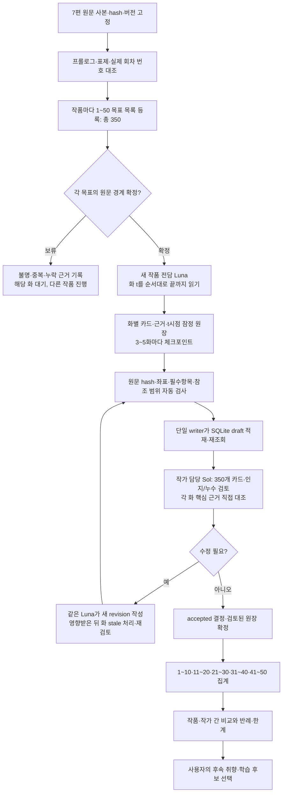
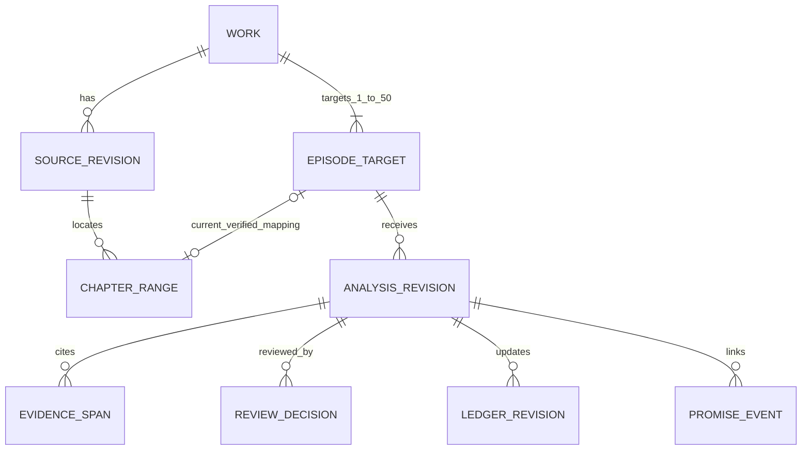

# 보유 7편 1–50화 회차별 분석·SQLite 적재 통합 계획

상태: **원문 코퍼스 적재 승인·실행, 1–50화 의미 분석은 미실행**. 2026-09-24. 사용자의 최신 요청에 따라 보유 7편의 실제 원문 전체를 [분석용 SQLite](../../data/analysis/novel-corpus.sqlite3)에 `TEXT`로 적재했다. 원본 BOM·CRLF·공백·끝 개행과 무번호/미확정 구간도 보존한다. 원문 적재·검증 기록은 [chapter-ingestion](../research/chapter-ingestion/README.md)을 따른다. 이 문서의 **7편 × 각 1–50화 = 목표 350개 독립 의미 분석 카드**는 후속 단계이며 아직 생성·검토·수락되지 않았다. 기존 [작품별 구조 지도·대표 표본 분석](../research/author-study/README.md)은 이 전수 작업을 대신하지 않는다. 방법 상세는 [회차 분석 초안](20260924-first-50-episode-analysis-method.md), 후속 분석 저장 설계는 [SQLite 계획](20260924-first-50-sqlite-storage.md)을 참고한다.

이번 SQLite는 **재사용할 소설 분석 코퍼스**다. 운영 공용 원역사·작품 캐논을 관리하는 [PostgreSQL + pgvector 목표 설계](../systems/README.md)를 바꾸지 않는다. 판매량·유료 전환·독자 반응 자료가 없는 원문만으로 상업적 성공 점수나 원인을 만들지 않는다. 초반의 약속·선택·보상·회차 연결이 어떻게 구성되는지 관찰하고, 효과는 해석/가설로 남긴다. 기존 7편·이전 문맥·파생 분석은 개발 자료이며 미관측 최종 test로 재분류하지 않는다. 이전의 사용자 취향 선택 질문은 이번 분석 코퍼스 구축의 선행 조건이 아니다.

## 전체 흐름

각 작품의 1화부터 50화까지 **본문을 각 화별로 읽고 독립 레코드 50개**를 만든다. 50화 전체 요약이나 기존 대표 표본으로 대체하지 않는다. 3–5화 묶음은 작업·적재·검토 체크포인트일 뿐, 5화 원문을 한꺼번에 읽힌 뒤 1화 시점 지식을 적는 입력 단위가 아니다. 화 `t`의 Luna 입력은 해당 화 원문과 `t−1`까지 근거가 연결된 잠정 원장으로 제한한다. 기존 후반/결말 분석을 Luna의 회차별 문맥에 넣지 않는다.

## 1. 350개 분모와 회차 경계

후속 의미 분석에서는 작품마다 `target_episode_no=1..50` 50개를 **목표 목록**으로 취급한다. 현재 원문 코퍼스의 `first_50_status`는 그 번호별 경계 대응을 조회하는 view이며 350개 분석 카드의 적재를 뜻하지 않는다. 파일 경로·Drive 출처 ID·원본 raw byte SHA-256·인코딩/BOM·개행 보존 규칙을 고정하고 표제 후보와 `[start,end)` 코드포인트 범위를 대조한다. 표제의 등장 순번, 파일명의 숫자, 플랫폼의 공식 회차 수를 혼동하지 않는다. 프롤로그가 `1화 프롤로그`이면 1화 한 건이고, 1화 앞의 독립 무번호 프롤로그는 근거가 나오기 전까지 별도 선행 자료다. 광고·후기·작가의 말도 회차 본문과 구별한다.

기존 보고서상 고종의 `【…】` 제목과 하위 구획, 고려의 `◈` 무번호 표제는 공식 1–50에 바로 대응하지 않는다. 콧수염의 중복·변형 표제도 확인이 필요하다. 순종·1588·공정무역·폴란드의 번호 표제는 유력한 출발점이지만 각 1–50의 시작·끝·중복을 검증한다. [작품별 경계 메모](20260924-first-50-episode-analysis-method.md#0-회차-경계와-분모를-먼저-고정)를 사용한다. 확인하지 못한 목표는 `boundary_hold`로 두고 필요한 외부 회차 목록 또는 다른 원문 판본을 특정한다. 해당 작품의 `50/50 완료`는 보류한다. 확정된 다른 작품의 작업은 계속할 수 있다.

집계는 **목표 등록 수 / 원문 경계 확정 수 / 전체 본문 읽음·draft 적재 수 / Sol 검토 수락 수**를 별도 분모로 보고한다. 350개 목표 행을 미리 만든 뒤에도 경계 불명 회차를 완료로 세지 않는다. 원문 revision이 바뀌면 이전 좌표를 새 원문에 재사용하지 않고 재경계·근거 검증을 한다.

## 2. 회차별 분석과 검토

모든 350화의 필수 적재는 회차 식별·읽은 전체 범위·원문 hash, 주요 사건과 시작/끝 상태, 인물의 욕망/제약/선택과 확인된 비용, 정보 공개와 인물별 인지, 설명·시점·대사/서술 방식, 도입의 질문·전환·보상·말미 미해결 및 앞 화의 약속 회수 여부, 핵심 주장별 원문 근거 범위, 관찰/해석/역구성 가정/미확인 구분, 누락·불확실성·검토 상태다. 항목이 없는 화에는 `없음`, 해당하지 않으면 `비해당`, 근거가 모자라면 `미확인`을 남긴다. 원문에 없는 선택·훅·판매 성과를 만들어 채우지 않는다. 본문 전체를 분석 카드에 복제하지 않고 근거 ID와 짧은 식별 문구만 둔다.

1–50의 인과·연속성 질의를 위해 각 화의 **시작 전 확인 상태, 실제 사건, 끝 상태와 열린 질문**은 카드와 잠정 누적 원장에 남긴다. 이것이 350화의 최소 역사·서사 재구성이다. 모든 화에 장면별 exact answer slice, 가상 역사표 선행 조건, Writer용 허용/금지 패킷까지 강제하지 않는다. 그런 깊은 [입력 역구성 계약](../research/writing-spec-v0-1/reverse-input-contract.md)은 사용자 취향과 학습 구간 선택 후 **선택 장면**에 적용한다. 원저자의 실제 기획 의도나 운영 승인 캐논으로 승격하지 않는다.

각 작품은 이번 라운드의 **새 Luna 한 명을 전담**시켜 1→50을 순서대로 처리한다. 기존 후반을 읽은 담당자의 기억이 지워졌다고 가정하지 않는다. 새 담당에게 기존 후반 보고서나 다른 작품의 미래 분석을 입력하지 않고, 필요한 회차 경계 메타데이터와 현재 화까지의 원문·근거 있는 원장만 제공한다. 기존 후반 분석은 Sol의 경계 점검·사후 비교에 분리한다. 루트는 배정·진행·완료 취합, Sol은 기존처럼 작가별 검토를 맡는다. 슬롯 4개에는 루트도 포함되므로 **분석 Luna 최대 3명**을 병렬로 두거나 **분석 Luna 2명 + Sol 1명**으로 교대한다. 7 Luna와 4 Sol을 동시에 실행하지 않는다.

Luna는 화마다 잠정 카드를 저장하고 3–5화마다 자동검사·draft 적재 체크포인트를 만든다. Sol은 **350개 카드 모두**의 사건/해석 분리, 주요 근거, 인지·회차 연결, 누수 여부와 수락 여부를 판단한다. 권장 검수에서는 **각 화의 핵심 상태 변화와 말미 연결 근거를 원문에서 최소 한 번 직접 대조**한다. 말미에 연결이 없다고 기록했으면 실제 끝부분의 근거도 확인한다. 이는 그 화의 원문 전체를 Sol이 재독했다는 뜻은 아니다. 전체 회차 재독은 각 작품 1·2·10·25·49·50화, 나머지의 사전 고정 무작위 표본, 경계·인지·큰 전환·수정 영향 화에 추가한다. 고정 회차와 무작위 대조는 오류 탐지용 운영 기본값이지 작품의 상업적 법칙이나 검수 보장이 아니다. 중요한 오류가 나오면 같은 묶음·인접 화와 그 상태에 의존한 후속 데이터까지 대조를 넓히고 새 revision을 검수한다. 전체를 재독하지 않은 카드의 잔여 해석 위험을 검토 기록에 남긴다.

처리량을 위해 자동검사를 통과한 **이전 묶음이 Sol 검토 중일 때 다음 묶음 하나까지** Luna가 잠정 진행할 수 있다. [분석 방법 초안](20260924-first-50-episode-analysis-method.md)은 묶음 수락 뒤 다음 묶음을 여는 보수적 운영을 적었지만, 통합 권장안은 한 묶음만 앞서 진행한다. 350번의 화별 검토 왕복을 피하면서 수정 영향의 범위를 한 묶음 안팎으로 제한하기 때문이다. 이때 잠정 원장은 `provisional`, Sol이 수락한 원장은 `accepted`로 분리해 표시한다. 선행 화의 사건·인지·약속이 바뀌면 해당 상태를 참조한 이후 화와 원장을 `stale`로 표시하고 같은 작품 담당 Luna 역할이 영향 시작 화부터 새 revision으로 재검토한다. 재작업은 그 역할의 **독립 문맥 새 호출**에 해당 화까지의 원문과 수정된 원장만 전달하며, 뒤 화를 본 이전 대화의 기억을 지웠다고 가정하지 않는다. 경계·원문 버전 오류처럼 범위가 큰 실패는 다음 묶음 진행을 멈춘다. 이미 수락된 카드도 영향을 받으면 재검토 대상으로 돌리되 과거 revision·판정은 남긴다.

## 3. SQLite 구조와 적재 흐름

**현재 원문 코퍼스는 원문 전체를 SQLite `segments.body`의 `TEXT`로 보존한다.** 각 구간은 순서·코드포인트 범위·개별 hash를 갖고, 결합한 텍스트를 UTF-8로 다시 인코딩하면 보관 사본의 raw byte SHA-256과 같아야 한다. [원문 manifest](../references/manifest.json)의 상대경로·Drive ID·원본 hash도 source revision에 기록한다. 보관 사본은 대조·복구용으로 별도 유지한다. 아래 ER 그림과 JSONL 적재 절차는 **후속 350개 의미 분석을 위한 제안 관계**이며 현재 `novel-corpus.sqlite3`의 물리 스키마나 구현 완료 상태를 나타내지 않는다.

이는 후속 의미 분석에 필요한 조회 단위의 **논리 관계**다. 현재 원문 DB에는 `works`, `source_revisions`, `segmentations`, `segments`와 `first_50_status` view가 있고, 아래의 `ANALYSIS_REVISION`·`EVIDENCE_SPAN`·`REVIEW_DECISION`은 아직 없다. 제안된 `EPISODE_TARGET` 350행은 미발견 화도 보존하고, `CHAPTER_RANGE`는 원문에 실제로 나타난 표제·범위를 보존한다. 그림의 1:1은 **현재 선택한 원문 revision 안에서 확정된 대응**만 뜻한다. 원문 revision이 바뀌면 같은 목표에 과거·현재 범위가 여러 개 존재할 수 있으므로 과거 범위와 대응 판정 이력을 보존하고, 충돌 후보는 확정 대응으로 세지 않는다. `ANALYSIS_REVISION`은 회차별 카드와 source/schema/prompt/model/run 버전, 상태, 입력 hash를 가진다. `EVIDENCE_SPAN`은 주요 주장 ID·관찰/해석/가정 구분·같은 원문 revision의 범위에 연결한다. 약속/회수는 도입·유예·회수 사건을 화와 근거에 연결해 조회한다. `REVIEW_DECISION`의 수락과 분석 revision의 accepted 상태는 **단일 writer 트랜잭션에서 함께** 갱신하는 방안을 제안한다. 상세 후속 물리 테이블·SQL은 [저장 계획](20260924-first-50-sqlite-storage.md)에서 정한다.

작품별 Luna는 SQLite에 직접 동시 쓰지 않고 회차별 JSONL draft와 manifest를 낸다. 단일 writer가 원문 hash·범위·근거·필수 항목·중복 import key를 자동 검사해 draft로 직렬 적재하고 재조회한다. Sol 판정 후 accepted로 전이한다. 같은 JSONL 재실행은 행 수·ID·관계를 바꾸지 않고, 수정본은 예전 기록을 덮어쓰지 않는 새 revision이다. 실패 묶음은 transaction rollback하고 실패 이유와 재개 지점을 남긴다. 백업은 SQLite 일관된 스냅샷과 원문 사본·manifest·schema/export 버전을 함께 묶고, 다른 경로 복원 후 hash·무결성·FK·대표 질의를 검증한다. 구조화된 조회로 미완·보류·수정, 인물/화별 사건, 근거, 약속/회수를 확인할 수 있어야 한다.

## 4. 구간 비교·완료 조건·처리량 추정

작품별 1–10, 11–20, 21–30, 31–40, 41–50의 **사후 집계**와 작품 간 비교는 accepted 회차 카드·근거를 가리키는 파생 결과다. 앞 화의 `t`시점 카드에 50화까지 안 사실을 소급하지 않는다. 집계가 원문 350화의 개별 분석을 대체하지 않는다. 작품 내 반복과 반례를 나누고, 보유작이 한 편인 작가의 공통 작법은 확정하지 않는다.

완료는 **목표 350/350 등록, 경계 350/350 확정, 본문 전체 읽음 350/350, 필수 카드·근거 draft 적재와 재조회 350/350, Sol 판정 accepted 350/350, stale/hold/실패 0건**을 각각 확인한 뒤에만 선언한다. 원문 직접 대조 표본·위험 화·수정 이력과 5개 구간/작품 간 집계의 근거도 기록한다. 경계가 불명인 작품은 미완 수와 이유를 그대로 보여 준다.

실행 시간이나 토큰 총량을 지금 약속하지 않는다. 경계가 확정된 작품마다 **처음 연속 3–5화 묶음**을 실제로 처리·검수해 화당 독해, 카드 작성, 자동검사, Sol 대조·수정, DB 적재 비용을 측정한다. 이 묶음은 별도 파일럿으로 버리지 않고 해당 작품의 350개 목표에 포함한다. 작품 형식과 오류율 차이를 반영해 남은 양을 다시 추정하고, 사용자에게 실측과 남은 조건을 제시한다. 일곱 작품의 1–50 목표 자체는 축소하지 않는다.
