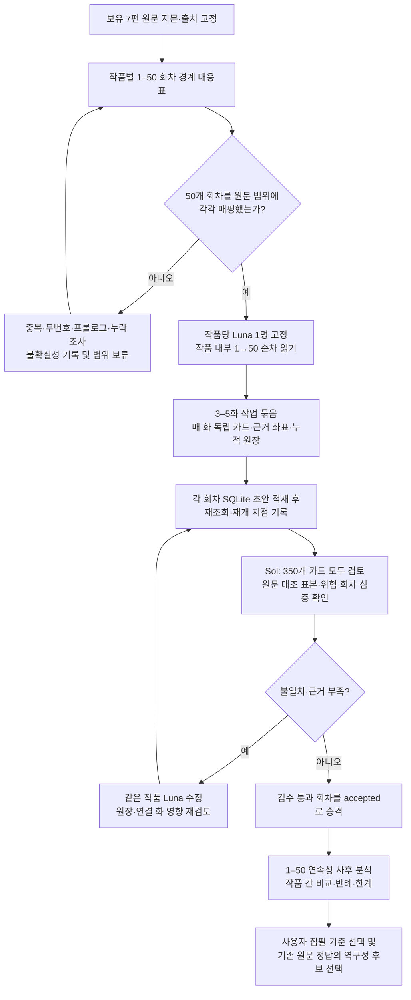

# 보유 7편의 1–50화 전수 분석·SQLite 적재 방법 — 실행 전 계획

기준일: 2026-09-24. **계획만 승인 대상으로 제시한다. 이 문서는 원문 1–50화 분석, DB 생성·적재, 코드 구현의 완료 기록이 아니다.** 사용자가 초반 50화를 상업성 판단의 핵심 구간으로 정했다. 이는 분석 대상 선정 전제이며, 원문만으로 “50화에 성공이 결정된다”는 인과를 입증하지 않는다. 판매·독자 반응 자료가 없다면 상업 성과는 `미확인`으로 둔다. 현재 [작가별 연구](../research/author-study/README.md)는 구조 지도와 대표 표본 7편이지 350화 전수 분석이 아니다.

## 사용자에게 보여줄 실행 흐름

**목표 단위는 작품마다 실제 1화, 2화, …, 50화의 독립 결과 50개, 총 350개다.** 3–5화를 한 번에 읽어도 각 화의 본문 전부를 읽고 별도 카드·상태·근거·검수 판정을 저장한다. 50화 요약 한 장이나 대표 장면 표본은 완료 조건이 아니다. 경계가 확인되지 않아 50개를 정직하게 만들 수 없으면 그 작품은 `경계 보류`로 남기고 부족한 회차를 채운 척하지 않는다. 여러 작품은 병렬로 진행하되 **이번 라운드는 작품별 새 Luna 한 명이 한 작품을 끝까지 담당**하고 그 작품 내부에서는 순서대로 읽는다. 앞선 표본 분석 담당자는 후반·결말을 이미 읽었으므로 이 순차 읽기의 t시점 작성자로 재사용하지 않는 안을 권장한다. 동시 작업 수는 실행 슬롯에 맞춘다.

## 0. 회차 경계와 분모를 먼저 고정

작품별 보관 원문에 대해 원본 파일 경로·Drive ID·raw byte SHA-256·인코딩·BOM·줄바꿈을 기록한다. 파일 내 표제 후보를 전수 인덱싱하되 정규식 결과를 공식 회차로 곧바로 승격하지 않는다. 작품별 대응표의 한 행에는 `episode_no 1..50`, 원문 `[start,end)`와 단위, 파일 표제 원형, 공식 플랫폼 회차 대응 근거, 직전/다음 경계, `확정/추정/충돌/미확인`, 판정 이유와 검수자를 둔다. 시작·끝의 실제 문장 경계와 중복·누락 여부를 사람이 확인한 뒤 분석에 넘긴다.

**프롤로그 정책:** 원문이 `1화 프롤로그`라고 표시하면 **1화 한 건**으로 센다. `1화` 앞에 별도의 무번호 프롤로그가 있으면 선행 문맥·별도 부록으로 보존하고, 공식 연재 회차에 해당한다는 근거가 없는 한 1–50의 50건에 끼워 넣지 않는다. 공식 플랫폼에서 프롤로그를 별도 회차로 세는 경우에는 그 대응을 명시해 1–50 목록을 다시 확정한다. 하나의 원문 구간을 프롤로그와 1화에 중복 배정하거나 무번호 문단으로 50화를 채우지 않는다. 작가의 말·후기·광고성 문구도 본문 경계와 구별한다.

| 작품 | 현재 알려진 경계 정보 | 1–50 선행 조치 |
|---|---|---|
| 리첼렌 《폭군 고종대왕 일대기》 | [기존 보고서](../research/author-study/richerlen/works/gogjong.md)는 `【…】` 제목 경계 513개와 숫자 하위 구획을 확인했으나, 이를 공식 회차와 일대일로 보지 않았다. `【프롤로그】`도 있다. | 1–50 플랫폼/원문 대응 근거를 별도 확보해 제목·하위 구획을 매핑한다. 근거가 없으면 제목 순번을 ‘화’로 창작하지 않고 경계 보류. |
| 리첼렌 《성군 순종대왕 일대기》 | [기존 보고서](../research/author-study/richerlen/works/sunjong.md)는 원문 1–155화의 연속 표제를 확인했다. | 1–50의 시작·끝과 1화 내 프롤로그 여부를 직접 검증한다. 155화 이후 무표제 구간 문제는 이번 1–50 대응을 대신하지 않는다. |
| 리첼렌 《초대 콧수염 대마왕이 되었다》 | [기존 보고서](../research/author-study/richerlen/works/mustache.md)는 정규 `N편` 표제 1–55, 41편 중복, 45·47편의 변형 표기를 확인했다. | 41편 두 표제의 실제 소속과 45·47편 변형을 원문 경계·가능한 플랫폼 대응으로 확인한다. 중복 표제를 두 화로 세지 않는다. |
| 간다왼쪽 《1588 샤인머스캣으로 귀농 왔더니 신대륙》 | [기존 보고서](../research/author-study/ganda-left/works/1588.md)의 탐지 범위 1–661에서 1–50 표제는 연속으로 나타나며 1화 제목이 프롤로그다. | 1–50 본문 끝 경계와 번호 중복·본문 내부 가짜 표제 여부를 확인한다. 1화 프롤로그는 1건이다. |
| 명원 《대영제국 선비의 공정무역》 | [기존 보고서](../research/author-study/myeongwon/works/fair-trade.md)는 `1화 프롤로그`부터 시작하고 전체 파일에 144 누락·중복 번호를 기록했다. | 1–50 내부는 별도 경계 검증을 한다. 전체 파일의 뒤쪽 문제를 초기 50화의 결손으로 확대하지 않는다. 1화 프롤로그는 1건이다. |
| 마늘맛스낵 《고려, 신대륙에 떨어지다》 | [기존 보고서](../research/author-study/garlic-snack/works/goryeo.md)는 앞부분 `◈` 무번호 표제와 뒤쪽 숫자 표제를 확인했고 `◈` 순번을 공식 화 번호로 보지 않았다. | 첫 50개의 **공식 회차**와 `◈` 구간의 대응 근거가 필요하다. 공식 1–50을 확인할 수 없으면 무번호 표제 순번 1–50을 분석해도 별도 `섹션` 자료일 뿐 50화 완료로 세지 않는다. |
| 마늘맛스낵 《폴란드 여왕 키우기》 | [기존 보고서](../research/author-study/garlic-snack/works/poland.md)는 1–520의 연속 번호 표제를 확인했다. | 1–50의 시작·끝과 첫 장면의 서문/제목 소속을 직접 검증한다. |

경계 조사에 필요한 외부 공식 회차 목록이나 파일 판본이 없으면 `미확인`으로 보고하고 사용자에게 필요한 자료를 특정한다. 한 작품의 난점 때문에 **다른 작품의 확인된 1–50 분석을 멈출 필요는 없지만**, 전체 `350/350 완료` 표시는 모든 경계가 해결된 뒤에만 한다.

## 1. 한 화 카드: 사실, 해석, 가정을 분리

각 화를 끝까지 읽고 아래 항목을 **회차별 독립 레코드**로 만든다. 없거나 해당하지 않는 항목은 `없음/비해당/미확인` 중 하나로 표시하고, 없는 선택·대가·훅을 꾸며내지 않는다. 모든 주요 주장은 `근거 ID → 원문 파일 hash + [start,end) + 물리 줄`에 연결한다. 좌표 단위는 작품 원문의 decoding 규칙과 함께 고정하며 본문 전체를 카드에 복제하지 않는다. 짧은 식별 인용은 대조용으로만 둔다.

| 층 | 회차마다 남길 내용 |
|---|---|
| 식별·경계 | 작품 ID, 원문 버전·hash, 공식/파일 표제, 1–50 번호, 경계 상태, 전체 원문 좌표, 읽은 범위와 완료 시각, 이전·다음 화 연결 ID. |
| 관찰된 사건·상태 | 실제로 벌어진 사건을 시간순으로, 사건 전·후 인물/관계/제도/자원의 상태 변화와 아직 결과가 아닌 계획·위협을 분리. 장면 안에서 해결된 것과 미해결을 구별. |
| 인물의 동력 | 인물별 욕망·두려움·제약·대안, 실제 선택자와 선택, 즉시 확인된 이익·대가·피해, 예고된 위험. 동기가 추론이면 해석으로 표시. |
| 정보·인지 | 사실 발생 시점, **이 화에서 독자에게 공개된 시점**, 인물별 인지·믿음/오해·획득 경로를 분리. 화자가 암시만 했으면 확정 사실로 적지 않음. |
| 설명·표현 | 역사·기술·제도 정보의 역할과 출처, 해설/행동/문답/현장/요약 방식, 시점 인물·전환, 대사·내면·서술의 배치, 문장·문단 리듬과 톤의 구체적 근거. 길이 비율이나 ‘문체 점수’를 근거 없이 만들지 않음. |
| 연재 구성 | 도입에서 제기한 독자 약속/질문, 이번 화의 갈등·전환·보상, 화 말미가 닫은 것/남긴 것, **앞 화에서 남긴 약속의 회수·변형·유예**와 새 미해결 질문. 연결 근거는 양쪽 화 좌표로 기록. |
| 판정 상태 | 각 주장에 `관찰`, `해석`, `역구성 가정`, `미확인`을 부여. 반례·다른 가능한 독해·범위 한계, 검토자와 수정 이력. 실제 판매·조회·독자 반응은 별도 출처가 없으면 `미확인`. |

`관찰`은 원문 구간에서 직접 확인한 말·행동·서술이고, `해석`은 그 배치의 기능 추정이며, `역구성 가정`은 원저자의 실제 설계 의도가 아니라 학습·집필 입력을 가정해 본 후보이다. 장면 뒤에서 밝혀진 사실로 이전 화의 `t시점` 인지·열린 질문을 사후 변경하지 않는다. 필요하면 별도 사후 주석과 revision으로 연결한다. ‘재미있다’, ‘독자를 붙잡는다’, ‘상업성 높음’은 실제 반응 측정 없이 사실 필드에 넣지 않는다.

## 2. 누적 원장과 t시점/사후 시야

Luna는 **새 작업 문맥**에서 작품 내부 1→50 순서로 읽는다. 읽기 입력에는 원본의 해당 화까지와 그 전까지 근거가 연결된 누적 원장만 넣는다. 기존 작가 프로필·작품별 후반 표본·결말 요약은 Luna 입력으로 넘기지 않고, 원본 지문·표제 경계 같은 메타데이터만 별도 제공한다. 기존 분석 내용은 Sol의 경계 점검·사후 비교에서 사용한다. 각 3–5화 묶음의 시작에는 앞선 묶음에서 **Sol 검수로 확정된 누적 원장**을 로드한다. 원장에는 현재까지 확인한 인물·관계·제도·자원 상태, 약속·미해결 질문, 독자 공개·인물별 인지, 작품 내 역사 사건과 불확실성, 마지막 처리 화·원본 hash·revision을 둔다. 모델 대화 문맥의 기억을 원장 대신 신뢰하지 않는다. 묶음 안에서는 각 화의 **근거를 붙인 임시 원장**을 사용하되 **t화 카드와 원장 갱신을 저장·재조회해 동결한 뒤 t+1화 본문을 연다.** 한 번에 3–5화의 뒤쪽 본문을 Luna에게 먼저 보여주거나 묶음 전체를 요약한 뒤 과거 카드로 되돌리지 않는다. 묶음 끝에서 Sol이 카드·원장을 검수하여 확정하고 다음 묶음을 연다. 앞 화가 수정되면 그 뒤의 임시 카드·원장은 영향 검토 후 재검수한다. 실패하면 마지막 확정 화부터 재개하고, 중복 적재는 작품+회차+원문 버전+분석 revision으로 감지한다.

`t시점 카드`는 t화 끝까지 읽은 독자·인물의 정보와 그때 남은 질문으로 동결한다. `1–50 사후 분석`은 50화까지 모두 읽은 뒤 따로 생성하여 어떤 약속이 후속 화에서 회수·유예·폐기되었는지, 초반의 전환·보상·설명·시점 방식이 어떻게 변했는지 비교한다. 사후 분석은 화 카드 ID와 원문 근거로 돌아갈 수 있어야 한다. 50화 **뒤의 원문 정보는 이 프로젝트의 t시점 카드·원장·1–50 사후 분석 모두에서 금지**한다. 앞선 기존 작품별 연구가 후반 내용을 알고 있더라도 이번 Luna 분석 입력에 섞지 않는다. Sol은 기존 후반 분석을 이미 알 수 있으므로 t시점 카드 검수에서는 근거 범위를 t화 이하로 제한하고 미래 정보를 발견하면 카드에 소급하지 말고 오류로 돌려보낸다. 1–50 전체를 읽고 안 결과도 t화 카드의 인물 지식으로 소급하지 않는다.

## 3. 연속 50화의 역구성 범위

이번 전수 적재에서 **필수**로 권장하는 역구성은 화 단위의 **간결한 사건 계약**이다. 각 화에 대해 시작 전 상태·직전 문맥 요약, 이번 화의 실제 사건 중 계획 사건으로 지정할 후보, 주요 인물의 시작 시점 인지, 독자에게 새로 공개할 핵심 정보, 실현된 결과, 말미의 열린 상태를 **사건 수준**으로 기록하고 실제 원문 카드·좌표와 분리한다. 선택·대가·갈등이 없는 화는 해당 칸을 `비해당`으로 두며, 모든 인물의 세부 지식표나 모든 장면의 완전한 명세를 요구하지 않는다. 이 화 단위 레이어까지 350건을 필수로 권장하는 이유는 연속 50화의 이전 상태→원문 정답→다음 상태를 질의하고, 후속에 장면 학습 후보를 고를 수 있게 하기 위해서다. 이것은 **분석 완료 조건의 제안**이지 사용자의 학습용 패킷 350건 승인으로 보지 않는다. 원저자의 실제 기획표나 승인된 작품 캐논도 아니다. 원문 정답 구간 뒤의 표현·결과가 이전 문맥이나 인물 지식으로 새지 않도록 [기존 원문 정답 입력 계약](../research/writing-spec-v0-1/reverse-input-contract.md)의 검토 레코드/Writer 입력 경계를 따른다. `필수 사건`은 해당 화 범위 안에서 확인된 결과만 지정하고, 그 밖의 원문 문장·대사·비유를 지시하지 않는다.

**모든 장면의 세밀한 패킷을 350화 적재의 필수 조건으로 두지 않는다.** 화 경계 안의 장면 분할·좌표와 주요 장면 기능은 남기되, 이전 문맥의 정확한 절단, 가상 역사표의 선행 조건·인지 경로, 장면별 허용/금지·정답 exact slice를 갖춘 완전한 Writer 패킷은 사용자 취향 선택과 학습 구간 선정 후 **선택 장면**에 만든다. 이미 검수한 [1588 개발 파일럿](../research/writing-spec-v0-1/pilot-1588/source-audit.md)은 한 장면 계약 검사이지 50화 전수 패킷의 양식 강제가 아니다. 학습용 예시·문체 reference 생성 전에 개발 풀의 split·겹침 정책을 고정하고, 분석한 7편은 미관측 최종 test로 표시하지 않는다.

## 4. 적재·검수·완료 판정

SQLite는 이번 **분석용 로컬 저장소**로 계획한다. 아직 DB 파일이나 테이블을 만들지 않는다. 구현 때의 최소 논리 단위는 `source_file`, `episode_map`, `episode_card`, `evidence_span`, `claim`, `state_ledger`, `promise_link`, `reverse_episode_input`, `review_decision`, `revision_log`다. 같은 주장·좌표를 반복 보고서에 복사하지 않고 ID로 연결해 작품·인물·회차·미해결 질문·설명 방식별 후속 질의를 가능하게 한다. 원문 전체는 원본 보관 경로에 두고 SQLite에는 hash와 범위·짧은 식별 인용을 저장한다. 각 화 적재 뒤 읽기 재조회와 근거 범위 검사를 수행한다. **Luna의 적재 상태는 `draft`이고 Sol의 판정과 수정 반영 뒤에만 `accepted`로 승격한다.** 실패·보류는 이유를 남기며 `accepted` 수에 넣지 않는다. 수정은 덮어쓰지 않고 revision·이유·영향을 남긴다. 매 3–5화 묶음 완료 시 작품의 원장 revision과 다음 시작 화를 체크포인트로 기록한다.

**Sol 검수의 공통 필수선:** 350개 카드 모두를 읽어 경계 상태, 사건과 추론의 분리, 주요 주장→원문 근거 연결, t시점 인지·공개, 앞 화 약속 회수, 역구성 입력의 정답 누수를 판정한다. 모든 350화의 원문·좌표·hash·비중첩은 기계 검증한다. Sol의 직접 원문 대조 범위는 실행 자원에 따라 아래 둘 중 고른다. 두 수준 모두 Luna가 **원문 350화 전부를 읽는 것**과 Sol의 **350개 카드 전부 검토**는 같다.

| Sol 원문 대조 수준 | 직접 원문 대조 | 장점·한계 |
|---|---|---|
| **기본안(권장)** | 각 작품 1·2·10·25·49·50화(42화) 전체를 직접 읽고, 나머지 308화 중 사전에 정한 무작위 약 10%(약 31화) 및 경계 불명·논쟁적 인지·큰 역사 전환·반례·수정 영향 화를 추가 대조한다. 나머지 카드는 연결된 짧은 근거와 주장, 자동 좌표 검사로 검토한다. | 약 73화+위험 화 전면 대조로 도입·중간·50화 말미와 예외를 확인한다. 모든 문장의 독립 재독은 아니므로 미표본 해석 오류의 잔여 위험을 기록한다. |
| **강화안** | 각 작품 1–5·46–50화(70화)를 직접 읽고, 나머지 280화 중 무작위 약 20%(약 56화) 및 위험 화를 추가 대조한다. | 약 126화+위험 화 전면 대조로 초반 진입과 50화 전환을 더 촘촘히 확인하지만 Sol 비용이 커진다. |

무작위 대조 목록은 카드 검수 전에 seed와 함께 고정한다. 자동 검사는 의미 판단을 대체하지 않는다. 직접 원문 대조에서 핵심 사건·선택·인지·회차 연결 오류가 나오면 같은 작품의 인접 화와 같은 묶음으로 범위를 넓히고 수정 후 재검수한다. 모든 Sol 검토에서 반복적으로 오류가 발견되면 강화안으로 올리거나 해당 작품 전수 대조를 권고한다. 루트는 배정·완료 확인만, 작품 담당 Luna는 수정도 이어서 맡는다.

완료 표시는 작품별 `50/50 경계 확정 + 50/50 원문 전체 읽음 + 50/50 독립 카드·화 단위 역구성 적재·재조회 + Sol 50/50 카드 판정 + 원문 대조 수준·미해결 오류 기록`을 만족해야 한다. 일곱 작품 모두 이 조건을 충족할 때만 `350/350`이다. 그 다음 산출물은 1–50 연속성 사후 비교와 사용자 취향 선택을 돕는 근거표다. 성과 데이터가 없으면 “독자를 붙잡을 것”은 검증 가설로만 남긴다.
