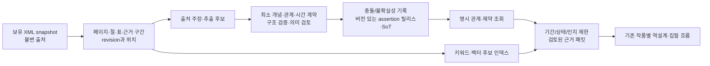

# 역사 SoT·온톨로지·검색 방식 조사 계획

- 기준일: 2026-09-24
- 상태: **조사 계획 독립 검토 수락. 문헌 검토의 결정, 덤프 검증, 파일럿 실험, 구축은 미착수.** [검토 기록](../research/20260924-history-sot-ontology-plan-review.md)
- 상위 기준: [핵심 시스템 설계](../systems/README.md). 기존 [영어 위키백과·Granite 지식 구축 계획](20260914-enwiki-granite-knowledge-ingestion-plan-v0-1.md)의 **조사 단계 보완**이다. 운영 저장 목표는 중앙 PostgreSQL + pgvector이며 아직 구현되지 않았다. 이 문서가 K0–K4의 실행 완료나 저장 기술 변경을 선언하지 않는다.
- 사전 자료: [공식 출처와 로컬 관찰 지도](../research/20260924-history-sot-ontology-source-map.md). 여기의 기술 요약은 채택 결정이나 벤치마크가 아니다.

## 출발점과 조사 경계

사용자는 `wiki-dump/`의 이미지·영상 없는 텍스트 기반 XML bzip2 파일 **19개, 합계 약 43 GiB(46.4 GB)**의 다운로드가 끝났다고 확인했다. 로컬 메타데이터 재집계도 19개·46,445,603,916 bytes(43.26 GiB)로 일치한다. 사용자 확인 및 로컬 목록/총량 일치와, 공식 배포 manifest 대조·개별 SHA-256·압축/파싱 무결성은 서로 다른 상태다. 이 계획에는 다운로드 단계가 없다. 이번 작성 작업은 덤프 본문을 읽거나 전체 hash를 계산하지 않는다.

연구의 목적은 “위키백과 덤프를 역사 SoT로 쓰려면 온톨로지 전체 구축 뒤 벡터 검색을 해야 하는가”에 대한 **근거 있는 설계 결정과 작은 실험 설계**를 만드는 것이다. 원시 위키백과 snapshot은 불변 **출처층**이다. 프로젝트의 원역사 SoT는 출처와 검토 상태가 추적되고 특정 범위·버전으로 릴리스된 **assertion 집합**을 목표로 한다. 좁은 온톨로지와 제약은 그 주장을 일관되게 표현·검증하는 계약이다. 키워드·벡터 인덱스는 snapshot, assertion과 설정에서 재생성하는 **검색 파생물**이다. 모든 주장을 사람이 전수 승인하는 절차는 전제하지 않는다. 검토 릴리스도 위키백과 주장의 무오류를 뜻하지 않는다. 작품별 창작·승인 역사표·공개 정사는 별도 지위이며 공용 원역사를 수정하지 않는다.

## 조사 질문과 대표 질의

| 질문 | 대표 질의 또는 실패 사례 | 결정에 필요한 증거 |
|---|---|---|
| 무엇을 원역사 SoT로 릴리스할 것인가? | “1453년에 어느 국가가 콘스탄티노폴리스를 점령했는가?”라는 주장과 상충 출처를 어떻게 반환하는가 | source snapshot·page/revision·절과 원문 span·주장 유형·검토 방법/상태·릴리스 ID를 잇는 최소 계약, 충돌/철회 규칙 |
| 어떤 시간과 범위가 필요한가? | “1520년대 장면에서 이전에 태어난 인물이 실제 활동했는가?”, “그 지역에 기술이 보급됐는가?” | 사건 발생, 상태 유효, 인물 활동/직위, 기술 발견·전파·보급, 출처 작성/편집, 인물 인지 시점의 구분; 미상·범위·불확실 날짜 처리 |
| 인과와 조건을 어떻게 다룰 것인가? | “인쇄술이 이 사건을 가능하게 했다는 근거가 있는가?” | 출처의 명시적 인과 주장과 모델의 필요/가능/방해 조건 추론 구분; 단순 선후·링크·유사도는 인과 증명이 아님 |
| 최소 모델로 충분한가? | 이름이 같은 두 인물, redirect/별칭/QID가 다른 동일 사건을 구별할 수 있는가 | event/entity/상태/기술/관계/assertion/source의 최소 식별·provenance·검토·제약과 재사용 표준의 적합성 |
| 관계 구축이 검색보다 먼저 필요한가? | “기간 내 베네치아의 조선 역량에 관계된 인물·자원·선행 사건” | 키워드, 시간 필터+벡터, hybrid, 명시 관계+hybrid가 근거 회수·비용에서 얻는 이득과 빠뜨리는 정보 |
| 기획 지식이 장면에 누수되지 않는가? | 현대 문서의 과학 원리와 작품 기간 안의 미래 사건이 1500년 인물의 지식으로 들어가는가 | 기획자 조회와 인물 인지 조회의 별도 계약; 현대 출처의 작성일만으로 과학 원리를 배제하지 않는 규칙 |

`1453–1600`은 사용자가 든 **예시**다. 실제 파일럿 작품·기간·지역·주제와 필요한 선행 배경은 연구 중 명시적으로 고른다. 문서 대표 연도 하나로 문서 전체를 걸러서는 안 된다. 범위 밖 배경이 필요하면 대상·기간·이유를 기록하고 검토 범위를 넓히는 절차를 설계한다. 원문에 없거나 아직 검토하지 않은 사실을 역사적 부재로 판정하지 않는다.

## 조사 순서와 종료 조건

아래 **R0–R3는 문헌·설계 조사**, R4는 **실험 프로토콜 작성**, R5는 **조사 결과의 선택 기록**이다. 원문 압축 해제·대량 파싱·DB 쓰기·모델 호출·임베딩·벤치마크는 이 조사 계획의 실행 항목이 아니다. 별도 승인된 K 파일럿에서 시행한다.

| 단계 | 확인할 일과 근거 | 남길 산출물·다음 단계 조건 |
|---|---|---|
| **R0 보유 snapshot 확인 방법** | 사용자 제공 19개와 현행 파일 목록, 날짜·namespace·range·`SHA256SUMS`·공식 배포 파일 목록을 대조할 절차를 정한다. `current`와 `history`, XML 콘텐츠 형식, 이미지 제외 범위, redirect/별칭/QID용 보조 자료의 유무와 날짜 차이를 확인할 항목을 정한다. Wikimedia export 안내·Parsoid 문서를 기준으로 parser 표본의 절/표/링크/각주/span 보존 검사도 설계한다. | 입력 manifest 양식, 누락·중복·범위 판정, 전체 hash·압축 검사와 표본 파싱 명령/합격 조건을 **후속 실행용으로 명세**. 실제 검증 전에는 전체 coverage·무결성을 확정하지 않음. |
| **R1 사용 질문·범위** | 역설계·Backfilling·정방향 영향 검토·장면용 근거 패킷 각각의 competency question을 고르고, 작품 기간/지역/주제/선행 배경과 인물 인지 제한을 구분한다. 기존 K 계획의 영어·한국어 질의, 무응답 사례를 이어받는다. | 질문 유형표와 대표 질의, 필요한 반환 근거·권한·시간 필터, 범위 확장 조건. 선정된 파일럿 범위는 사용자 예시와 구별. |
| **R2 최소 역사모델과 릴리스 계약** | 사건·인물/기관·장소·상태·기술/원리·조건·관계의 최소 표현과 assertion 단위를 비교한다. page ID/revision/span·hash·URL, 추출 방법, 출처 주장/모델 해석/교정, 검토 상태·충돌·철회·릴리스 기준을 정한다. 프로그램 구조 검증, SOTA/Sol 의미 검토, 사람 상향의 대상·기준을 조사한다. CIDOC CRM의 사건 관점, Wikidata statement/qualifier/reference·QID, PROV-O, RDF/OWL와 SHACL은 **필요한 부분만 재사용 후보**로 비교한다. | 최소 개념/관계·시간·provenance·검토/릴리스 계약 초안과 보류점. 그래프 DB, 전면 RDF/OWL, CIDOC CRM 전체 채택은 결정하지 않은 선택지로 둠. |
| **R3 검색 방식 비교 설계** | 같은 출처 구간·동일 질문·동일한 기간/상태/인지/릴리스 필수 필터 아래 ①키워드 ②필터+벡터 ③키워드+벡터 hybrid ④명시 관계+hybrid를 비교할 조회·반환 계약을 쓴다. PG full-text/관계 테이블/pgvector의 정확·근사 검색, 필터 선택도와 반환 부족을 조사한다. 벡터는 ontology가 끝나기 전에도 provenance가 있는 원문 절/chunk에 대해 **후보 검색** 가능성을 검토한다. | 각 방식의 필수 입력·우회 불가 필터·출처 반환·예상 비용/실패 조건. 온톨로지 전체 완성이 벡터 검색의 선행조건인지 여부에 대한 검증 가능한 가설. |
| **R4 소규모 공정 실험 설계** | 같은 고정 corpus/snapshot·chunk·질문에서 네 방식을 평가하도록 query와 독립 확인한 **표본 gold 근거 span**을 설계한다. 영어→영어·한국어→영어, 동명이인, 다른 시대의 같은 기술, 모호/무응답/충돌, 범위 밖 필수 배경, 현대 과학 원리, 미래 지식 누수를 포함한다. 튜닝/최종 확인 질문을 분리하고 corpus 내 gold 존재를 확인할 방법을 정한다. | Recall@K·근거 span 일치·출처 추적/검토 상태·시간 필터 누수/반환 부족·지연·색인/추출 비용을 측정할 프로토콜, 예산 상한·중단 조건·합격 기준을 정할 책임자. **실험 데이터 구축·실측은 후속 K 파일럿**. |
| **R5 조사 결론·ADR** | R0–R4 문헌과 설계안을 Sol이 통합 검토하고 대안별 장단점·미결정·파일럿 가설을 ADR에 남긴다. Astra가 선택이 필요한 항목과 실행 권한을 사용자에게 제시한다. | 원역사 SoT 최소 계약, 우선 검색 방식/비교군, 파일럿 범위·비용·완료 기준, 별도 구현 계획. 출처·반론·미확정 사항이 연결되고 기존 K 단계와의 대응이 명시되면 **조사 종료**. 파일럿 결과가 없으면 성능·최종 ontology·최종 모델 선택은 미결정으로 남김. |

R0의 실제 checksum/파싱, R4의 corpus 구축과 측정, K1–K4의 임베딩·DB 구현은 모두 **후속 실행**이다. 문헌상 선택이 불가능한 쟁점은 실험 질문으로 넘기고 수치나 합격 여부를 예측해 확정하지 않는다. 검색 후보는 출처 구간과 검토 상태를 보여 주되, 집필 패킷에는 해당 작품의 검토 완료 범위와 원역사 릴리스, 시간·인지 필터를 통과한 근거만 들어가게 설계한다.

## 출처와 역할

공식 근거는 [Wikimedia Content File Exports](https://wikitech.wikimedia.org/wiki/MediaWiki_Content_File_Exports), [MediaWiki Parsoid API](https://www.mediawiki.org/wiki/Parsoid/API), [Wikidata data model](https://www.wikidata.org/wiki/Help:Data_model), [CIDOC CRM](https://cidoc-crm.org/sites/default/files/Documents/cidoc_crm_version_7.1.3.html), [W3C PROV-O](https://www.w3.org/TR/prov-o/), [W3C SHACL](https://www.w3.org/TR/shacl/), [pgvector README](https://github.com/pgvector/pgvector)에서 시작한다. 라이선스·재배포·외부 모델 전송은 [Wikimedia 이용 조건](https://dumps.wikimedia.org/legal.html)과 실제 자료 유형을 확인한다. 표준 문서의 존재는 이 프로젝트에 대한 채택 근거가 아니다. 출처별 확인 범위는 [사전 출처 지도](../research/20260924-history-sot-ontology-source-map.md)에 있다.

Sol 설계 담당은 R1–R5의 계약·대안·ADR을 작성한다. 다른 Sol이 출처 연결, 질문의 충분성, 릴리스·검색 경계를 독립 검토한다. Luna는 R0 파일 목록/공식 문서의 좁은 항목 점검과 R4 질문·gold span의 기계적 대조를 맡는다. Astra는 범위·권한·슬롯·파일 소유를 배정하고 미결정 선택을 취합한다. 같은 파일을 동시에 편집하지 않고 실제 실험이나 역사표 승인 여부는 이 조사 계획만으로 바뀌지 않는다.
