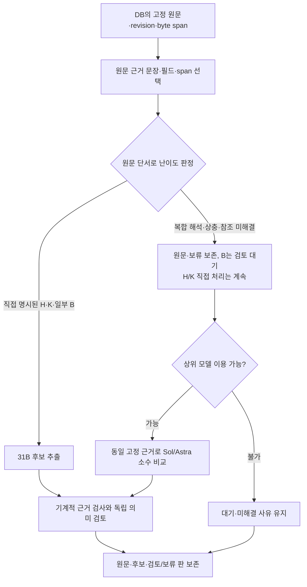
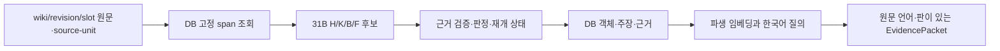

# 위키백과 다국어 순회·온톨로지 입력 보수 플랜

상태: **M3의 영·한 작은 수직 절편과 다섯 대상의 연결 언어판 255개 본문·1,256개 원문 단위 적재 완료; 31B 추출 진행 중, 후보 품질 보수·후속 색인·현실 릴리스 미완료.** 이 문서는 사용자의 “다른 언어 위키도 한 바퀴 다 순회” 결정에 따른 원래 입력 보수 단계와, 2026-09-28 결과 감사에서 드러난 H/K/B 품질 보수의 **후속 계획**을 함께 보존한다. 이번 개정은 실행 승인이나 실행 중 배치의 변경 지시가 아니다. 규범은 [온톨로지 변환기 PRD](../prd/wikipedia-history-ontology.md), [핵심 시스템 설계](../systems/README.md), [입력·증거 계약](wikipedia-history-sot-mapping/ingestion-contract.md)을 따른다. H/K/B/F의 전체 매핑 범위, 대략적인 1950년 선별선, 현실 릴리스와 작품 분리를 유지한다.

## 보수해야 하는 누락

[첫 31B 시험과 보강 재시험](../research/20260927-gemma4-31b-wikipedia-ontology-trial.md)은 2026-09-01 **enwiki**의 5개 선택 구간과 같은 enwiki revision의 추가 6구간을 처리했다. **당시 그 시험에서** 한국어 위키 본문은 0건이었다. 국립한글박물관의 한국어 발췌 1개와 UNESCO 영어 발췌 3개는 외부 기관 자료이며 kowiki 처리로 세지 않는다. 이 결과는 그대로 과거 영어판 시험으로 보존한다. 당시에는 영어판에 없는 대상이나 다른 언어판의 독자적 주장·서술·인용을 처리하지 못했다.

후속 [영·한 DB 수직 절편 시험](../research/20260927-wikipedia-multilingual-db-trial.md)에서는 고정 enwiki·kowiki 문종 각 **선택 구간 하나**를 H200 전용 PostgreSQL에 적재해 31B H 후보 5건, E5 벡터 2건, 한국어 질의의 원문 구간 역추적, 중복 없는 재실행과 동일 PGDATA의 프로세스 재시작·별도 DB 복원을 확인했다. K/B 후보는 없었고 승계 질의의 순위 및 첫 후보 인용은 질의에 맞는 근거 패킷으로 수락할 수 없다. **그 시점에는** 후보가 전부 미검토이고 대상의 모든 연결 언어판 본문, 세계 인벤토리, 새 컴퓨트 세션·A40 복원, 현실 릴리스가 미완료였다. 아래 원래 단계와 수락 기준은 후속 범위에도 적용하되, 위와 같이 실제 완료된 항목은 다시 미실행으로 세지 않는다.

그 뒤 승인된 다섯 대상의 **확인된 연결 언어판** 255개 본문(138 wiki, 3,303,431 UTF-8 byte)을 별도 `ontology_expanded` DB의 1,256개 고정 단위로 적재해 전체 byte coverage를 확인했다. [2026-09-28 결과 감사](../research/20260928-wikipedia-ontology-result-audit.md)의 마지막 읽기 `2026-09-27 23:28:54 UTC`에는 완료 934·실패 4·실행 중 1·미시작 317단위, 검토 전 3,111·보류 2,302후보, 적격 근거 span 2,467개 중 벡터 2개였다. **이는 진행 중 한 시점의 수치**이고 추출 종료·전량 색인 완료가 아니다. 고정 45후보 의미 진단에서 검토 전 25개 중 10개에 중대 오류가 있었고, 별도 원문 우선 9단위에서는 Bloomery 영어 페이지의 점진 장입·석회석 불필요에 대응하는 후보를 조사 범위에서 찾지 못했다. 이 표본을 전체 정확도·재현율로 확대하지 않는다. 같은 Storage의 새 CPU 세션 재연결은 별도 시험으로 확인했고, A40 원본 삭제 없는 백업은 사용자의 후속 일정에 남아 있다([현재 체크포인트](../harness/current-checkpoint.md)). 세계 사이트별 독립 page 전수 인벤토리와 현실 릴리스는 여전히 미완료다.

최종 목표는 두 층이다. **세계 입력 목록**은 동결한 Wikipedia 전체 사이트의 page/revision 인벤토리를 **사이트별 합집합**으로 만든다. enwiki의 page나 Wikidata QID가 없는 문서도 자기 원문 ID로 남는다. **대상별 순회**는 한 역사 대상에 연결된 모든 언어판의 해당 page를 찾은 뒤 목록 등록에서 멈추지 않고 **각 page의 고정 revision 본문 단위를 읽고 H/K/B/F 후보 또는 명시적 0건·보류·실패 결과로 닫는다.** 처리 우선순위는 순서만 바꾸며 영어·한국어·상위 N개 언어로 범위를 축소하지 않는다. 연결판 발견의 완전성은 동결한 연결 자료의 범위·미확보 상태와 함께 보고하며 발견하지 못한 링크를 ‘언어판이 없음’으로 단정하지 않는다.

사이트 분모는 Wikipedia family로 한정한다. Wiktionary·Wikisource·Commons는 외부 출처 또는 후속 범위로 구분한다. `wiki_id`/사이트 URL과 문서의 content language·표기 변형, 외부 기관 자료의 작성 언어는 별개다. zh의 간체·번체 표시 변환이나 redirect를 별도 역사 문서·독립 주장으로 중복 계산하지 않는다. 닫힌 사이트도 공개 덤프가 읽히면 자동 폐기하지 않고 접근 상태를 남긴다.

## M3 후속: H/K/B 후보 품질 보수 계획

**유형과 난이도는 다른 축이다.** H는 사건·상태, K는 사건과 독립된 지식 내용판, B는 특정 역사 맥락에서 지식을 정식화·명명·전달·채택·사용한 연결이다. 단일 문장에 행위자·시점·대상이 명시된 H, 실제 내용이 적힌 K, 특정 행위와 연결 K가 함께 적힌 일부 B는 같은 고정 근거에서 직접 추출을 시험할 수 있다. 반대로 어느 유형이든 인물 대명사, 여러 날짜, 표 머리와 주석, 출처별 귀속, 멀리 떨어진 정의, 내용판 동일성, 언어판 상충을 묶어야 하면 해석 난도가 높다. H/K가 항상 쉽거나 B가 Gemma 4 31B로 항상 불가능하다고 전제하지 않는다. [고정 의미 감사](../research/20260928-wikipedia-ontology-result-audit.md)의 좋은 문종 재위 H·한글 성조 K와 1933년 학회 설립 오독·《효경》 장르 날조·일반 제철 공정의 B 오분류가 이 구분의 개발 반례다.

### 원문 표현을 잃지 않는 후보 계약

원문 `wiki_id/page_id/revision_id/slot` 본문과 UTF-8 byte 구간은 **이미 DB에 불변으로 저장**된다. 바꿀 부분은 보관소가 아니라 모델 입력·출력 계약이다. 전체 페이지를 한 번에 모델에 넣지 않고 고정 source-unit에서 필요한 문장·표 셀·표 머리·주석을 ID로 제시한다. 모델은 원문 문장과 필드 및 근거 span ID를 선택하고, **코드가 DB의 원문 바이트에서 정확한 인용을 반환**한다. 부정·추정·가능성, 수량과 조건, 공정의 순서, 원래 달력, 원문이 귀속한 주장 주체, 표 머리·각주가 한정한 대상을 후보 필드와 함께 보존한다. 모델이 원문을 번역·요약·정규화한 문장은 별도 파생 표현으로 표시하고 정확 인용을 대신하지 못한다.

한 명제를 위해 표 머리와 행 또는 떨어진 주석처럼 **복수의 고정 span**이 필요한 경우는 출처 순서와 각 좌표를 함께 연결할 수 있게 좁게 보수한다. 고정 단위 경계에서 문장·표·절차가 잘렸으면 필요한 인접 단위와 표 머리만 DB에서 범위를 제한해 조회·입력판에 포함하고, 확보하지 못한 문맥은 모델이 복원해 채우지 않고 유보한다. 현재 단일 `evidence_span_id`/span 계약에서 그런 경우를 하나의 짧은 인용으로 위장하지 않으며 전체 페이지를 자동 입력하지 않는다. 관련성이 불명확한 멀리 떨어진 단어를 짜깁기해 새 명제를 만들면 보류한다. 원문 byte 일치 검사와 **주체·관계·대상·수식어의 의미 정확성 검사**는 독립 단계다. 바이트 손실 0이나 높은 ‘단어 보존율’이 의미 정확성을 보증하지 않는다. 위키 원문도 출처의 주장이지 채택한 역사 사실은 아니다.

H에서는 근거에 직접 적힌 사건·상태와 시간·행위자·영향 대상만 후보로 낸다. K에서는 이름이나 책 제목만으로 장르·교리·기술 내용·발명 시기를 채우지 않고, 실제 서술된 내용·조건·절차와 그 판을 구별한다. 이름만 나오는 K 대상은 참조 대상 미해결로 두고 내용판을 발명하지 않는다. 현재 프롬프트는 K/B의 `object` 필수 조건을 명시하지 않으면서 공통 예시에 `object:null`을 보이고, 검증기는 빈 K/B `object`를 `missing_knowledge_object`로 보류한다. 프롬프트의 K 내용 객체 예시와 검증 조건을 일치시키되, 출처에 내용이 없으면 강제로 채우지 않고 `held`·사유로 남긴다. 원문 주장 보존층과 온톨로지 정규화·관계 판정층을 나눠 CIDOC 전체 매핑 종류를 줄이지 않으면서 **모호한 매핑 ID를 강제하지 않는다.**

B는 ‘제철 공정은 이렇다’ 같은 일반 K 설명과 ‘누가 어느 때 그 공정을 도입·사용했다’는 역사적 행위를 분리한다. 명칭 유형 관계와 특정 시점의 명명 행위도 다르다. 주체·행위·시점 또는 시간 범위·대상 K 내용이 원문에 직접 나타나는 B는 31B로 먼저 시험하되, K 내용판·주체·시점·불확실성의 독립 검토 전에는 활성 현실 관계로 채택하지 않는다. K가 다른 단위에 있거나 귀속·시점·내용판이 모호하면 B 후보와 근거를 `held`/미해결로 보존한다. 이는 B 일괄 제외도, `candidate_unreviewed` 자동 승인도 아니다.

분기는 모델 자신감 점수 하나로 정하지 않는다. **원문을 먼저 검사해 관측 가능한 단서**—한 구간의 복수 행위자·날짜, 대명사 지시 대상, 표 머리/각주와 본문 결합, 복수 span, 다른 언어판의 상충, K 내용판의 부재, B 역사 행위와 일반 설명의 경계—를 적는다. 단일 문장에 필요한 필드가 충분한 건 31B 직접 후보로, 단서가 부족한 건 정당한 유보로, 근거는 있으나 해석이 복잡한 건 비교 검토 대상으로 보낸다. 후자는 현재 Codex에서 같은 고정 근거 묶음을 **실제로 사용 가능한 Sol/Astra**가 소수 항목에 대해 검토하는 비교부터 계획한다. H200의 상위 모델 API나 자격증명이 이미 마련됐다고 가정하지 않는다. 접근·호출 경로가 없으면 B 검토 대기 장부에 남겨 H/K 처리를 막지 않는다. 더 강한 모델의 설명도 원문 증거나 독립 검토를 대신하지 않으며 유보 결론이 가능하다. 새 API 자격증명·서비스·범용 router 구축은 첫 보수 범위에 넣지 않는다.

### 고정 입력, 순서, 담당과 수락

| 순서 | 계획한 작업·기록 위치 | 담당과 다음 단계 진입 조건 |
|---|---|---|
| 개발 기준선 | [감사의 고정 45후보](../../data/analysis/private/ontology-multilingual-expanded/audit-20260928/runtime/semantic-packet.json)와 [원문 우선 9단위](../../data/analysis/private/ontology-multilingual-expanded/audit-20260928/source-first/review.json), 실패 raw 4건을 개발·회귀 입력으로 고정한다. 원본 후보·상태·출처 hash를 바꾸지 않고 기존 장부에서 원문 중요 사실의 대응 후보·누락·유보·잘못 생성된 관계를 함께 본다. | Astra가 입력판과 담당을 고정, Luna가 원문 좌표·분모를 대조, 다른 Sol이 의미 판정 근거를 확인한다. 1933년 시점 전이·《효경》 장르·일반 공정 B·K `object:null`·귀속 불확실성의 실패와 문종 H·한글 K 지지 사례를 모두 포함한다. |
| 확인셋 선정·봉인 | 구현자가 튜닝에 사용하지 않을 다른 고정 원문 단위·언어·H/K/B 경계를 **프롬프트 수정 전에** 선정해 원문 revision·span·선정 규칙·해시를 봉인한다. 개발 45후보·9단위와 같은 사실의 중복 인용을 제외하고, 확인셋의 의미 판정은 개발·프롬프트 작성자에게 가린다. | Astra가 개발/확인셋 경계를 기록하고 Luna가 원문·분모를 기계 대조한다. 독립 Sol만 확인셋 판정과 이후 평가 근거를 보관한다. |
| 31B 계약 보수 비교 | Sol 구현자가 실제 [프롬프트·검증 경로](../../src/novel_factory/reality/expanded.py)와 [다국어 CLI](../../tools/wiki_ontology_trial/multilingual/expanded_cli.py)의 필요한 부분만 새 판으로 보수하고, [원문·근거 adapter](../../src/novel_factory/reality/adapters/expanded_postgres.py)는 복수 span 등 실제 필요한 경계만 다룬다. 기존 모델 raw 기준선→고정 입력의 새 31B 결과를 **별도 attempt/비교 산출**로 대조한다. | 구현하지 않은 Sol이 H/K/B 의미·근거·누락을 독립 검토한다. 형식 통과뿐 아니라 주체·시점·내용판·불확실성 보존과 중요 사실의 대응을 확인하고, 잘못된 후보를 전부 0출력으로 없애는 해법은 통과시키지 않는다. |
| 어려운 항목 비교 | 앞 단계에서 원문 단서는 있으나 31B가 모호하거나 틀린 소수 H/K/B에 양쪽 생성자에게 **같은 source revision·span·문맥과 출력 계약만** 준다. 기존 오류 판정·정답은 독립 검토자에게만 보이고, 이용 가능한 Sol/Astra의 새 후보 또는 유보와 31B 결과를 나란히 비교한다. 기존 후보를 보여 주는 교정 시험은 생성 능력 비교와 별도 목적·기록으로 분리한다. 원문이 부족한 항목은 모델 교체 대신 미해결로 둔다. | 다른 Sol의 독립 의미 검토로 31B와 상위 모델 모두 원문에 없는 주장·K 내용·B 인과를 만들지 않았는지 확인한다. 상위 모델 접근이 안 되면 비교 미실행·대기 분모를 남긴다. |
| 확인셋 실행·확대 결정 | 앞서 봉인한 확인셋을 개발·비교가 끝난 출력 계약판에 한 번 적용한다. 그 결과는 추가 프롬프트 조정에 재사용하지 않고 독립 검토 후에만 배치 범위 확대를 판단한다. | Luna는 원문 byte/span·상태·미처리 분모, 다른 Sol은 후보 지지·중대 오류·문맥 부족과 원문 우선 누락·정당한 유보를 함께 기록한다. 고위험 반례에서 잘못된 채택이 남거나 중요 사실을 0출력으로 숨기면 확대하지 않는다. 전수 재현율·단어 보존율을 의미 정확도 대용으로 쓰지 않는다. |

원본 추출 attempt·모델/프롬프트·매핑 판, source revision/hash, 후보 payload·보류 사유는 기존 장부를 우선 재사용하고 새 비교판의 ID를 별도로 둔다. 같은 시도에 소유 파일과 출력판을 기록하며 원본 후보를 덮어쓰지 않는다. 새 스키마는 복수 span이나 비교 상태를 기존 필드로 정확히 표현할 수 없는 경우에만 필요한 최소 범위를 설계한다. 후보 10건 상한을 넘은 네 raw 응답(11·11·12·11건)은 조용히 열 개로 잘라 성공 처리하지 않는다. **첫 보수 절편은 검증 통과 항목도 부분 후보로 DB에 커밋하지 않고** raw와 `failed`/미완료 분모를 유지한다. 필요하면 새 판의 입력 분할·출력 상한 정책을 먼저 고정한 뒤 별도 attempt로 비교한다. 후속에 부분 저장이 필요하다고 판단하면 부분 결과의 비완료 상태와 빠진 항목을 명시하는 계약을 먼저 검토해야 한다.

이 품질 보수 계획만으로 당시 돌아가던 H200 추출 batch와 post-extract watcher를 자동 중단·수정·전량 재실행하지 않는다는 경계였다. 이후 사용자가 **별도 H200 효율 구성 실행과 기존 추출 중지**를 승인해 [실제 보존·중지 기록](../research/20260928-h200-ontology-benchmark-setup.md)을 남겼다. 앞으로도 기존 원문·raw·후보를 보존하고 새 판을 별도 비교로 저장한다. 이 품질 보수의 선행 조건에 전세계 사이트 인벤토리 완성, A40 백업 완료, 새 상위 모델 API 구축을 추가하지 않는다. 채택 기준은 현실 릴리스와 작품 집필의 기존 독립 검토·승인 경계를 그대로 따른다.

## 추론 효율 비교: 원본 배치와 8비트 복제 배치

**상태(2026-09-28): 계획 뒤 별도 승인으로 H200 세팅을 실행했다.** 기존 추출은 원문·raw·후보·미완료 상태를 보존한 채 중지했고, 격리된 vLLM/FP8 설치·고정 100단위 DB/토큰 사전검증·A 및 B2의 합성 연결을 확인했다([실제 구성 기록](../research/20260928-h200-ontology-benchmark-setup.md)). B3는 고정 14,592토큰 문맥·BF16 KV·엔진당 GPU 예산 0.28에서 **첫 엔진부터 KV 부족으로 기동 불가**라 다른 두 엔진이나 100단위 본측정을 시작하지 않았다. A/B2도 원문 100개 본측정은 **0회**다. 이 절의 원래 100×3=300회 설계는 그대로 남겨 실행불가 원인을 추적하지만, 현재 조건에서 후속 실행 가능한 안은 A100+B2 100, 최대 200회뿐이다. [현행 추출 어댑터](../../src/novel_factory/reality/adapters/gemma.py)의 과거 BF16 순차 `generate`는 아래 배치안의 처리량 기준선이 아니다.

### 실제 비교 대상과 고정 조건

| 구분 | 같은 H200에서 시험할 구성 | 목적과 제한 |
|---|---|---|
| 기존 참고값, 이번에 새로 실행하지 않음 | 현행 Transformers BF16, 요청 1개씩 순차 처리 | 과거 추출 계약과 입력·응답 경로의 기능 참고값. 배치안 A의 성능 대리값이 아님 |
| **A — 원본 배치** | 같은 base revision의 **BF16 Gemma 4 31B를 vLLM 엔진 1개**에 적재하고 독립 요청을 그 엔진에 공급 | 한 엔진 안의 [continuous batching](https://docs.vllm.ai/en/latest/) 효과를 측정. 사전 로딩·메모리 수용 가능성 확인 전 성능을 약속하지 않음 |
| **B — 8비트 복제 배치** | 같은 GPU에 **FP8 Gemma 4 31B vLLM 엔진 2개 또는 3개를 각각 적재**하고 요청을 중복 없이 분할. 각 엔진 안에서도 배치 | 모델 수를 실제로 늘렸을 때 단일 엔진 A보다 총 처리량·대기시간이 나아지는지 측정. FP8은 8비트 **부동소수점**으로 INT8과 같은 형식이 아님 |
| 후속으로 보류 | FP8 엔진 **1개** | 양자화 자체의 효과와 복제 효과를 분리하는 진단용 대조군이다. 이번 100개 비교에서는 새로 실행하지 않으므로 A/B 차이를 양자화만의 효과로 단정하지 않음 |

[vLLM 공식 Gemma 4 31B 레시피](https://recipes.vllm.ai/Google/gemma-4-31B-it)는 `RedHatAI/gemma-4-31B-it-FP8-dynamic`을 Hopper/H200에서 가능한 FP8 변형으로 제시한다. **사용자가 4비트의 품질을 우려해 이번 비교에서 제외했다.** 레시피에 나온 특정 NVFP4 변형도 Blackwell용이지만, 이것이 모든 4비트 변형의 H200 실행 불가를 뜻하지는 않는다. 이 문서의 FP8 2·3복제는 레시피의 성능 보증이 아닌 시험 가설이다. 실제 실행 전 vLLM runtime/컨테이너 판, 모델 저장소·revision, 토크나이저·채팅 템플릿·출력 해석 판을 고정한다. FP8 변형의 base 계통이 현행 `google/gemma-4-31B-it` 고정 revision과 실질적으로 같은지 확인한다. 다르면 A/B 결과를 **순수 양자화 효과**로 해석하지 않고 모델판 차이를 명시한다.

**공정 비교 입력은 로컬에 보존한 원문 source-unit 정확히 100개**다. [전체 로컬 인벤토리](../../data/analysis/private/ontology-benchmark-100-20260928/inventory.json) SHA-256 `aa6dafaf2d1d72a815b870e1677920fb916cf3a09113c31942b40d4633a07047`은 255개 page 파일의 1,256개 고유 단위를 3,200 UTF-8 byte 분할로 재현하고 각 page 원문 hash·byte coverage를 대조했다. 이는 **라이브 DB를 재조회한 결과가 아니다.** 사용자가 관측한 현재 약 1,600개/10시간 이상 작업과 이 1,256개 로컬 인벤토리가 같은 job·분모라고 단정하지 않는다. 미래 실행 직전에는 고정 `unit_id`·page revision/slot/byte 좌표/hash를 해당 job 입력과 읽기 전용으로 대조하고, 불일치하면 재선정 또는 실행 보류를 기록한다. 1,600/10시간을 100개 예상 시간으로 단순 비례하지 않는다.

[원문 없는 100행 공개 CSV](20260928-ontology-benchmark-100-samples.csv) SHA-256 `f70b30ab7b57355b719b14d8c81dd7d3820ba801d19cb36d80d28081f77cfbbd`와 [선정 규칙·원본 메타데이터 JSON](../../data/analysis/private/ontology-benchmark-100-20260928/selection.json) SHA-256 `45f58bccc92f7b0455bd3c7902da200c24b579d3b706a495721132eeb9b856f0`을 입력판으로 봉인한다. 모두 정확히 **100개 고유 `unit_id`**이며 target마다 20개다. 기존 [의미 감사](../research/20260928-wikipedia-ontology-result-audit.md)의 **45개 후보는 41개 고유 단위**에 걸쳐 있으므로 ‘45개 구간’으로 세지 않는다. 선정 목록에는 이 41단위, 원문 우선 점검 9단위, 기존 후보 10개 상한 raw 실패 4단위, 0후보 응답 예시 2단위를 의도 고정하고 언어·길이 보충에서 같은 유형 1단위가 더 선택되어 총 3단위를 중복 제거해 포함하고, 남는 자리는 실제 존재 언어와 UTF-8 byte 길이를 SHA-256 정렬 규칙으로 층화했다. 영어·한국어만 뽑지 않았고, `priority33`은 100개 안의 축약 표시일 뿐 기본 시험의 입력을 33개로 바꾸지 않는다. 축약안을 따로 쓰게 되면 **첫 33행이 아니라 `priority33=true`인 33개 ID**를 고른다. 기존 감사의 H/K/B·오류 유형은 **재검토할 구조 표지**이며 새 정답·난이도 판정이 아니다. 1950년 뒤 서술 위주의 구간과 극히 짧은 page 꼬리는 역사 사실 생성 성공을 기대하는 정답 항목이 아니라 시대범위 제외·0후보·문맥 부족 경계로 센다.

| 대상 | 단위 | en | ko | ja | zh | de | fr | ru | ar | es | 기타 실제 언어 | 짧음/중간/김 byte 구간 |
|---|---:|---:|---:|---:|---:|---:|---:|---:|---:|---:|---:|
| 문종 | 20 | 2 | 4 | 2 | 2 | 1 | 1 | 1 | 2 | 2 | 3 | 2/6/12 |
| 단종 | 20 | 3 | 3 | 2 | 1 | 2 | 1 | 1 | 2 | 2 | 3 | 4/5/11 |
| 세조 | 20 | 3 | 5 | 2 | 1 | 1 | 1 | 1 | 2 | 1 | 3 | 3/5/12 |
| 한글 | 20 | 3 | 2 | 1 | 1 | 1 | 1 | 2 | 2 | 1 | 6 | 3/4/13 |
| Bloomery | 20 | 3 | 0 | 0 | 0 | 3 | 4 | 3 | 1 | 3 | 3 | 4/7/9 |
| **합계** | **100** | **14** | **14** | **7** | **5** | **8** | **8** | **8** | **9** | **9** | **18** | **16/27/57** |

길이층은 UTF-8 byte 기준 `≤800 / 801–2399 / ≥2400`이며 모델 토큰 수나 의미 난이도가 아니다. Bloomery에는 이 고정 입력판의 한국어·일본어·중국어 page가 없어 그 칸을 억지로 채우지 않았다. 대표 회귀 위치는 한글 ru의 **1933 시점 연결** `byte-62946-66104`, 세조 ko의 **《효경》 K 내용판 발명** `byte-6084-9205`, Bloomery ar의 **일반 물질 변화 B 오분류** `byte-0-2340`, 문종 ar의 **출처 귀속과 K 연결** `byte-0-2975`, 문종 ko의 **B→K 연결** `byte-2484-5061`이다. Bloomery en `byte-2654-5760`은 원문 우선 누락 점검, 한글 pt `byte-12051-15251`은 후보 상한 실패, 한글 am의 29-byte 끝 구간은 0후보·문맥 부족 경계로 다시 본다. 이 예시는 해당 언어의 page/revision/slot을 CSV의 전체 ID와 함께 읽어야 하며, 새 100개 원문을 전수 의미 판독했다는 주장이 아니다.

두 방법의 입력 manifest·원문 revision/hash·정확한 프롬프트와 출력 계약·토크나이저/템플릿·`enable_thinking=false`·greedy 생성(`temperature=0`, `do_sample=False` 상당)·최대 입력 길이·출력 토큰 상한·요청 순서와 도착률·타임아웃을 동일하게 맞춘다. 이번 100개 안에서는 **실패 자동 재시도 0회**로 닫고 실패·미완료를 원래 분모에 남긴다. 입력 토큰 계약은 실행 전 로컬에서 비교하고 출력 스키마는 100개 실행의 결과에서 대조해 별도 위키 구간 추론을 추가하지 않는다. 원문 보존·H/K/B 의미 지침을 효율 시험과 동시에 바꾸지 않는다. 양자화가 품질에 미치는 변화는 별도 판정축으로 남긴다.

이번에는 같은 **총 동시 요청 수 6개와 전체 GPU 메모리 예산·입출력 한도**에서 한 지점만 비교한다: `A=BF16 1엔진×6요청`, `B2=FP8 2엔진×각3요청`, `B3=FP8 3엔진×각2요청`. 고정 **고유 원문 100단위**를 A·B2·B3에 각각 한 번씩 넣으므로 본측정은 **100+100+100=총 300 unit-inference**이며, 엔진마다 100개가 아니다. B2에는 50/50, B3에는 34/33/33단위를 중복 없이 배정한다. 대상별 연속 구간을 한 엔진에 몰지 않고 **고정 목록을 round-robin으로** 나눠 내용 편중을 줄인다. 3엔진이 예산 내에서 로드되지 않으면 `실행불가`와 실제 사용·실패 원인을 기록하고 그 안의 100개를 다른 구성의 결과로 대체하지 않는다. 12동시성 확대, 구성별 안전 상한 탐색, 별도 FP8 단일 엔진, 새 Transformers 100개 기준선, 임의 반복은 **이번 범위 밖**이다. 엔진 내부 워밍업·적재 시간은 별도로 재되 고정 위키100구간을 워밍업용으로 반복하지 않는다. vLLM은 입력 요청을 연속 배치하지만, 공유 GPU에서 엔진 3개가 연산·메모리 대역폭을 경쟁하면 **2개 또는 1개보다 느려질 수 있다**. 가중치 용량 감소가 속도 증가와 정비례한다고 가정하지 않는다.

### VRAM, 작업 분배와 판정

2·3엔진을 띄우기 전에 **각 엔진의 weights + KV cache + runtime 버퍼 + 기존 GPU 프로세스의 관측 피크**를 합쳐 한 GPU의 총 예산으로 계산하고 여유를 남긴다. 각 프로세스에 예시 기본값 `gpu_memory_utilization=0.9`를 그대로 주면 합계가 GPU 전체의 180% 또는 270%가 되므로 금지한다. vLLM 레시피의 [메모리·KV 설정 예시](https://recipes.vllm.ai/Google/gemma-4-31B-it)는 단일 엔진 값으로 읽고, 복제 시험에서는 **전체 예산을 엔진 수로 나눈 개별 설정**을 잡는다. 엔진은 **하나씩 순차 로드**해 매번 성공 여부와 총 VRAM 사용량을 확인한 뒤에야 같은 GPU에서 동시 추론한다. 3개가 로딩 실패·OOM이면 원인과 이미 성공한 구성을 남기고 무한 재시도하지 않는다. 기존 production 추출 job이 남아 있으면 완료 후의 **별도 시험창**을 잡거나 자원 조정을 별도 결정한다. 이 계획은 그 job의 중단 권한을 만들지 않는다.

| 동일한 고정 입력에 기록할 값 | 비교 방법 |
|---|---|
| 전체 처리 wall time, 완결 units/hour | 모델 다운로드·적재·워밍업 시간을 분리하고, 원래 요청한 **모든 단위**가 성공·실패·유보 중 하나로 닫힐 때까지 또는 사전에 고정한 cutoff/타임아웃까지의 wall time을 잰다. cutoff에 남은 미완료·0출력·응답 유실도 원래 분모와 별도 건수에 남기며, 성공 단위 수·실패 단위 수를 함께 보여 빠른 일부만으로 처리량을 부풀리지 않음 |
| 개별 대기시간 | enqueue→첫 토큰 또는 완료까지 p50/p95와 긴 꼬리를 같은 기준으로 기록. 총 처리량만 높고 특정 언어·긴 원문이 굶주리는지 확인 |
| GPU와 운영 실패 | 엔진별 및 GPU 전체 피크 VRAM, 로딩/OOM, timeout, 잘린 JSON, 재시도, 중복 처리, 누락·미완료 건수. 순간 GPU utilization을 장기 평균이나 처리량의 대리값으로 사용하지 않음 |
| 추출 품질 | JSON/스키마 통과율과 후보 H/K/B·held·0건을 따로 집계하고 독립 검토자가 원문 지지·중대 오류·누락·정당한 유보를 같은 근거로 판정. **JSON 통과는 의미 수락이 아님** |

| arm | 총 동시 요청 | 전체 wall / 완결 units/hour | 대기 p50/p95 | GPU 피크 VRAM | 오류·누락·보류 / 의미 판정 |
|---|---:|---|---|---|---|
| A BF16 1엔진 | 총 6, 고유100단위×1 | 미측정 | 미측정 | 미측정 | 미측정 |
| B FP8 2엔진 | 총 6, 50/50단위 | 미측정 | 미측정 | 미측정 | 미측정 |
| B FP8 3엔진 | 총 6, 34/33/33단위 | 미측정 또는 실행불가 | 미측정 | 미측정 | 미측정 |

위 표는 **본측정 결과표가 아니다.** 이번 setup에서 B3의 첫 엔진이 `max_model_len=14,592`의 단일 요청에 필요한 BF16 KV 12.26GiB에 비해 할당 가용 KV 5.34GiB만 확보해 시작 실패했다. vLLM이 추정한 허용 길이 6,336으로 입력을 절삭하거나 KV dtype을 바꾸어 원래 비교 조건을 흐리지 않는다. B3를 미실행 100회로 분모에 남겨 A/B2가 이긴 처리량처럼 계산하지 않는다.

**작업 배분은 단일 코디네이터·단일 결과 writer**가 고정 manifest의 `unit_id`를 엔진별로 중복 없이 나누고, `run_id/arm_id/unit_id/model_revision/prompt_hash/source_hash`로 응답과 미완료를 추적한다. 결과는 **도착·완료 순서가 아니라 `unit_id`로** 원래 입력에 대응시킨다. 현재 [확장 DB adapter](../../src/novel_factory/reality/adapters/expanded_postgres.py)의 pending 선조회와 [기본 attempt 경계](../../src/novel_factory/reality/adapters/postgres.py)의 `begin_attempt`는 다중 워커의 원자적 작업 선점 큐가 아니다. 현행 `extract` 명령을 2·3개 단순 실행하면 같은 단위를 동시에 고를 수 있으므로 금지한다. 시험 응답·raw·오류·검토는 별도 run/arm/unit identity 파일 또는 **시험 전용 DB**에 보존하고 운영 attempt·후보를 덮어쓰지 않는다. 중단·응답 유실도 미완료로 남겨 재개 분모를 지키며, 기존 원본과 운영 DB는 읽기 전용 입력으로 사용한다.

승인된 세팅에서는 Sol 엔지니어가 **작은 vLLM 실행기·localhost adapter·단일 writer 결과 장부**만 만들었다. 현재는 DB 원문 100개 확인·합성 응답까지만 사용했으며, 결과 장부에 쓰는 본측정은 아직 실행하지 않았다. Luna는 manifest 중복·선정·전송·preflight 영수증을 기계 대조했고 다른 Sol은 코드와 중단 경계를 독립 검토했다. 새 범용 router·큐 서비스·무거운 모니터링 시스템은 만들지 않는다. 후속 선택은 `같은 동시성에서 유효 완료 처리량과 대기시간`, `VRAM/OOM`, `오류·누락·보류 및 의미 오류`가 모두 나온 뒤에만 한다. 짧은 속도차의 반복 확인은 **후속 판단**으로 두고 이번 100개를 자동 반복하지 않는다. **FP8에서 BF16 대비 추가 중대 의미 오류나 중요 사실 누락이 확인되면 채택을 보류한다.** 표본에서 품질이 유지되는 구성끼리는 유효 완료 처리량을 우선하고 차이가 작으면 더 단순한 구성을 택하되, 표본의 동등한 판정은 전수 품질 보증이 아니다. 현재 B2가 A를 이긴다는 처리량 수치나 최적 구성을 예언하지 않는다. 시험 가능성·자원 상한이 안 맞은 B3는 그 상태로 남기고 기존 순차 경로를 임의 교체하지 않는다.

## 바뀌어야 할 계약과 파일

| 영향 대상 | 현재 관찰·보수 작업 | 소유와 완료 근거 |
|---|---|---|
| [변환기 PRD](../prd/wikipedia-history-ontology.md), [핵심 설계](../systems/README.md) | 입력을 ‘영어 덤프’로 한정하는 제품 설명을 별도 후속 개정에서 다국어 사이트 합집합·대상별 전언어 순회로 바꾼다. H/K/B/F·릴리스/작품 승인 규칙은 유지한다. | Astra가 규범 변경 범위를 확정, Sol이 별도 판 개정·독립 검토. **이번 계획에서 본문은 수정하지 않음** |
| [구축 대상 목록](wikipedia-reality-sot-build-plan.md), [매핑 명세](wikipedia-history-sot-mapping.md), [입력 계약](wikipedia-history-sot-mapping/ingestion-contract.md) | 34종 대상은 유지. `snapshot/wiki_id/page_id/revision_id/slot`·원문 UTF-8 span, 사이트별 템플릿·redirect·번역·재인용과 다국어 원장 상태를 명시한다. QID는 확보 시 **변경 가능한 외부 매칭 후보**이며 영구 domain ID가 아니다. | Sol 현실 자료 담당, 다른 Sol 독립 검토. 고정 영어판 fixture 재현과 다국어 새 fixture를 함께 확인 |
| `tools/wiki_ontology_trial/prepare.py` | `enwiki-*` glob·고정 `TARGETS`·`page-{page_id}.json`을 그대로 확장하지 않고, wiki별 manifest와 `wiki_id` 포함 새 입력판·파일 namespace를 추가한다. | Sol 추출기 담당; 옛 5구간과 원시 결과의 ID·해시 불변 |
| `tools/wiki_ontology_trial/make_packet.py` | enwiki 날짜/ID 하드코딩, page ID 단독 유일성, 3–5개 선택 제한을 다국어 입력판에서 제거한다. 모든 연결판의 **본문 단위**를 고정한다. 기존 시험 경로는 유지한다. | 같은 Sol; 두 wiki에서 같은 page ID가 충돌하지 않고 각 `source_unit_id`가 원문으로 역추적됨 |
| `tools/wiki_ontology_trial/build_evidence.py`, `verify_reextract.py` | `by_page`와 page-ID만 쓰는 파일 조회·추가 근거 ID를 site+revision+slot+span으로 구별한다. 사이트별 증거를 교차 인용할 때도 원문 계열을 잃지 않는다. 하드코딩 시험 발췌는 별도 fixture로 보존한다. | Sol·Luna 기계 점검; 중복 ID·잘못된 wiki span·소스 계열 혼동 0 |
| `tools/wiki_ontology_trial/run.py`, 현재 `src/novel_factory/reality/expanded.py` | 기존 영어판 시험 `run.py`는 그 입력·raw와 함께 보존한다. 현재 다국어 추출의 H/K/B 후보 지시·검증은 `expanded.py`에 있으므로 새 품질 보수는 그 경로에서 원문 언어·span 선택·언어 실패를 검토한다. 번역은 원문 후보와 분리한 파생 표현이다. | Sol 추출기, 다른 Sol 의미 검토; 고정 문장/source-unit ID→DB 원문 span 연결, quote 재타이핑 오류 회귀 |
| `EvidencePacket`·검색 파생판 | 동일 domain 객체의 다국어 이름·별칭을 한국어 질의에서 찾되 결과에 원문 언어·wiki/revision·근거·한국어 번역 설명의 **파생 지위**를 표시한다. 임베딩은 대상 ID·모델 revision·차원·입력 hash에 묶고 벡터 색인은 재생성 가능한 파생물로 둔다. 31B 추출 모델과 임베딩 모델은 별개다. | 첫 비영어 수직 절편에서 실제 한국어 질의로 원문 근거를 회수한다. 임베딩 모델판과 지원 언어는 그때 검증해 고정하고, 합성 벡터만으로 의미 검색을 통과 처리하지 않음 |
| 현실 모듈·저장 adapter | 원래 계획 때 없던 `src/novel_factory/reality/`와 PostgreSQL·pgvector 시험 adapter는 현재 존재한다. 새 품질 보수는 위 실제 파일의 source identity·본문조회·후보 제출 경계를 좁게 고치고, dump/API/DB·GPU 구현은 adapter에 둔다. 이 경로의 후보 DB는 현실 릴리스 DB가 아니다. | 지정 Sol이 필요한 파일만 개정하고 독립 Sol이 검토. 빈 계층·범용 plugin/DI framework·별도 벡터 DB는 만들지 않음 |

기존 `data/analysis/private/ontology-trial/`의 enwiki 패킷·raw·검증 결과와 두 보고서의 숫자는 이동·덮어쓰기하지 않는다. 새 다국어 format version과 별도 저장 경로를 사용한다. 역사적 객체는 사이트·QID의 복제본이 아닌 안정 domain ID 후보로 제안하고, 원문별 assertion·근거·언어·판정은 별도로 둔다. **동일 QID·제목·번역문만으로 객체나 주장을 자동 병합하지 않는다.**

**이번 구축의 저장 결정:** 다국어 원문 처리와 온톨로지 RAG가 목적이며 DB 설치는 그 수직 절편의 일부다. H200 **컴퓨트 세션에 연결된** Storage를 주저장으로 쓴다. [읽기 전용 사전점검](../../data/analysis/h200-postgresql-preflight-20260927.json) 당시 사용자 할당 2 TB·사용 192.91 GB(폴더 단독 quota 아님), Ubuntu 24.04·비대화식 sudo·NFSv3 `rw,hard`를 확인했고 PostgreSQL server·pgvector는 **미설치**였다. 후속 작은 시험에서 PostgreSQL 16.15·pgvector 0.6.0을 설치하고 기존 `/home/work/novel-toy-tune` 아래의 **새 전용 하위 경로**에 PGDATA를 만들었다. 기존 문체 학습·모델 cache는 건드리지 않았다. H200 세션 안의 실행 파일이나 `/tmp`를 영속 저장으로 간주하지 않는다. 서버는 외부 포트를 열지 않는 local-only 프로세스로 시작했다([PostgreSQL 서버 시작](https://www.postgresql.org/docs/current/server-start.html)). `systemd` 유무가 DB 사용 가능성을 결정하지 않는다. 작은 실저장·재기동은 관찰된 기능과 재연결만 검증한다. NFS server의 `sync` export와 장애 시 `fsync` 내구성은 별도 확인 전 **미검증**으로 남기고, 운영 SoT·규모 확대 판단에서 이 한계를 표시한다([PostgreSQL NFS 조건](https://www.postgresql.org/docs/current/creating-cluster.html#CREATING-CLUSTER-NFS)).

**저장·조회 연결:** 압축 원덤프는 해시가 붙은 불변 파일로 둘 수 있다. DB에는 `wiki_id/page/revision/slot`과 원문 언어·UTF-8 본문·source-unit/span, 추출 입력판과 처리 상태를 넣는다. 같은 고정 구간만 DB에서 31B 입력 패킷으로 읽고, H/K/B/F 객체·주장·등장/전파/실현 관계·원문 근거·불확실성·검토 상태를 별도 기록으로 연결한다. 임베딩은 그 대상 ID와 모델 revision·차원·입력 hash를 가진 파생 행이며 재생성할 수 있다. **DB 저장 후보 ≠ 검토 수락 ≠ 현실 릴리스 ≠ 작품 정사**다. 새 벡터 모델을 이번 문서에서 확정하지 않고 첫 한국어 의미 조회 시험에서 지원 언어·판·차원을 고정한다. 기존 핵심 설계의 원문/진척 DB·큰 불변 파일·파생 벡터와 adapter 교체 경계를 따른다.

**보존·백업:** DB 프로세스 재시작만으로 세션 종료 뒤 보존을 입증할 수 없다. 원래 계획의 **같은 Storage 새 CPU 세션 재연결**은 뒤에 실제 시험해 기존 DB를 다시 읽었다([현재 체크포인트](../harness/current-checkpoint.md)). 향후 계획된 전환에서도 원 postmaster를 정상 정지한 뒤 같은 PostgreSQL major·호환 pgvector로 기존 PGDATA를 **새 `initdb` 없이** 열고, 동일 PGDATA에 postmaster 둘을 동시에 띄우지 않는다. NFS server `sync`와 장애 시 내구성은 이 재연결만으로 증명되지 않았다. A40은 사용자가 정한 원본 삭제 없는 후속 백업 대상이다. 예정된 백업에서는 일관된 `pg_dump -Fc`/`pg_restore`와 DB가 참조하는 불변 파일 manifest·hash·설정/role/extension/버전을 묶어 별도 DB에 복원 검사한다. `pg_dump`는 동시 변경 중에도 DB 일관성을 제공하지만, **DB판과 파일목록을 맞추려** 파일 manifest를 고정한다([pg_dump](https://www.postgresql.org/docs/16/app-pgdump.html)). 작동 중 PGDATA의 단순 `cp`/`tar`는 백업으로 쓰지 않는다([파일 백업](https://www.postgresql.org/docs/16/backup-file.html)). 복원처에 같은 확장 판을 설치해 벡터 행·인덱스/검색이 복원되는지는 실제 복원 시험으로 확인한다([pgvector](https://github.com/pgvector/pgvector)). A40 호스트·목적 경로·용량·접속은 아직 확인되지 않았고 이번 고정 표본 품질 보수의 선행 조건이 아니다. **하루 1회와 세션 전환 전**은 제안 주기일 뿐 미확정·미실행이다.

## 구현 순서와 작업 분담

아래 M0–M5는 2026-09-27에 정한 입력·운영 확장 순서다. 이후 다섯 대상의 연결판 255본문 적재와 작은 영·한 수직 절편·새 CPU 세션 재연결은 위 상태처럼 실행했다. 현 시점의 다음 한 작업은 앞 절의 **고정 개발셋으로 후보 품질 계약을 보수하는 계획**이며, 세계 인벤토리·A40 완료를 이 절편의 진입 조건으로 바꾸지 않는다.

**M0 — 사이트와 연결 자료를 먼저 고정한다.** Wikimedia의 [SiteMatrix](https://www.mediawiki.org/wiki/Extension:SiteMatrix)·[wiki ID 매핑](https://wikitech.wikimedia.org/wiki/MediaWiki_Content_File_Exports/WikiId_Mappings)에서 Wikipedia family의 사이트 목록을 page 순회 전에 동결한다. SiteMatrix 문서의 오래된 설명을 그대로 API 계약으로 코딩하지 않고 구현 착수 때 실제 endpoint·페이지네이션(`smcontinue`)·closed/private 상태를 확인한다. 각 wiki의 current/history export, 날짜, [SHA256SUMS 게시와 완료](https://wikitech.wikimedia.org/wiki/MediaWiki_Content_File_Exports), 사이트 언어/코드, 덤프 획득·검증 상태를 기록한다. **모든 wiki가 같은 날짜의 덤프를 제공한다고 가정하지 않는다.** Wikidata 연결 자료도 별도 날짜·해시로 고정한다. [Wikidata 접근 안내](https://www.wikidata.org/wiki/Wikidata:Data_access)대로 대량 연결 목록은 dump 중심으로, 이미 아는 소수 대상 보완만 API로 한다. API에서는 페이지네이션·429 `Retry-After`·`maxlag`·사용자 에이전트를 존중한다. **산출:** 전체 사이트 catalog와 사이트별 입력판·미확보 사유. **다음 진입:** 첫 대상의 사이트/연결 분모가 고정됨.

**M1 — 모든 사이트의 원문 인벤토리를 합집합으로 만든다.** 확보·checksum 검증된 wiki current export를 **사이트별로** 스트리밍해 namespace/page/revision/slot·원문 hash를 **의미 추출보다 독립적으로** 기록한다. `site_page_key=(wiki_id,page_id)`이며 revision·slot은 별도 판/근거 키다. history export를 current에 섞지 않는다. 영문 제목·QID가 없어도 page 행을 보존하고, 인벤토리의 일부가 미확보면 전체 완료라 하지 않는다. 대상 밖 namespace/redirect/삭제·미공개 텍스트도 이유와 접근 가능성을 남긴다. XML 구조·템플릿·Lua module·지역별 infobox 이름 차이는 보존하고 지원판을 나중에 정한다. **연결이 발견되지 않은 page도 자체 `(wiki_id,page_id)` 작업 큐에 남겨** 역사 대상 선별·본문 처리로 보낸다. **한 표본 사이트의 검증된 인벤토리 절편으로 M3 시범을 시작할 수 있고, 세계 전체 인벤토리 완성은 선행 조건이 아니다.** **산출:** 사이트별 page 분모, checksum·압축/XML 실패 목록, 누적 합집합. **다음 진입:** 해당 시범 site/page의 원문 핀과 미확보 site 상태를 재현 가능하게 조회.

**M2 — 같은 대상을 잇는 언어판을 발견한다.** 판 고정한 Wikidata sitelink와 각 wiki의 interlanguage link/redirect를 **연결 후보**로 저장한다. [sitelink](https://www.wikidata.org/wiki/Help:Sitelinks)는 같은 대상 연결의 단서이지 본문 동일성이나 독립 사료의 보증이 아니다. QID 없는 page도 `(wiki_id,page_id)`로 독립 유지하고 확인된 interlanguage link가 있으면 연결 후보로 낸다. 동일성 상충·동명이인·언어 변형은 병합 보류한다. 한 대상의 명시 연결을 새 page가 없을 때까지 순회해 **동결 연결판에서 발견된 모든 언어판 목록**을 만든다. `no_sitelink`는 **연결이 아직 발견되지 않음**이지 그 언어에 문서가 없다는 증거가 아니다. `page_missing`은 해당 사이트의 고정 dump 또는 고정 API 조회로 실제 부재를 확인한 경우에만 쓴다. 연결 입력 미확보는 미발견과 구별한다. **산출:** 대상별 연결 후보·확정/보류 edge, wiki별 조회 상태. **다음 진입:** 다섯 시험 대상의 확인된 연결판 분모와 미해결 edge가 명시됨.

**M3 — 첫 page+DB 수직 절편을 통과시킨 뒤 연결 page와 독립 page의 실제 본문을 처리한다.** 먼저 이미 확보한 enwiki의 고정 작은 구간과 같은 대상의 비영어 wiki **한 page의 고정 작은 구간**을 쓴다. 전용 Storage 하위 경로에 PostgreSQL 16 우선 후보와 맞는 pgvector를 준비해 실제 원문·구간을 DB에 넣고, **DB의 고정 구간만** 31B에 전달한다. 후보를 근거 좌표와 대조한 뒤 후보/보류를 DB에 제출하고 같은 판을 재조회한다. 실제 지원 언어가 검증된 임베딩 모델판으로 벡터를 만들고 **한국어 질의에서 해당 비영어 원문 근거가 반환되는지** 확인한다. 같은 입력·실패 재개에서 중복 후보/벡터/출력 행을 만들지 않는다. 설치·합성 벡터 검색만 성공한 상태는 이 절편 통과가 아니다. 이 절편은 세계 원문 인벤토리나 다섯 대상 전언어 완료를 선행 요구하지 않는다.

이어 다섯 대상의 확인된 연결판은 **top N 제한 없이 모두** 작업 대상으로 삼고, M1에서 온 영문·QID·sitelink 없는 독립 page도 자체 키로 선별·본문 처리하거나 사유 있는 후속 큐에 둔다. M2의 연결 결과가 독립 page를 M3에서 탈락시키지 않는다. 각 wiki 덤프의 고정 revision/slot을 우선 사용하고, 표본의 아직 없는 덤프를 소량 API로 보완할 경우 [revids·rvslots](https://www.mediawiki.org/wiki/API:Revisions)로 revision과 회수일을 기록한다. API 보완 자료와 dump 원문을 동일 판으로 위장하지 않는다. redirect 원문과 도착 page를 각각 기록하고, parser template·문장·표·ref를 원문 UTF-8 byte 범위로 되돌린다. 모델은 source-unit/문장 ID와 주장/불확실성을 반환하고 파서가 원문 span을 연결한다. **원문 언어에서 먼저 추출**하고 한국어 설명·번역은 별도 언어·번역 판·출처가 있는 파생물로 둔다. 한 언어를 처리 못하면 `unsupported_deferred`, 원문이 없으면 `source_unavailable` 등 실제 상태로 남기며 본문 완료로 세지 않는다. **산출:** 사이트별 본문 단위 장부와 H/K/B/F 후보·근거 또는 0건/실패. **다음 진입:** 시범 대상의 확인된 각 연결판은 완결 처리 또는 구체 미완료 사유를 가지며, 독립 문서 fixture도 같은 경로로 판정됨.

**M4 — 언어별 주장을 비교하되 다수결을 하지 않는다.** 언어별로 새 지식 온톨로지를 만들지 않고 **공통 H/K/B/F 객체·관계**에 원문 이름·언어·주장·근거를 연결한다. 내용 동일성은 별도로 보수적으로 판정한다. 원문 언어, 위키가 인용한 자료, 직접 읽은 외부 자료, 번역/복제 계열, 모델 해석을 다른 출처 지위로 보존한다. 같은 문장 번역이나 서로 베낀 출처를 독립 증언 여럿으로 세지 않는다. 상충하는 생몰·재위·창제/발표·출판 시점과 사건의 actor/affected를 주장판으로 나란히 둔다. 한글 문자와 훈민정음 소개 글·해례 주석을 서로 다른 K 후보로 검토하고, B가 보류 K를 참조하면 B도 공개 보류한다. 문서 언어에 따른 강조 차이는 삭제하지 않고 근거와 검토 결론을 보존한다. **산출:** 언어별 주장/동일성 충돌표, 검토·미상·제외 사유. **다음 진입:** 한 대상의 사용 가능한 H/K/B/F와 미해결 관계를 소비자가 구별할 수 있음.

**M5 — 실제 자원 측정 후 순차 확대한다.** 첫 대상의 DB·연관 파일 사용량, 처리량·API 요청·언어별 실패/검토 비용을 재고 배치 순서를 정한다. H200의 기존 31B 순차 추출은 별도 승인된 구성 시험 준비에서 **완료 1,090·실패 6·미완료 1·미시작 159를 보존하고 중지**했다. 전량 처리의 종료·품질·비용은 아직 수락되지 않았다. A40 별도 복원과 장기 운영 확대는 후속 일정으로 두되, 고정 표본 품질 보수의 완료를 막는 조건으로 삼지 않는다. 모든 wiki 덤프를 동시에 내려받는 일을 첫 절차로 만들지 않는다. 사이트 메타 인벤토리→선택 본문 표본→검증한 배치 확장 순으로 간다. 다른 언어·영문 없는 page는 **나중 순서**일 수 있어도 완료 범위에서 빼지 않는다. 현실 릴리스는 검토한 범위·잔여 미처리를 표시하며, 작품 분기에 자동 반영하지 않는다.

Sol 구현자가 단계별 파일을 단독 소유하고, Luna는 checksum·원문 좌표·분모를 기계 대조하며, **다른 Sol**이 동일성·시간·출처의 의미 표본을 독립 검토한다. Astra는 범위와 실제 자원·판 선택을 조율한다. 운영 DB는 단계별 **한 writer**가 기록하고, 수집·의미 처리·검토 병렬 작업자는 불변 입력/후보를 전달한다. 같은 파일 동시 편집이나 GPU 병렬 실행을 첫 절편의 조건으로 만들지 않는다.

| 순서·담당 | 코드·입력 후보와 산출 | 통과 조건·실패 시 재개 |
|---|---|---|
| M0–M1 / Sol 수집, Luna 원문 점검 | 기존 `prepare.py`·`make_packet.py`의 영어 고정 입력은 보존하고 site catalog·wiki별 manifest/원문 inventory 경계를 추가한다. | 전역 site 분모와 첫 비영어 site의 page/revision/slot 원문 핀을 구별한다. 미확보 site는 상태로 남기고 해당 wiki만 다시 받는다. |
| M2 / Sol 연결, 별도 Sol 동일성 검토 | 연결 dump/소량 API adapter와 `(wiki_id,page_id)` 독립 page 큐. | 확인된 연결판 분모와 no-sitelink·page-missing이 분리된다. 충돌 edge만 보류·재검토한다. |
| M3 첫 절편 / Sol DB·추출 단일 writer, Luna 기계 점검 | H200 Storage 전용 하위 경로의 PG16 우선 후보·pgvector, `prepare.py`/`run.py`/`verify_reextract.py`의 DB 고정 span 조회·후보 제출, 작은 enwiki+비영어 입력판. | 실원문 DB 재조회→31B 후보·근거 검증→같은 DB 판 재조회→실제 한국어 질의의 원문 근거→멱등 재개. 실패 단위·시도 판을 보존하고 그 단위부터 재개한다. |
| M3 확장–M4 / Sol 추출·검토, 다른 Sol 의미 표본 | `build_evidence.py`/재추출 계약과 공통 H/K/B/F·언어별 주장판. | 다섯 대상의 확인된 전언어 본문 상태와 무영문·무QID page fixture를 닫는다. 근거 불일치·상충·미지원은 보류로 남겨 재검토하며 자동 병합/공개하지 않는다. |
| 보존·A40 백업 / Sol 운영 단일 writer, Luna 복원 점검 | 고정 PGDATA·설정/버전·불변파일, `pg_dump -Fc`와 파일 manifest; A40 접속·용량은 진입 전에 확인. | 새 세션 같은 Storage의 기존 DB 행/hash·벡터·진척 재조회와 A40 별도 DB 복원이 통과. 실패 시 원본 H200 Storage를 보존하고 백업/복원 단계만 재시도한다. |
| M5 / Astra 배치 결정, Sol 구축 | 실측 비용·오류·미처리 분모와 범위가 적힌 RealityRelease 후보. | 선택 범위의 근거/검토 상태를 공개하고 잔여 미처리를 보존한다. 작품 분기는 별도 승인까지 그대로 둔다. |

## 완료를 판단할 시험

| 수락 항목 | 실제 검증할 반례와 성공 조건 |
|---|---|
| 사이트·문서 분모 | 동결 사이트 catalog에는 대상 Wikipedia 사이트 전부와 획득/미획득/접근 불가가 있다. 확보된 각 사이트의 XML page·revision·slot 목록과 독립 인벤토리 수가 맞고, **미확보 사이트의 page 수는 0으로 보고하지 않는다.** enwiki 없는 page와 QID 없는 page가 합집합에 남는다. |
| 다섯 대상 전체 연결판 | Bloomery·문종·단종·세조·한글 각각의 동결 sitelink/interlanguage에서 **확인된 모든 연결 언어판**을 대상으로, 각 연결 page의 **고정 본문** 처리와 원문좌표·H/K/B/F 또는 명시적 0건/보류/실패를 대조한다. 발견만 했거나 영어판만 처리하면 실패. 연결 입력 미확보 시 이 시범의 전체 완료로 표기하지 않으며, 이 시범을 **무연결 문서까지 포함한 전세계 인벤토리 완료**로 확대하지 않는다. |
| 별도 최소 fixture | **영어 문서가 없는 대상, QID·sitelink가 없는 독립 문서, 영어/비영어 본문 범위가 다른 대상, 같은 숫자의 page ID가 다른 wiki에서 재사용되는 대상, redirect·중국어 표시 변형**을 각각 시험한다. 영문·QID·연결 없는 문서도 인벤토리뿐 아니라 실제 고정 본문에서 후보 또는 명시적 0건/보류로 이어지고, 불확실한 연결은 자동 병합되지 않아야 한다. |
| 근거와 의미 | 문장/source-unit ID에서 원문 UTF-8 byte span이 복원되고 잘못된 인용은 보류된다. 같은 출처의 번역 복제는 독립 증거로 중복 가산하지 않는다. 한글 문자/책, 생몰/재위, 사망 사건 actor/affected, B→보류 K 참조의 반례를 독립 검토한다. |
| 한국어 기획 조회 | 다국어 출처가 붙은 동일 객체를 한국어 이름·별칭으로 찾는 후속 RAG 검증에서 `EvidencePacket`이 원문 언어·wiki/revision·근거 span, 번역 설명의 파생 지위, 상충·미상을 함께 반환한다. 번역문·벡터 유사도가 원문 근거나 동일성 검토를 대체하지 않는다. |
| 첫 DB 수직 절편 | 고정 enwiki·비영어 작은 구간을 **DB 본문**으로 읽어 H/K/B/F 후보/근거/검토 상태를 저장·재조회하고 실제 한국어 의미 질의가 비영어 원문 span을 반환한다. 같은 입력 재개에서 중복 생성 0. 원문 파일 직접 모델 주입, 설치만 완료, 합성 벡터만 검색은 실패로 센다. |
| 세션·백업 복원 | 기존 세션을 임의 종료하지 않고 계획된 전환에서 원 postmaster를 정상 정지한 뒤 새 세션에 같은 Storage를 연결해 기존 PGDATA를 열어 원문 hash·벡터 검색·진척을 확인한다. 동시에 두 postmaster가 동일 PGDATA를 열거나 `initdb`가 덮어쓰면 실패. 이는 NFS server `sync`/장애 내구성 증명이 아니다. A40 호스트/경로/용량 확인 뒤 별도 DB에 dump+불변 파일을 복원해 참조·hash·검색을 대조한다. 미확인 A40은 첫 절편의 실패로 세지 않는다. |
| 처리 장부·재개 | **사이트 분모**는 동결 전체 catalog와 dump 확보·검증·미확보/비공개 상태로, **page/source-unit 분모**는 확보된 page의 고정 본문·단위 처리·정당한 0건·제외·미지원·실패·미처리로, **후보/주장 분모**는 생성·기계연결·의미 검토 수락/보류/기각으로 따로 센다. 대상별 연결판 분모는 확인된 연결 page와 `no_sitelink`·미조회·고정 조회로 확인한 `page_missing`을 구분한다. 본문 미확보·언어 미지원·의미 보류를 ‘전언어 본문 및 의미 처리 완료’에 합산하지 않는다. page가 복수 후보를 낼 수 있으므로 문서 수와 후보 수를 같게 맞추지 않는다. 중단 후 같은 입력판 재개는 중복 발행하지 않는다. |
| 기존 시험 보존 | 기존 enwiki 5단락 패킷·raw·검증 SHA가 그대로이고 옛 CLI fixture를 다시 읽을 수 있다. 새 format의 다국어 시험만 새 ID와 경로를 쓰며 old 27/25/2, wiki-only 30/21/9, enriched 32/26/6을 새 자료로 덮어쓰지 않는다. |

원래 첫 구현 배정은 **M0의 사이트/연결 목록판과 M1의 한 비영어 사이트 원문 인벤토리, M2의 다섯 대상 연결판 분모, M3의 한 비영어 page를 고정 revision·span으로 처리하는 수직 절편**이었다. 이후 확인된 연결판 255개 본문 적재까지 진행했지만 전체 사이트·문서 인벤토리나 후보 의미 품질·현실 릴리스 완료는 아니다. 다음 품질 보수는 이 실제 적재판의 **고정 개발 입력**에서 시작해 독립 미사용 확인셋을 통과한 뒤에만 확대를 판단한다. 정확한 일정·비용·모델 성능 문턱은 해당 비교를 실측하기 전 임의 숫자로 채우지 않는다.
