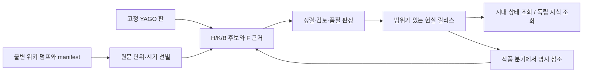

# YAGO·Wikidata·위키백과 → 현실 역사 온톨로지 변환기 PRD

상태: **구성요소 제품 요구.** 이 문서는 목표 계약이며 YAGO 전량 적재·운영 현실 릴리스·작품 역사표 승인 완료를 뜻하지 않는다. 제한된 시험과 자원 상태는 [현재 체크포인트](../harness/current-checkpoint.md) 및 연결된 실행 보고에서 확인한다. 이 문서의 요구사항 채택과 프로젝트 문서 DB의 `canon` 선택은 현실 역사 사실의 채택이나 작품 정사 승인이 아니다.

이 PRD는 [상위 집필 제품 PRD](../PRD.md)의 **공용 원역사 입력 구성요소**를 정의한다. [핵심 시스템 설계](../systems/README.md)의 원역사·작품 분기 규칙을 따르며, 만드는 대상은 [34개 데이터 집합 목록](../plans/wikipedia-reality-sot-build-plan.md), 의미·관계 계약은 [CIDOC CRM 기반 매핑](../plans/wikipedia-history-sot-mapping.md), 원문 좌표 계약은 [입력·증거 보존 계약](../plans/wikipedia-history-sot-mapping/ingestion-contract.md)에 둔다. 이 PRD는 목록이나 매핑표를 복제하지 않고 **제품이 언제 무엇을 보여 주고 수락할지** 정한다.

## 1. 문제, 사용자, 제품 결과

YAGO의 정제된 개체·분류·관계는 역사 조사의 출발 골격이지만, 제외되거나 단순화된 Wikidata 진술과 위키백과 본문의 작은 사건·논쟁·출처 구절을 대신하지 않는다. 보유 영어 위키백과 덤프의 페이지 제목만으로 인물·사건·개념을 하나씩 만들면 한 문서의 복수 사건과 지식판을 잃고, 후대의 설명을 과거 인물의 지식으로 오인한다. 작품의 한 앵커를 바꾸는 데 필요한 당시 정치·자원·기술 상태와 후대에 알려진 지식을 서로 다른 질문으로 조회할 수 있어야 한다. [YAGO 4.6 조사](../research/20260928-yago-46-history-foundation-research.md)는 선택의 근거와 확인되지 않은 coverage를 기록한다.

이 구성요소의 결과는 출처가 있는 **현실 역사 사건·상태 전표(H)**, 시대의 사건과 독립된 **지식 객체 및 내용판(K)**, 지식의 정식화·학습·전달·수용·사용을 나타내는 **연결 전표(B)**, 그 판단을 되짚는 **원문·주장·검토 기록(F)**의 버전 있는 현실 릴리스다. 위키의 문장은 우선 출처의 주장이고, 현실 릴리스는 검토 정책에 따라 채택한 주장들의 특정 판이다. 릴리스에도 미상·논쟁·사용 제한이 남을 수 있다.

| 사용자 | 필요한 일 | 제품이 제공할 결과 |
|---|---|---|
| 자료 구축 운영자 | YAGO·Wikidata·위키백과 입력판을 고정하고 범위를 선별해 배치를 재개·재처리 | 입력 manifest, 소스별 상태, 실패·제외 사유, 처리 분모, 자원 측정 |
| 역사·자료 검토자 | 동일성·시기·출처·상충·고위험 관계를 판정 | 원문 span 또는 외부 KG 진술 위치와 후보 주장 비교, 병합 보류·수락 기록, 검토 범위 |
| 역사 설계 소비자(SOTA와 작가) | 시대 상태와 도입 가능한 지식을 근거와 함께 조회 | 릴리스·기간·지역·인지 조건이 표시된 근거 패킷과 미확인 항목 |

첫 제품 사용은 한 작품에서 필요한 기간과 배경을 **명시한 검토 범위**를 제공하는 것이다. 전 세계 역사 지식을 완성해야 첫 작품을 시작할 수 있다는 조건은 [상위 PRD](../PRD.md#첫-완성에서-제외하거나-미결인-것)에 없다. 제품의 객체 유형은 세계사에 재사용 가능하게 만들고, 선택한 범위부터 증거·품질을 확인해 확장한다.

### 대표 사용 질문

1. “1450년경 이 지역에서 누가 어떤 직위·자원·외교 관계를 가졌나?” → 그때 유효한 현실 전표와 근거만 반환한다.
2. “1200년 현지에서 어떤 문자와 제철 공정이 알려지고 실제 사용됐나?” → 해당 시기의 수용·사용 전표를 따로 반환한다.
3. “작가가 1200년 인물에게 후대 기술을 알려 주려면 무엇이 필요한가?” → **이 제품에 수록된 1950년 이전의 후대 지식 객체**를 별도 기획 조회로 찾고, 당시 인물의 인지·현지 실행 가능성·보급은 미상 또는 별도 전표로 둔다.
4. “문종 사망과 단종 즉위 사이에 확인된 사건은 무엇인가?” → 상위/하위 사건·시간 불확실성·상충 주장·출처를 함께 제시한다.

## 2. 범위와 제품 경계

- **구조화 입력의 기본 골격은 판을 고정한 YAGO 4.6**으로 한다. YAGO 개체·분류·관계를 작품 기간·배경의 후보 발견에 쓰되, YAGO의 형식 제약 통과를 사실 진위·완전성·역사 인과의 수락으로 해석하지 않는다. 해당 판의 제공 파일·해시·라이선스·스키마를 manifest로 고정하고 최신 코드와 배포 덤프가 같은 빌드라고 추정하지 않는다. 원본 YAGO와 프로젝트 보강·판정 결과는 분리 보존한다.
- 필요한 범위의 **Wikidata 전체 statement, rank, qualifier, reference와 원시 시간값**을 고정판으로 별도 보존하고 YAGO에 채택·제외·미매핑된 후보를 대조한다. YAGO의 제외 로그만으로 원 Wikidata의 모든 누락을 셌다고 하지 않는다. 인명·지명 등 프로젝트 안정 ID와 외부 YAGO ID·Wikidata QID는 판별 대응표로 연결하며 이름 변경, 동명이인, 상충 병합을 자동 확정하지 않는다.
- 의미 구축 대상은 대체역사 생성에 유용한 [H/K/B/F 34종](../plans/wikipedia-reality-sot-build-plan.md)이다. 한 페이지에서 0개 또는 여러 대상·사건·주장이 나올 수 있다. 제목·범주·인포박스만으로 한 페이지를 한 개체로 단정하지 않는다.
- **1950년은 대략적인 선별 기준**이다. 현실 사건·상태의 유효 시점과 인간이 정식화·기록·사용한 지식 내용판의 시점을 구별한다. 덤프 편집일 또는 후대 연구서 출판일은 이 시점과 별개다. 명백한 1950년 이후 사건·내용판은 대상 밖이지만, 경계 근처·불명 연대의 작은 오차는 자동 폐기·릴리스 실패 사유가 아니다. 원문 시기 표현과 판단 이유를 보존한다.
- 경계를 가로지르는 인물·국가·기관·장기 사건의 필요한 이전 상태를 남긴다. `1949-12-31`을 종료·사망일로 만들지 않는다. 연대·행위자·장소가 불명확하면 가능한 범위와 `unknown`을 기록한다. 명백한 후대 내용만 제외하고 경계 근처·불명은 후보·보류·제한 사용으로 검토한다. 개념의 최초 기원이 미상이어도 이전 사용 근거와 시기 불확실성을 표현할 수 있다. 자연 현상/재료의 대상 식별은 후대 과학 설명판이나 생산 공정판의 선행 존재를 증명하지 않는다.
- 위키백과 원본 덤프는 YAGO/Wikidata와 별도의 불변 입력으로 보존한다. 의미 추출보다 먼저 **독립적인 가벼운 XML 인벤토리**로 원본 page/revision/slot·해시 목록을 고정한다. 제목/범주/구조 단서로 저비용 후보를 찾되, 혼합 문서에서는 문단·표셀·주장 단위로 다시 판정한다. 명백한 후대 내용은 활성 현실 사건·지식·벡터 색인에 넣지 않는다. 미상·보류·파서 실패의 원문 좌표와 사유는 운영 원장에 남긴다.
- H200의 Gemma 4 31B는 고정 위키 원문 span을 근거로 H/K/B/F **후보**를 추출·보강하는 실행 역할이다. 구조 관계의 충돌 검출과 원문 근거 검증은 별도 정책·검토 단계가 맡는다. 저장·모델 처리량·비용·백업·운영 DB 구성은 선택한 환경에서 실측하고 고정하며, 현재 인프라와 실행 여부는 [자원 현황](../systems/infrastructure.md) 및 [체크포인트](../harness/current-checkpoint.md)에서 확인한다.

이 제품은 **SOTA의 대체역사 경로 창작, 원인 확률화, Gemma 집필, 작품 역사표 잠금**을 구현하지 않는다. 작품 설정·빙의·미래 지식은 작품 분기의 데이터다. 위키 자료의 모든 주장 채택, 세계 역사 전체의 무오류 복원, 모든 사실의 전문가 개별 승인을 첫 릴리스의 완료 조건으로 삼지 않는다.

## 3. 운영자와 소비자의 사용 흐름

1. 운영자가 YAGO 배포판, Wikidata full dump, 위키백과 snapshot/export family를 각각 manifest·hash·라이선스·선별 범위로 고정한다. 독립 XML 인벤토리가 위키 원본의 page/revision/slot·hash 목록을 먼저 고정한다. 재현 가능한 입력판과 원문 식별·checksum 결과가 없으면 의미 배치를 릴리스할 수 없다.
2. 제품이 선별한 slot을 문단·목록 항목·표 셀·독립 template 필드 등 겹치지 않는 기본 회계 단위로 등록하고 `0..N` 후보 결과의 장부를 만든다. 구조상 중첩된 행·인용·inline markup은 부모/주석으로 기록한다. 시기 혼합 문서와 후보 밖 문서의 표본을 운영자가 확인한다.
3. YAGO는 개체·분류·관계의 구조 후보를, Wikidata full statement는 순위·시간 한정·출처와 YAGO에서 빠진 후보를 제공한다. H200 Gemma 4 31B와 규칙·구조 필드 추출기는 고정 위키 원문 단위의 근거 span에서 H/K/B와 주장을 제안한다. 소스마다 후보·제외·미매핑·실패를 따로 회계하며 모델은 현실 릴리스를 직접 변경하지 못한다.
4. 검토자는 같은 대상의 별칭·동명이인·중복 사건·상충 주장·부정·반복 기간과 원 날짜의 정밀도·달력을 확인한다. 시간의 선후만으로 인과를 확정하지 않고, 병합 후보를 되돌릴 수 있으며 근거가 부족하면 보류한다.
5. 정책판에 따라 원문 목록·단위 처리 장부·출력 근거 연결을 전수 검사하고, 이상 문서와 독립 원문 표본 및 고위험 주장을 검토한다. 단일 발행자가 범위·판·잔여 미결을 표시한 불변 현실 릴리스를 공개한다.
6. 소비자는 현실 상태 조회와 독립 지식 기획 조회를 구분해 요청한다. 제품은 채택 근거·충돌·미상·범위 제한을 담은 패킷을 돌려준다. 작품의 개변은 별도 권한과 `work_id`로 조회·기록한다.
7. 다음 덤프 판 또는 규칙판에서 바뀐 단위를 재처리하고 영향 받은 주장·병합·검색 색인을 재평가해 **새 현실 릴리스**를 만든다. 이전 릴리스와 그 작품 참조는 그대로 재현된다.



## 4. 산출 정보의 최소 계약

이 절은 개념적 런타임 계약이다. 실제 테이블 DDL, 전체 CIDOC CRM 클래스·속성, 모든 추출 필드는 [매핑 명세](../plans/wikipedia-history-sot-mapping.md)와 구현 설계에서 정한다. 아래 ID는 자료의 종류에 따라 다른 네임스페이스를 사용하고, 제목·문자열·YAGO ID·QID 하나로 대상을 확정하지 않는다. **위키 원문 위치와 외부 KG 진술 위치는 다른 증거형**이다. 외부 KG 사실에 위키 byte span을 만들어 채우지 않는다. 위키 문장에서 따로 확인한 경우 두 근거를 각각 연결한다.

| 레코드 | 반드시 보존할 내용 | `null`/미상 허용과 불변 경계 |
|---|---|---|
| `PageInventory` | `snapshot_id`, shard hash, page/revision/slot ID, 원문 hash·byte 길이, 선택/제외 사유 | 의미 추출 전에 독립 인벤토리로 고정. 문서 제목이나 추출 결과로 원문 분모를 만들지 않음 |
| `SourceUnit` | `source_unit_id`, 상위 page/revision/slot, 원문 span, 기본 단위 유형·부모/중첩 주석, 파서판, 인용 occurrence | 기본 회계 단위끼리는 비중첩. 인용·표 행 등 주석은 중첩 가능. 내용과 원문 위치는 불변 |
| `KGStatementSource` | `source_kind=yago_fact/wikidata_statement`, 배포/dump 판·파일/hash, 원 진술 식별자 또는 재조회 가능한 좌표, 주체·술어·객체, rank·qualifier·reference·원 시간값 중 실제 가진 항목, 매핑/제외 상태 | YAGO 파생 사실과 Wikidata 원 진술은 별도 판으로 보존. 없는 원본 항목은 `unknown`이며 위키 `SourceUnit`·span으로 가장하지 않음 |
| `UnitResult` | `source_unit_id`, 실행/규칙/모델판, attempt, 최종 커밋 여부, 배타적 처리 상태·이유 | `candidate_generated/justified_zero/filtered/unsupported_deferred/failed/unprocessed` 중 최종 하나. 재시도 이력은 별개 |
| `OutputLink` | 후보/주장/지식/전표 ID, `source_kind`, 해당 위키 `source_unit_id`+근거 span **또는** 외부 `KGStatementSource` ID, 후보 판정·릴리스 참조 | 위키 단위별 후보 0개 이상 허용. 외부 KG만 근거이면 위키 span은 비워 둠. 소스별 후보 수와 단위 수는 별도 집계하며 끊어진 근거 참조 금지 |
| `Entity`/`Knowledge` | 프로젝트 안정 ID, 의미 유형, 이름/언어별 별칭, 외부 YAGO ID·Wikidata QID의 판별 대응, 지식 내용판 식별, `origin` 주장과의 연결 | 지식의 최초 발생일·발견자·사람의 인지자는 `unknown` 가능. 외부 식별자 변경·병합과 동일 내용판 수정은 기존 판을 덮지 않음 |
| `Event`/`State` | 프로젝트 안정 ID, 유형, 유효 시간 또는 가능한 반복 구간, 원 시간값·정밀도·달력·정규화판, 참가·대상·장소 역할, 상위 사건 후보 | 미상 시간/행위자/장소 허용. 공개 시점과 유효 시점 별개; 경계 절단을 가짜 종료로 기록 금지. YAGO 단일 날짜/구간이 반복 상태의 완전한 이력이라고 추정하지 않음 |
| `Bridge` | 안정 `bridge_id`, 지식 ID, 사건/상태 ID, 정식화·인지·숙련·전달·수용·실행 등 **하나의 관계 종류**, 주장 ID | 단순 인지에서 생산·보급으로 자동 승격 금지. 필요한 주체/장소 미상은 명시적으로 표시 |
| `Assertion` | `assertion_id`, 주장 주체/술어/대상, 긍정·부정, `source_kind`별 근거 위치, 제안 방식, 시간 한정, 상태 | 위키 구절·Wikidata 진술·YAGO 파생 사실·직접 읽은 원저작·모델 해석을 다른 `basis_kind`로 기록. 모델이 출처를 재인용해도 원 출처와 모델 해석을 합치지 않음. 수락/반려/보류는 기존 후보 덮어쓰기 대신 판 기록 |
| `MergeDecision` | 병합 후보 ID들, 근거·반례, 판정자/정책판, 수락·보류·기각 상태 | 별칭이나 QID만으로 강제 병합 금지. 이전 ID·주장·판을 역추적 가능 |
| `ReviewDecision` | 대상 주장/병합·범위, 검사 정책판, 자동/사람 검토자 유형, 근거·결론·시각 | 정책 수락과 개별 사람 검토를 구별. 미검토는 검토 완료로 표기 금지 |
| `RealityRelease` | 릴리스 ID, YAGO 배포판·Wikidata dump·위키 snapshot 및 각각의 hash, 매핑·추출기·정책 판, 선택 시간/지역/분야, 소스별 수락·미결·제외 분모, 발행 시각 | 발행된 내용은 불변. 정정은 새 릴리스. 문서 DB `canon`이나 작품 `work_id`와 독립 |
| `ReviewScope` | `scope_id`, `work_id`, 작품이 쓸 현실 릴리스 ID, 필요 기간·지역·이전 배경, 검토 완료/제약/잔여 미상 | 범위 안의 미검토 0건이 사용 가능 조건. `failed`·`unsupported_deferred` 잔여 수·사유·용도 제한과 검토 후 허용한 미상·논쟁을 표기. 전체 릴리스 발행만으로 작품별 범위가 완료되지는 않음 |
| `EvidencePacket` | `query_mode`, 현실 릴리스 ID, 요청한 `as_of`/지역/지식판 범위, 결과별 유효 시점·지식판 정식화 시점·당시 인지/보급 상태·주장 ID·출처형별 위치·상충/미상 | 위키 근거에는 원문 span, 외부 KG 근거에는 해당 고정판 statement 위치를 표시한다. 현실 상태 조회는 `as_of` 시점의 사건·인지·보급만 제시. 기획 지식 조회는 1950년 이전 후대 지식도 별도 표시하며 당시 인물 인지로 승격 금지 |

원문 span은 불변으로 저장한 **slot 텍스트의 UTF-8 byte offset, 반열린 구간 `[start,end)`**을 기준으로 삼고, XML 원바이트 범위와의 대응이 있으면 별도로 둔다. 템플릿 전개·정규화·문장 분할의 span은 원문 복수 범위로 되돌리는 변환판을 기록한다. 기본 단위는 slot 원문을 빠짐없이 회계하고 markup·공백의 빈틈은 `structural_only`로 표시한다. 정규화 전후 글자 수 일치나 모든 주석 span의 비중첩을 요구하지 않는다. 정확한 역추적이 불가능한 공개 후보는 허용하지 않는다. 세부 필드는 [입력·증거 보존 계약](../plans/wikipedia-history-sot-mapping/ingestion-contract.md)을 따른다.

외부 KG 증거는 `statement_id/원 진술 위치 + 고정 dump·파일 hash`로 별도 재조회한다. YAGO 사실과 그 바탕이 된 Wikidata statement의 파생 대응을 기록하고, **동일 원천을 독립 증언 두 건으로 가산하지 않는다**. 대응이 불명확하면 별도 미상으로 둔다. Wikidata reference는 그 진술이 제시한 출처 주장이고 직접 열람·검증한 원저작의 인용과 구분한다. YAGO의 RDF* `Meta`는 사실 파일과 별도로 적재·결합하거나 명시 변환해 시간 조회를 검증한다. YAGO 값에 보이지 않는 원 Wikidata의 여러 statement·순위·반복 기간·정밀도·달력은 원판에서 복구하며, 누락/경합을 보류 상태와 근거로 남긴다. **시간 순서만으로 인과를 확정하지 않는다.**

선택 범위의 최종 커밋 실행판마다 **위키 원문 단위 장부**에서 `원문 기본 단위 수 = 후보를 낸 단위 + 정당한 0건 + 제외 + 미지원/보류 + 실패 + 미처리`가 성립해야 한다. **YAGO·Wikidata 장부**는 각 입력의 대상 진술·매핑·채택/제외·미매핑·실패를 자료 판별로 따로 센다. 양쪽 장부의 분모를 합쳐 한 출처의 누락을 감추지 않는다. 후보 개수는 별도로 `채택 + 기각 + 보류/상충 + 미검토 + 후보 처리실패`와 대조한다. 재시도 attempt를 모두 합산하지 않는다. 후보 일부를 만든 뒤 오류·중단된 단위는 최종 `failed`/`unprocessed`이고 부분 후보는 attempt 산출로만 보존한다. 완결된 재개 결과만 `candidate_generated` 및 최종 후보/릴리스 집계에 넣는다. [계획의 12단위 가상 예시](../plans/wikipedia-reality-sot-build-plan.md#문서별-정제-장부와-누락-확인)처럼 5개 위키 단위에서 후보 7건이 나올 수 있다. 회계 합계가 맞아도 일부 의미가 빠졌을 수 있으므로 이를 내용 완전성의 증명으로 표시하지 않는다.

**상태는 네 단계로 나눈다.** `candidate_created`는 원문 후보가 있음, `batch_validated`는 구조·시간·근거 불변조건을 통과함, `reality_released`는 고정 정책과 검토 결과로 현실 릴리스에 포함됨, `work_scope_reviewed`는 해당 작품의 사용 기간과 배경을 검토함을 뜻한다. 어느 단계도 자동으로 다음 단계를 뜻하지 않는다. 원문의 불확실성과 논쟁은 릴리스 이후에도 유지될 수 있다. 프로젝트 문서 하네스의 `canon`은 검색할 **문서판 선택**, `reality_released`는 특정 **현실 주장판**, 작품 정사·잠금은 **작가 승인 결과**로 각각 다른 상태다.

다음 JSON은 **가상 테스트 데이터의 후보 패킷 예시**이며 위키 실측·현실 역사 사실·실제 운영 스키마가 아니다. `demo:` ID와 내용은 출시 데이터에 들어가지 않는다.

```json
{
  "snapshot_id": "demo:snapshot-1",
  "page_inventory": {
    "snapshot_id": "demo:snapshot-1",
    "shard_sha256": "demo-shard-hash",
    "page_id": "demo-page",
    "revision_id": "demo-revision",
    "slot": "main",
    "raw_text_sha256": "demo-text-hash",
    "raw_byte_length": 300,
    "selector_status": "selected"
  },
  "source_unit": {
    "source_unit_id": "demo:source-1",
    "snapshot_id": "demo:snapshot-1",
    "file_sha256": "demo-hash",
    "page_id": "demo-page",
    "revision_id": "demo-revision",
    "slot": "main",
    "raw_span": [120, 188],
    "unit_kind": "paragraph",
    "parent_unit_id": null,
    "parser_version": "demo:parser-1",
    "citation_status": "wiki_citation_unread"
  },
  "unit_result": {
    "source_unit_id": "demo:source-1",
    "run_version": "demo:run-1",
    "attempt_id": "demo:attempt-1",
    "committed": true,
    "status": "candidate_generated",
    "reason": "explicit_process_use"
  },
  "knowledge": {
    "id": "demo:knowledge-1",
    "type": "manufacturing_process",
    "content_version": "demo:version-1",
    "origin_time": null
  },
  "event": {
    "id": "demo:event-1",
    "type": "process_use",
    "valid_time": { "earliest": "1450", "latest": "1459", "precision": "decade" },
    "actor_id": null,
    "place_id": "demo:place-1"
  },
  "assertion": {
    "id": "demo:claim-1",
    "subject_id": "demo:event-1",
    "predicate": "actually_used",
    "object_id": "demo:knowledge-1",
    "source_unit_id": "demo:source-1",
    "basis_kind": "attributed_source_claim",
    "polarity": "positive",
    "valid_time": { "earliest": "1450", "latest": "1459" },
    "extractor_version": "demo:extractor-1",
    "status": "candidate_created"
  },
  "bridge": {
    "id": "demo:bridge-1",
    "knowledge_id": "demo:knowledge-1",
    "event_id": "demo:event-1",
    "relation_kind": "actually_used",
    "assertion_id": "demo:claim-1"
  },
  "output_link": {
    "source_unit_id": "demo:source-1",
    "candidate_id": "demo:claim-1",
    "evidence_span": [120, 188],
    "candidate_status": "candidate_created",
    "reality_release_id": null
  },
  "merge_decision": null,
  "review_decision": { "status": "unreviewed", "policy_version": null },
  "reality_release_id": null
}
```

## 5. 기능 요구사항

표의 `필수` 요구는 제품 구현 계약이다. 검증 방법은 §7의 요구 추적표에 연결한다. 상세 CSV의 모든 행을 이 표에 복사하지 않는다.

| ID | 필수 요구 |
|---|---|
| FR-01 | YAGO 배포판, Wikidata full dump, 위키 snapshot/export family와 각 checksum·형식·라이선스를 manifest로 고정한다. 의미 추출과 독립된 가벼운 위키 XML 인벤토리에서 namespace/page/revision/slot·원문 hash 분모를 먼저 만들고, 외부 KG 진술 분모는 별도 계산한다. 불일치 입력은 격리한다. |
| FR-02 | 불변 위키 원문, 비중첩 기본 단위와 중첩 주석, 위키 후보의 역추적 가능한 span·인용 occurrence를 보존한다. 외부 KG 후보는 판·원 statement 위치·reference를 별도 출처형으로 보존하고, 위키 인용과 직접 확인한 외부 원저작을 구별한다. |
| FR-03 | 1950년을 대략적인 대상 선별선으로 써 사건/상태·인간 지식 내용판을 주장 단위로 판단한다. 혼합 문서와 경계 횡단 대상, 불명 연대는 원문·가능 범위·보류/제한 사유를 보존하고 작은 날짜 오차만으로 폐기·실패 처리하지 않는다. |
| FR-04 | 한 원문 단위에서 H/K/B 후보가 **0..N개** 나올 수 있다. 단위마다 후보 생성·정당한 0건·제외·미지원/보류·실패·미처리를 배타적인 최종 상태와 이유로 기록하고, 후보 판정은 별도 층에서 센다. |
| FR-05 | 개념·언어·문자·교리·과학 이론·공정의 독립 ID/내용판을 시간 사건과 분리하고, 등장·인지·숙련·전달·채택·사용을 원자 브리지로 잇는다. |
| FR-06 | 모든 사실 후보에 위키 구절·YAGO 파생 사실·Wikidata statement·직접 확인 원저작의 출처형, 모델 해석, 직접 확인 여부, 긍정·부정·상충·미상을 표현한다. Gemma의 자가확신이나 시간 순서만으로 인과를 현실 관계로 승격하지 않는다. |
| FR-07 | 프로젝트 안정 ID와 외부 YAGO ID·**확보된 경우에만 QID**·언어별 별칭·위키 링크의 판별 대응을 보존한다. 동명이인/동일사건의 병합·분리·보류를 근거와 함께 가역적으로 기록한다. |
| FR-08 | 자동 형식 검사와 표본 의미 검토, 고위험 병합·인과 검토의 정책판·담당·결론을 남긴다. 사람 전수 검토를 자동 전제로 두지 않는다. |
| FR-09 | 선택 범위와 미결을 명시한 불변 현실 릴리스를 단일 발행 경계에서 만들고, 정정 시 새 릴리스로 이전 판과 참조를 보존한다. |
| FR-10 | `reality_as_of`와 `planner_knowledge` 조회를 별도 모드로 제공한다. 전자는 요청 시점의 현실 사건·인지·보급만, 후자는 1950년 이전 후대 지식 내용판까지 찾되 당시 인지·보급·실행 가능성을 자동 주장하지 않는다. |
| FR-11 | 구조 관계·키워드·파생 벡터 검색에서 **모드별** 릴리스/시간/지역/상태 범위를 적용하고 `query_mode`·`as_of`·지식판 역사 시점·당시 인지/보급 상태·원문/상충/미상이 표시된 `EvidencePacket`을 반환한다. 기획 모드의 지식판을 `as_of` 하나로 일괄 제거하지 않는다. 한국어 질의로 영어 원문 근거를 찾고 이름/별칭의 언어를 표시한다. 번역 설명은 원문 사실·동일성 증거의 파생 표현이다. |
| FR-12 | 현실 구축 권한은 작품 분기를 쓸 수 없고, 작품 조회·창작은 명시적 `work_id`와 현실 릴리스 참조를 요구한다. 공용 원역사로 작품 사실 역유입을 막는다. |
| FR-13 | 배치·원문·규칙/모델판별 멱등키와 중단점·격리 사유를 남겨 재실행 시 중복 없이 재개한다. 부분 후보를 낸 뒤 중단돼도 그 attempt를 성공으로 표시하지 않고, **완결된 최종 커밋 결과만 회계**한다. |
| FR-14 | 새 덤프/추출기/매핑판에서 바뀐 주장을 재추출하고 영향 받은 병합·릴리스 후보·색인을 재검토한다. |
| FR-15 | 독립 위키 원문 목록·단위별 처리 장부·후보 출력 연결과 YAGO/Wikidata 진술별 매핑·제외/미매핑 장부의 분모와 최종 결과를 **소스별로** 대조한다. 누락 단위·진술·중복·단절 근거를 기계 검사하고, 이상 문서 및 무작위 층화 표본에서 후보가 나온 단위까지 원문을 독립 재독해한다. 발견 누락의 유형·영향범위를 기록해 재처리한다. |
| FR-16 | 작품별 `ReviewScope`에 `scope_id`/`work_id`, 필요한 현실 기간·지역·선행 배경, 참조 릴리스, 미검토/미상을 남긴다. **범위 내 미검토 0건**을 확인한 뒤 사용 가능 판정을 한다. |
| FR-17 | YAGO의 RDF* `Meta`를 사실과 별도 처리·결합하고, Wikidata full statement의 rank·qualifier·reference·반복 구간·시간 정밀도/달력 원값과 대조한다. YAGO에서 제외·단순화된 관계를 자동 오류 또는 자동 무효로 판정하지 않으며 상충·미상 상태를 남긴다. |
| FR-18 | 같은 고정 작품 범위와 독립 원문 표본에서 YAGO 골격만 쓴 후보와 Wikidata·Gemma 근거 보강 후보를 비교한다. 커버리지·잘못된 연결·시간/출처 손실·자원 사용을 구별해 기록하고, 표본 결과를 전체 역사 보증으로 확대하지 않는다. |

## 6. 비기능 요구와 측정 규칙

| ID | 필수 요구 |
|---|---|
| NFR-01 | 승인된 H200 Gemma 후보 추출과 선택한 저장/백업 환경의 실제 GPU/CPU/RAM·용량·PostgreSQL/pgvector·복구 가능성을 실측하고, 자원 한도 안에서 배치 크기·보존 기간을 정한다. 현행 배치 위치와 진행 상태는 실행 기록에서 확인한다. |
| NFR-02 | 원본·중간 후보·릴리스·색인을 구별한다. 벡터는 재생성 가능한 검색 부산물이며 유일한 사실 저장소가 아니다. |
| NFR-03 | 원문·입출력·모델 설정·실행 attempt·판정·발행 결과를 보존해 **기존 릴리스를 정확히 재조회**한다. 확률적 모델 재호출은 새 attempt의 후보로 기록하고 차이를 검토하며 동일 릴리스에 중복 발행하지 않는다. |
| NFR-04 | 원문·검토·발행과 작품 분기에 역할별 쓰기 권한을 적용하고 질의 범위의 작품 간 누출을 시험한다. |
| NFR-05 | 발행 릴리스와 원본·manifest의 백업/복구 및 이전 릴리스 재조회를 시험한다. |
| NFR-06 | 표본 의미 누락·처리량·입출력 토큰·저장·재시도 비용을 실측한다. 첫 릴리스 전 회계·근거·미매핑 손실 정책과 자원 상한을 기록한다. 표본 recall은 선택적 보조 진단으로 보고하며 릴리스 주요 게이트나 미실측 성능 보장으로 쓰지 않는다. |

## 7. 수락검사와 요구 추적

**주요 릴리스 게이트는 정제 회계·의미 보존·근거 연결·미매핑 손실 관리**다. 공개된 수락 주장에는 출처형에 맞는 **위키 원문 좌표 또는 외부 KG 고정 진술 위치**, 출처판·유효 ID가 있어야 하고 작품 사실은 현실 릴리스로 역유입할 수 없다. 독립 위키 원본 인벤토리에서 선택 범위의 모든 기본 단위까지 처리 결과가 추적되고 `unprocessed=0`이어야 하며, KG 진술은 별도 분모로 매핑·제외·미매핑을 대조한다. 명백한 후대 자료를 목적 범위에서 제외하되 작은 날짜 오차나 불명 연대 자체를 일괄 중단 조건으로 두지 않는다. 의미 누락은 시대·지역·분야·문서 형식·길이별 독립 원문 표본과 이상 문서에서 찾고, 병합·인과·인물 인지의 고위험 후보를 따로 검토한다. 표본 recall은 보조 진단값이며 100% 회계나 높은 추정 recall 어느 쪽도 내용 누락 0을 증명하지 못한다. 운영 정책과 자원 상한은 개발 표본·선택 환경 실측 후 독립 검토 표본을 보기 전에 판으로 고정하고, 판을 바꾸면 새 표본에서 평가한다.

| 수락 ID | 시험 입력과 검증 방법 | 합격 근거로 남길 것 |
|---|---|---|
| AC-01 | YAGO 배포판·Wikidata full dump·위키 덤프의 manifest·hash·형식·라이선스를 각각 대조하고 손상 입력을 격리한다. 의미 추출과 별도로 위키 XML page/revision/slot·원문 hash 인벤토리와 KG statement 목록을 자료 판별로 따로 고정한다. 위키 원문 span은 바이트·인용으로, 외부 진술은 원 statement 위치로 역조회한다. | 검증된 소스별 분모, 격리 목록, 복구 가능한 근거 위치, 선택 환경 자원 실측 |
| AC-02 | 옛 사실을 담은 현대 문서, 명백한 후대 내용판, 경계 근처·횡단 인물·날짜 미상 표본을 넣는다. 작은 날짜 차이와 불명 연대가 자동 폐기·전체 릴리스 실패로 이어지지 않고 원문 표현·판단 근거·보류/제한 상태로 남는지 확인한다. 제목만으로 탈락한 후보를 표본 감사한다. | 적격·제외·보류 이유, 날조한 종료 0건, 연대 오차/미상 보존과 잘못된 제외 사례 |
| AC-03 | 한 글에 인물·사건·공정·보급이 섞인 표본과 관련성 0인 표본을 넣는다. 한국어(언어)·한글(문자)·한글로 적은 다른 언어의 텍스트를 각각 식별한다. 가상 12단위에서 후보 7건을 낸 5단위·제외 4·미지원 2·실패 1의 단위 회계와 후보 개수 분리를 검사한다. | 다중 후보와 0건 이유, 사건·언어·문자·텍스트의 독립 ID, 단위/후보 별도 합계 |
| AC-04 | 위키 구절이 없는 YAGO 사실, Wikidata reference만 있는 진술, 직접 읽지 않은 인용 문헌, 문장 부정, 상충 서술, 모델 외삽을 넣어 근거 유형과 상태를 대조한다. | 외부 KG 위치에 가짜 위키 span 0건, 위키 인용/직접 원저작 구별, 부정·상충·미상 보존, 근거 없는 수락 0건 |
| AC-05 | 철기 지식과 실제 제련을 분리하고, `reality_as_of=1200` 조회·기획자의 `planner_knowledge` 후대 지식 조회·작품 인물의 지식 조회를 비교한다. 명시적 작품 분기 인지 전표가 없는 후대 지식이 인물에게 자동 노출되지 않는지 검사한다. | 후대 독립 객체 검색 가능, 당시 인지·숙련·자원·생산·보급의 자동 승격 0건 |
| AC-06 | 동명이인·동일 사건의 중복 기사, 교리 분파·상충 주장, 시간순이지만 인과 불명인 쌍을 대조한다. | 병합 수락/보류/분리 근거, 원 주장 복원, 미근거 인과 채택 0건 |
| AC-07 | 긴데 후보 0건, 표가 많은데 후보가 적음, 미지원·실패가 많은 문서를 재독해한다. 분야·세기·지역·원문 형식별 무작위 층화 표본에서는 후보가 나온 단위도 살펴 부분 사실 누락을 찾고, YAGO 제외·미매핑과 Wikidata 원 진술을 대조한다. 필요하면 다른 규칙/모델의 second pass를 쓴다. | 이상 문서·외부 진술 미매핑 목록·독립 표본·누락 유형/영향범위·재처리 기록, 보조 recall의 한계 표기 |
| AC-08 | 한 범위를 발행 후 원문·매핑/모델/정책판을 바꿔 새 릴리스로 정정하고 이전 릴리스 및 백업을 재조회한다. | 두 불변 릴리스·차이·단일 발행 기록·복구 결과 |
| AC-09 | 구조·키워드·벡터의 동일 질의를 모드별 릴리스/시점/지역/상태 필터로 실행한다. 한국어 질의→영어 원문 근거, 이름/별칭 언어, 기획 모드의 후대 지식 검색을 검사하고 번역 설명과 원문을 대조한다. | `EvidencePacket`의 모드·시점·지식판/인지/보급·근거, 필터 누락·벡터 반환 부족 측정, 근거 없는 정답 처리 0건 |
| AC-10 | 작품 빙의·조기 한글 도입 후보를 만들고 현실 릴리스 쓰기를 시도한다. 다른 작품과 미지정 `work_id` 조회도 시험한다. | 현실 기준선 오염·작품 간 누출 0건, `ReviewScope`와 명시적 현실판 참조 |
| AC-11 | 처리 중 강제 중단·중복 실행·규칙판 변경·격리 복귀를 시뮬레이션한다. 보존된 기존 릴리스를 재조회하고 확률적 모델 재호출은 새 attempt로 차이 기록한다. 장부 합계에는 최종 커밋 결과만 반영한다. | 중복 수락·중복 단위 집계 0건, 실패/보류 원장, 재개 cursor, 새 후보와 기존 릴리스의 구별 |
| AC-12 | 선택 작품의 기간·선행 배경과 범위 밖 표본을 점검해 `ReviewScope`와 독립 위키 원문 분모·기본 단위 결과·출력 링크, KG 진술 분모·매핑 장부를 각각 대조한다. 범위 안 미검토가 하나라도 있으면 사용 가능 판정을 막고, `failed`·`unsupported_deferred` 잔여 수·사유·용도 제한을 노출한다. | **문서별 원문 목록·단위별 처리 장부·KG 진술별 매핑/제외 장부·이상 문서 목록**, `unprocessed=0`, 끊어진 공개 근거 0건, 검토 후 허용한 미상/논쟁·용도 제한과 비용 실측 |
| AC-13 | 같은 주체·속성의 반복 재임, preferred/normal rank, 경합 값, 원 Wikidata 시간 정밀도·달력, YAGO RDF* Meta가 빠진 쿼리 입력을 고정해 YAGO 단독 후보와 원 진술/Meta 결합 후보를 대조한다. 같은 역사 범위의 위키 독립 표본에서 Gemma 보강 전후를 비교한다. | 보존/손실/상충 건별 원 statement와 날짜, Meta 결합 결과, 인과 오채택 여부, 후보 증가와 오류·자원비용을 분리한 비교표. 전체 역사 품질 보증 아님 |

**요구→검증 추적표:** 이 표는 향후 릴리스 수락 계약이며 실행 완료 판정표가 아니다. 실제 합격/실패/보류는 연결된 실행·검토 기록에서 확인하고, 릴리스 보고에는 각 요구 ID별 시험 근거 위치와 실행 판을 기록한다.

| 요구 ID | 대응 수락검사 |
|---|---|
| FR-01 | AC-01 |
| FR-02 | AC-01, AC-04 |
| FR-03 | AC-02 |
| FR-04 | AC-03 |
| FR-05 | AC-03, AC-05 |
| FR-06 | AC-04, AC-06 |
| FR-07 | AC-06 |
| FR-08 | AC-07 |
| FR-09 | AC-08 |
| FR-10 | AC-05, AC-09 |
| FR-11 | AC-09 |
| FR-12 | AC-10 |
| FR-13 | AC-11 |
| FR-14 | AC-08, AC-11 |
| FR-15 | AC-02, AC-07, AC-12 |
| FR-16 | AC-10, AC-12 |
| FR-17 | AC-01, AC-04, AC-13 |
| FR-18 | AC-07, AC-13 |
| NFR-01 | AC-01, AC-11 |
| NFR-02 | AC-08, AC-09 |
| NFR-03 | AC-08, AC-11 |
| NFR-04 | AC-10 |
| NFR-05 | AC-08, AC-11 |
| NFR-06 | AC-07, AC-12 |

AC-02·03·05의 초기 사례는 [기존 설계 fixture](../plans/wikipedia-history-sot-mapping.md)에서 시작할 수 있지만, 실제 덤프의 원문 span과 독립 정답을 확보하기 전에는 실측 합격으로 표기하지 않는다.

## 8. 릴리스 단계와 남은 결정

| 단계 | 제공할 것 | 종료 기준 |
|---|---|---|
| R0 입력·계약 시험 | 고정 YAGO·Wikidata·위키 판과 독립 원문/KG 진술 목록, 작은 실제 원문 표본, 기본 단위·0..N 결과 계약, H/K/B/F 후보 | AC-01~06·13의 원문/진술·회계 표본과 실패 유형 확보. 현실 릴리스 아님 |
| R1 첫 현실 후보판 | 선택 범위의 문서별 원문 목록·단위별 처리 장부·KG 매핑/제외 장부·이상 문서 목록, 후보·근거·검토 원장 | AC-07·11·12·13으로 누락/자원 실측. `candidate_created`와 `batch_validated` 표시 |
| R2 작품 사용 가능 현실 릴리스 | 불변 `RealityRelease`, 구조/키워드/벡터 근거 조회, 해당 `ReviewScope` | 실제 원문·KG 판 기반 AC-01~13 모두 통과. 사용 범위의 미검토 0건을 확인하고, 검토 후 남은 미상·논쟁·용도 제한은 공개 |
| R3 재사용 범위 확대 | 추가 시대·지역·분야와 다음 덤프판 재처리 | 동일 AC 회귀 및 판간 차이·비용 기록. 첫 작품의 선행 조건은 아님 |

구축 착수 전에 **선택한 H200 처리·저장/백업 위치와 자원**, YAGO 배포/스키마·Wikidata full dump·보유 XML의 고정판과 무결성, 각 자료의 권리·보존 조건을 확인한다. R1 실측을 토대로 첫 릴리스의 표본 규모·의미 품질 문턱·재시도/저장 상한·검토 책임을 고정한다. 첫 작품의 기간·지역·앵커와 선행 배경은 작품 요구와 함께 정한다. 후대 지식 별도 팩은 현재 범위에서 제외하며 필요할 때 독립 요구로 정의한다.
