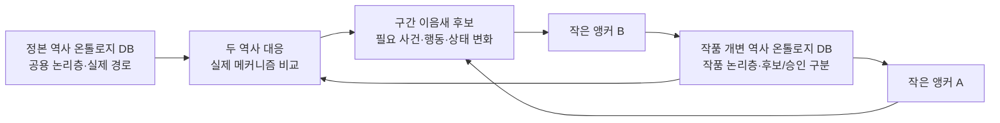
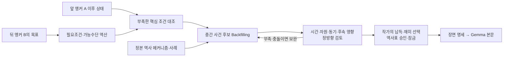
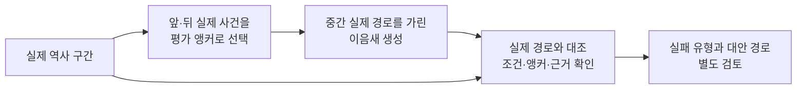

# 정본·개변 역사 온톨로지와 앵커 사이의 역사적 이음새

기준일: 2026-09-24. **상태: 사용자와 문답에서 정리한 목표·작동 가정, 세부 계약은 미결정.** [핵심 시스템 설계](README.md)의 원역사·작품 역사·승인 경계를 따른다. 이 문서는 [영어 위키백과 지식 계획](../plans/20260914-enwiki-granite-knowledge-ingestion-plan-v0-1.md)과 [역사 SoT·온톨로지 조사 계획](../plans/20260924-history-sot-ontology-research-plan.md)의 실행 승인이 아니며, 최종 스키마·모델·평가 기준을 확정하지 않는다.

**최상위 품질 기준:** 재미가 먼저다. 대체역사 소설의 경로가 역사 전문가도 납득할 만하면 충분하다. 실제 역사를 모든 미시 변수까지 완전히 재현하거나 유일하게 필연적인 경로를 증명할 필요는 없다. 납득할 만한 복수의 경로가 있으면 작가가 갈등·선택·대가·긴장·보상이 더 살아 있는 것을 고른다. 그렇다고 채택 전표, 시간 방향, 고정 앵커, 승인·공개 정사, 인물의 인지·동기에 생기는 핵심 모순을 무시하지는 않는다. ‘전문가도 납득할 수준’은 목표이며 성능 검증을 마친 상태가 아니다. [핵심 설계 §1–3](README.md#1-만드는-것)

## 목표와 합의된 전제

목표는 **전 세계의 역사·과학·인물 등으로 구축할 정본 역사 온톨로지**와 **작품에서 개변된 역사 온톨로지**를 대응해, 대체역사 집필에 쓸 역사적 인과 경로를 찾고 검토하는 것이다. 정본은 사실·조건·효과의 검색 저장소이자 실제 역사에서 어떤 과정이 이어졌는지 살펴볼 사례와 계산기 검증 기준이다. 이 목표의 규모가 모든 자료를 먼저 처리해야만 작은 범위의 설계·실험을 시작할 수 있다는 뜻은 아니다. 작품의 실제 집필에 사용할 기간과 필요한 배경의 원역사 검토 조건은 [핵심 설계 §4](README.md#4-원역사와-작품-역사의-경계)를 따른다.

사용자가 **선택·지정한 역사전표는 계산의 입력 사실**로 둔다. 전표에 채택된 조건·효과·인과관계도 입력에 포함된다. 이는 위키백과 원문 전체가 무오류라거나 미기재 전표 사이의 관계가 이미 사실이라는 선언이 아니다. 출처 주장, 모델 해석, 작품 창작의 지위와 작가 승인 경계는 계속 분리한다. 입력 전표의 진위를 매 단계 다시 심사하는 것보다, 입력을 일관되게 적용했을 때 어떤 후속 조건이 충족·부족·충돌·미확인인지 설명하는 데 계산기의 초점을 둔다. [핵심 설계 §2·4](README.md#2-역사-설계의-규칙)

사용자는 긴 시대를 한 번에 잇는 막연한 사건 생성보다 **작은 변경 앵커를 여러 개 놓고 그 사이의 자연스럽고 역사적으로 풍부한 이음새**를 원한다. 두 지정 사건이 가능한 조합인지, 그 사이에 어떤 사건·행동·조건이 필요한지, 실제 역사에는 비슷한 과정이 있었는지를 함께 살핀다. 이음새는 단순한 연대순 문장 나열이 아니라 앞 앵커에서 뒤 앵커로 도달하는 데 필요한 상태 변화와 근거를 설명해야 한다. 이것이 원역사와 작품 개변 역사를 상호 분석하는 핵심 목적이다. [핵심 설계 §1–3](README.md#1-만드는-것)

이 두 온톨로지의 **논리적 비교**는 별도 물리 DB 두 개와 원역사 전체의 작품별 복제를 뜻하지 않는다. 현행 저장 목표는 중앙 PostgreSQL + pgvector에서 공용 원역사 기준선과 작품별 변경 전표를 논리적으로 분리하는 것이다. 같은 역사 객체·관계·시점을 어떻게 대응할지는 설계할 문제다. 관계·기간·조건은 일반 조회가, 의미상 비슷한 문서·사례 후보는 시맨틱 검색이 맡을 수 있다. 온톨로지 개념을 SQL 관계로 표현할 수 있으나 컬럼·관계 테이블·JSONB의 조합은 아직 선택하지 않았다. 벡터 결과만으로 인과관계를 확정하지 않는다. [핵심 설계 §4·6](README.md#6-교체-가능한-기술-변하지-않는-계약), [PostgreSQL 재귀 조회](https://www.postgresql.org/docs/current/queries-with.html), [JSON 타입](https://www.postgresql.org/docs/current/datatype-json.html)

## 사건 객체·시간·인과의 경계

큰 전쟁은 중요한 **상위 사건/과정**이고 선전포고, 전투, 점령, 조약은 각각 독립적으로 조회할 수 있는 **세부 또는 관련 사건**이다. 어떤 사건이 전쟁의 `partOf`인지, 후속 사건인지, 인과로 연결되는지는 사건별 시점과 근거에 따라 정한다. 전쟁 후의 조약이나 여러 전쟁에 걸친 조약을 일괄적으로 그 전쟁의 구성요소로 넣지 않는다. `partOf`는 포함 관계, `causes`는 채택되었거나 이후 검토할 인과 관계이므로 서로 바꾸지 않는다. 상위 전쟁과 그 안의 전투를 두 개의 독립 원인으로 합산하면 한 경로의 효과를 중복 계산할 수 있다. 사건의 시작·종료, 세부 사건 발생, 조건·효과가 작동한 시점, 상태의 유효 기간을 구분한다. 전쟁이 끝나기 전에 전투가 점령이나 보급 상태를 바꿀 수 있다. 사건·과정·시간의 재사용 모델은 [CIDOC CRM](https://cidoc-crm.org/html/cidoc_crm_version_7.1.3_documentation_text.html)과 [SEM](https://homepages.cwi.nl/~hollink/pubs/vanHage2011SEM.pdf)을 비교 참고한다. 전체 표준 채택 결정은 아니다.

정확한 시계열은 **미래 사건이 과거 상태를 바꾸지 못하게 하는 방향 제약**을 준다. 시점별로 채택 전표의 조건과 효과를 적용해 상태를 재생하면 앞 앵커의 결과가 다음 구간의 입력이 된다. 개변 시점 이전은 보존하고 이후의 원역사 사건은 유지·변형·취소·지연·대체 여부를 다시 검토한다. 같은 날짜에 기록된 사건을 임의로 정렬해 인과가 성립했다고 주장할 수 없고, 시간순만으로 미기재 `causes` 관계를 만들 수도 없다. 기간이 겹치는 사건의 효과 발생 시점과 시간 불명 사실의 처리는 별도 규칙이 필요하다. 시간 속 사건과 상태 변화의 구분은 [OWL-Time](https://www.w3.org/TR/owl-time/)과 [Event Calculus](https://www.doc.ic.ac.uk/~mpsha/ECExplained.pdf)가 비교 자료다.

이미 **채택된 인과 주장**은 입력 전표의 일부로 쓴다. 반면 전표 A와 B 사이에 아직 기록되지 않은 관계는 계산·검토의 대상이다. 조건 충족 및 상태 전이는 명시 규칙으로 점검할 수 있지만, “A가 없었다면 B가 없었는가” 같은 개입·반사실 질문에는 어떤 상태와 대체 경로가 함께 바뀌는지 가정해야 한다. 큰 전쟁과 하위 사건의 중복, 보이지 않은 원인, 다른 경로의 선점 가능성을 드러낸다. [Halpern·Pearl의 구조적 인과 모델](https://www.cs.cornell.edu/home/halpern/papers/actcaus.pdf)과 [모델 변수 선택의 영향](https://arxiv.org/abs/1412.3518)은 이 경계의 연구 참고이며 계산 규칙 채택을 뜻하지 않는다. 역설계는 뒤 앵커의 조건을 역산하고 가능한 수단을 추론해 앞 앵커와 대조하는 것으로, 미래 사건이 과거의 원인이 된다는 뜻이 아니다.

## 작은 구간 이음새의 작업 단위

**사용자 확정 목표:** 여러 작은 앵커 사이를 역사적 핍진성이 있는 연결로 채우고, 실제 역사에도 유사한 메커니즘이 있었는지 확인한다. 사용자가 정한 결말·목표일·금지 전개, 승인 역사표 잠금과 정방향 영향 검토는 그대로 적용된다. 승인된 중간 사건도 Writer에게 제약이다. [핵심 설계 §2–3](README.md#3-역사표가-먼저-본문은-그-실현)

**아직 채택되지 않은 작업 계약 제안:** 한 구간의 입력을 `앞 앵커 직후 상태 + 뒤 앵커의 목표 상태·기한 + 허용 개변`으로, 출력을 `필요 사건·행동·선행조건·효과·원역사 근거 또는 창작 가정 + 남은 간극`으로 잡아볼 수 있다. 이 구간의 자원 소모, 사망, 소속·관계 변화 등은 다음 구간에 이어져야 한다. 앵커 사이의 적절한 간격도 연수만이 아니라 바뀌어야 할 상태의 크기와 자료의 밀도를 함께 보고 정할 수 있다. 이들은 다음 문답에서 정할 입력·출력 제안이지 지금 확정한 스키마가 아니다.

**역사 경로 역설계와 Backfilling의 작동 흐름:** SOTA는 뒤 앵커 B가 성립할 선행 조건과 가능한 수단을 역산하고, 앞 앵커 A 이후의 상태와 대조한다. 부족한 핵심 조건을 만들 중간 사건·행동을 작품 후보로 제안하며, 정본 역사에서 비슷한 메커니즘과 사례를 찾는다. SOTA는 이음새의 사건에 갈등·선택·대가도 설계해 재미를 본문 표현 단계에만 맡기지 않는다. 후보를 시간·자원·인물 동기·후속 영향에 대해 필요한 깊이로 정방향 검토하고 `충족/부족/충돌/미확인`과 남은 간극을 설명한다. 조건이 충족된다는 것은 사건이 필연적으로 일어난다는 뜻이 아니며, 가능한 경로는 여럿일 수 있다. 창작 사건은 정본 역사가 아니라 작품 후보에만 속한다. 작가가 납득 가능성과 재미를 보고 경로를 선택·승인하면 중간 사건까지 역사표에 잠기고, Gemma가 장면 명세와 학습한 문체로 이를 본문에 실현한다. [핵심 설계 §2–3](README.md#2-역사-설계의-규칙)

이 역설계는 뒤에서 앞의 **조건을 찾는 사고 순서**이지 미래가 과거에 영향을 주는 시간 역인과가 아니다. Backfilling도 그럴듯한 문장을 덧붙이거나 확률을 임의로 보정하는 과정이 아니다. 경로를 유지하는 데 필요한 주요 간극을 설득력 있게 메우되, 서사에 영향이 작은 배경의 무한 검증을 요구하지 않는다. 기존 소설 원문을 정답으로 삼아 학습 입력을 역구성하는 작업은 별도다. [핵심 설계 §5](README.md#5-모델과-데이터의-역할)

## 온톨로지 항목을 정하는 방법 — 제안

객체 분류를 끝없이 늘리기보다 이음새가 풀 질문에서 시작한다. **질문 → 필요한 개념·관계·제약 → 실제 역사의 작은 구간 모델링 → 답하지 못한 이유를 자료 부족·표현 부족·추론 부족으로 구별 → 필요한 항목만 보완**하는 순서를 제안한다. 실제 역사를 재현해 보는 사용자의 평가 구상에도 이 순서를 적용할 수 있다. 질문으로 범위와 세부 수준을 검증하는 방식은 [Ontology Development 101](https://protege.stanford.edu/publications/ontology_development/ontology101.pdf)의 참고점이다. 아래 항목들은 채택된 스키마가 아니다.

| 이음새가 물을 질문 | 표현할 정보의 후보 |
|---|---|
| 누가 언제 행동할 수 있었고 무엇을 원했나? | 인물·조직의 사건별 역할, 유효 기간이 있는 관계·지위, 출처에 기록된 동기와 모델의 해석·창작 가정 |
| B에 이르기 전에 무엇이 필요했고 무엇이 막았나? | 사건 전후 상태, 필수·촉진·방해 조건, 복수 조건의 묶음과 대체 경로, 결과를 바꾼 효과 시점 |
| 자원·기술이 실제 지역에서 작동할 수 있었나? | 수량·단위·시점이 결론에 영향을 줄 때의 자원, 과학 원리·인물의 지식·제작 역량·지역 보급을 구별한 기술 상태 |
| 실제 역사에는 비슷한 과정이 있었나? | 개별 사건 사실과 일반화한 메커니즘의 별도 기록, 메커니즘의 적용 범위·지원 사례·반례·근거 |

범용 핵심은 사건/과정·인물/조직·장소·시간·상태·조건/효과·관계·근거의 구별에서 시작하고, 전쟁·외교·기술·경제 등은 질문에 필요할 때 분야별로 확장한다. `A causes B` 한 줄로 표현하지 못하는 조건부 관계는 참여자·필수 조건·대체 수단·방해 조건·시점·근거가 달린 **관계 객체 후보**로 볼 수 있다. [W3C 다항 관계 지침](https://www.w3.org/TR/swbp-n-aryRelations/)은 이런 표현의 참고 자료이지만 프로젝트의 AND/OR/NOT 실행 규칙을 대신 정하지 않는다. 조건이 기록되지 않았다고 거짓으로 확정하거나 모든 사건에 모든 필드를 억지로 채우지 않는다. 항목 이름·의미·타입·기간·필요한 단위·근거·미상값·예시를 적은 정의서는 후속 **제안**이며 정확한 DDL·클래스 선택은 미결정이다. 판단이나 전개가 달라지는 정보부터 깊게 표현하고, 재미와 납득 가능성에 영향이 작은 미세 정량은 보류한다.

## 실제 역사 복원으로 성능 확인

사용자는 실제 역사에서 임의의 실제 사건들을 **주춧돌 앵커**로 놓고, 사이를 우리 이음새 모델이 만들어 보게 한 뒤 실제 전개와 얼마나 비슷한지 평가하자고 제안했다. 이는 원역사를 메커니즘 사례와 **이음새 생성 능력의 진단 기준**으로 쓰는 방법이다. 실제 경로와 가까운 정도가 소설의 재미나 유일한 올바른 대체역사 경로는 아니다. 평가 보완안으로는 실제 경로 재현과 다른 납득 가능한 경로를 구별하고, 독자에게 보일 갈등·선택·대가·긴장·보상과 뚜렷한 모순·편의적인 기적·동기 부재·핵심 과정 생략을 따로 정성 검토할 수 있다. 이 보완안은 아직 평가 계약이 아니다. 모델 평가용 측정치와 작품 내 사건의 개연성을 하나로 합산하는 인과 점수는 다른 문제이며, 현행 설계의 인과 확률·임팩트 등급·개연성 합산 점수 미사용 원칙을 유지한다. [핵심 설계 §2](README.md#2-역사-설계의-규칙)

아래 도식의 중간 경로 가림과 대안 경로 판정은 **미확정 평가 보완 제안**이다.

**평가 보완 제안, 미확정:** 생성 시 실제 중간 사건·직접 요약·정답으로 이어지는 관계가 입력에 누출되지 않도록 가릴 범위를 정하고, 조정용/최종 확인용 사례를 분리한다. 재구성 충실도, 조건 성립성, 근거 충실도, 앵커 준수를 별도로 볼 수 있다. 실제 경로와 다르지만 조건상 유효한 대안은 별도 평가한다. 성공 사례뿐 아니라 막힌 구간과 실패 사유도 남긴다. 무엇을 가리고 어떤 기준으로 수락할지 아직 사용자 결정과 실험 결과가 없다.

## 남은 설계 질문과 현재 상태

- 사건·상태·조건·효과·인물·기술의 최소 객체와 관계, 상위/하위 사건의 효과 귀속·중복 방지 규칙은 무엇인가?
- 앵커마다 고정할 사건·날짜·상태의 범위와 적절한 구간 간격은 무엇인가? 실제 역사에서 다른 유효 경로를 어떻게 평가할 것인가?
- 원역사·작품 변경의 객체 대응, 전표 추출·검토·릴리스, 검색과 구조 계산, 모델/SOTA 의미 검토의 책임 경계는 어디인가?
- 복원 평가의 가림 범위, 사례 분할, 수락 기준과 실패 유형은 무엇인가?
- 앵커 사이에서 서사적 재미와 전문가도 납득할 개연성을 어떤 단위로 정성 판단하고, 어느 정보부터 자세히 모델링할 것인가?

이번 문서는 문답 내용을 정리했다. 위키 덤프의 체크섬·파싱, 온톨로지 적재, 인과 계산기 구현, 앵커 이음새 생성, 실제 역사 복원 평가는 수행하지 않았다. 다음 문답에서는 **작은 앵커 한 쌍에서 반드시 고정할 사실과 이음새가 바꿀 수 있는 상태**를 예로 정하면 객체·관계 정의를 구체화할 수 있다. [조사 계획](../plans/20260924-history-sot-ontology-research-plan.md)은 별도 계획 상태로 유지한다.
