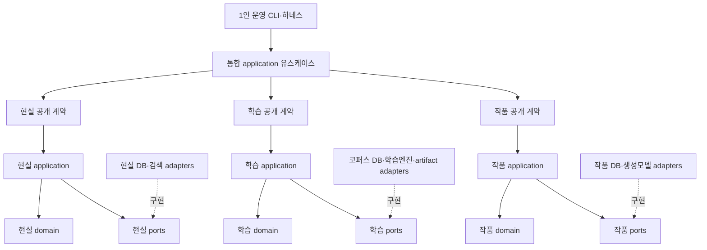
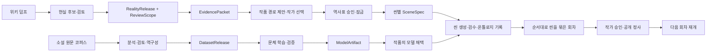
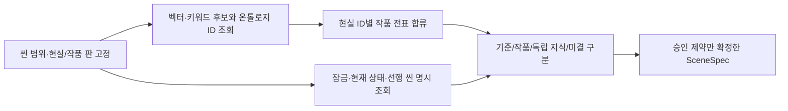

# 대체역사 AI 공장 — 핵심 시스템 설계

현재 설계의 핵심 기준이다. 상세 문서와 충돌하면 이 문서를 우선한다. 목표 설계이며 구현 완료를 뜻하지 않는다.

[집필 제품 요구(PRD)](../PRD.md)는 작가의 첫 완성 범위와 수락 기준을, [현실 역사 온톨로지 변환기 PRD](../prd/wikipedia-history-ontology.md)는 역사 자료 구축의 요구를 정한다. 문체 학습 축은 [toy-tune 설계](../plans/20260914-toy-tune-architecture-and-backendai-bootstrap-plan-v0-1.md)를 기존 구현·실행 경계의 참고 자료로 사용하며, 상충하는 설계 기준은 이 문서의 통합 계약을 따른다. 별도 문체 학습 PRD 경로는 아직 확인되지 않았다. 이 문서는 세 업무를 **한 제품**으로 연결하는 구조와 승인 경계를 설명한다. 보유·계획 자원과 확인 수준은 [인프라·데이터 자원 현황](infrastructure.md)에 둔다. 미결 제품 선택은 해당 요구 문서에 표시한다.

최종 갱신: 2026-09-27. 중앙 현실 역사·작품 운영 DB는 PostgreSQL + pgvector를 목표로 한다. 이전의 SQLite 우선·작품별 **운영 정사** DB 파일 분리 제안은 이 기준으로 대체한다. 현재 별도 SQLite에 적재된 소설 원문·분할판은 문체 학습용 분석 코퍼스의 정본이며 운영 정사와 혼동하지 않는다. 중앙 DB 설치·이관·검색 성능 검증과 통합 제품 흐름은 아직 수행하지 않았다.

## 1. 만드는 것

**작가가 결말을 정하고, AI가 그 결말에 도달할 역사를 설계한 뒤, 승인된 역사표를 소설로 구현한다.**

핵심은 역방향 인과 추론과 역사표 창조(Backfilling)다. 검색·DB·문체 학습은 이를 지원한다. 실제 역사를 예측하거나 객관적 필연성을 증명하는 시뮬레이터가 아니다.

**재미가 우선이다.** 역사 경로는 역사 전문가도 납득할 만한 개연성이면 충분하며, 실제 역사를 미시적으로 완전 재현하거나 유일한 필연성을 증명하려 하지 않는다. SOTA의 중간 사건·갈등·선택·대가 설계에도 이 기준을 적용하고, 그 수준을 만족하는 복수의 경로에서 작가가 서사적으로 더 재미있는 것을 선택한다. 이 기준은 시간·앵커·승인 정사·인물 인지와 핵심 조건의 모순을 무시한다는 뜻이 아니다. [정본·개변 역사와 앵커 이음새](20260924-history-ontology-and-anchor-bridges.md)

```text
작가의 앵커 → 선행 조건·중간 사건 역설계 → 간극을 메울 사건 창조
                       ↑                              │
                       └── 수정 ← 정방향 영향 검토 ←──┘
                                      ↓
                           작가 승인 → 역사표 잠금
                                      ↓
                         장면 명세 → Gemma 집필
                                      ↓
                    검수·씬별 온톨로지 기록 → 승인·공개
                                      ↓
                            작품의 단일 정사 반영
```

### 한 제품의 세 업무 모듈

한 사람이 같은 제품 흐름에서 **현실 역사·지식 구축**, **파인튜닝 문체 학습**, **작품 설계·집필**을 운영한다. PRD의 개수와 코드 모듈 수를 기계적으로 맞추지 않는다. 통합 유스케이스는 모듈의 공개 기능을 호출하고 결과의 불변 식별자를 다음 단계에 전달한다. 각 모듈은 자기 데이터와 상태를 변경하며 다른 모듈의 내부 테이블·모델 객체를 직접 조회하거나 수정하지 않는다. 필요한 정보는 공개 유스케이스와 반환 계약으로 받는다.

| 업무 모듈 | 소유하는 규칙·데이터와 변경 권한 | 다른 모듈에 공개하는 결과 |
|---|---|---|
| 현실 역사·지식 구축 | 고정 YAGO·Wikidata 구조 자료와 위키 덤프 원문·주장·검토, 현실 사건/상태(H), 독립 지식 내용판(K), 지식의 등장·인지·전달·적용 브리지(B), 출처·근거(F), 불변 현실 릴리스. 작품 분기에 쓸 수 없고 근거 없는 인과를 현실 사실로 승격하지 않는다. | `RealityRelease`, 작품 기간·배경의 `ReviewScope`, 질의 모드별 `EvidencePacket`. 범위 내 미검토가 남으면 집필용 범위 완료로 표시하지 않는다. [변환기 PRD](../prd/wikipedia-history-ontology.md#4-산출-정보의-최소-계약) |
| 파인튜닝 문체 학습 | 기존 소설 원문·분할판, 원문 분석과 독립 검토, 역구성 입력, split·선정·학습·평가 상태. 검토된 원문 정답과 파생 분석을 구분하고 작품 정사나 현실 릴리스를 바꾸지 않는다. | 출처·역할·split·계약판이 고정된 `DatasetRelease`, 검증 결과와 데이터셋 참조를 가진 `ModelArtifact`. `gemma_style`과 `sota_planning` 자료는 별도 역할이며 자동 혼합하지 않는다. [toy-tune 설계](../plans/20260914-toy-tune-architecture-and-backendai-bootstrap-plan-v0-1.md#9-데이터-계보평가-누수) |
| 작품 설계·집필 | `work_id`별 앵커·개변 후보, 작가 승인·잠금 전표, 작품의 씬·회차·본문 판과 씬별 온톨로지 기록, 인물 인지, 검수·공개된 단일 정사. 현실 근거를 참조하되 공용 현실을 고치지 않는다. 학습 결과를 명시 채택해 사용하되 모델 출력만으로 승인 상태를 바꾸지 않는다. | 잠긴 역사표판과 장면 계약, 검수 가능한 씬/회차 초안, 작가가 승인한 정확한 회차 원고·씬별 온톨로지 기록·정사판. [집필 PRD](../PRD.md#핵심-사용-흐름) |

작품 기획자는 1200년의 현실 상태·현지 보급과 그보다 후대에 형성된 지식 객체를 **서로 다른 조회 모드**로 볼 수 있다. 후대 지식을 찾았다는 이유만으로 그 시대 인물이 알고 있거나 실행할 수 있다고 기록하지 않는다. 작품에서 빙의 인물이 그 지식을 가져오면 작품 분기의 인지·자원·숙련·전파 전표로 검토한다. 현실 객체 ID와 작품 사실 ID는 함께 조회할 수 있지만 같은 상태로 합쳐지지 않는다.

### 통합 유스케이스와 의존 방향

제품 구조는 **모듈러 모놀리스**를 기본으로 한다. 1인 운영 하네스·CLI는 작품/학습/현실의 공개 유스케이스를 **같은 제품에서 실행·위임하는 진입점**이다. 기본은 한 배포 단위 안의 함수 호출이며, 내부 HTTP·큐·새 모델 실행 프레임워크가 필요하지 않다. Native Codex 작업 배정은 기존 하네스가 맡고 제품은 고정 입력 준비, 제출 결과 검증·저장, 독립 검토 결과 적용, 다음 미완료 항목 조회를 담당한다. 한 제품이라는 뜻이 한 GPU·DB 파일·OS 프로세스를 강제한다는 뜻은 아니다. 문서 탐색·버전 관리용 하네스 SQLite와 문서 `canon`은 운영 지원이며 이 제품의 원역사 릴리스나 작품 정사 DB가 아니다.

아래는 **코드 의존 방향**이다. 공개 함수의 이름은 구현된 API가 아닌 목표 계약의 예시다.



각 모듈의 `domain`은 승인 상태와 불변식을, `application`은 작업 순서·권한·재개를, 작은 `ports`는 필요한 읽기·쓰기·실행 계약을, `adapters`는 SQLite/PostgreSQL·파일·모델 SDK·CLI를 맡는다. 의존성은 안쪽으로 향한다. 코어에는 DB 행·SQL·파일 경로·벤더/배포 모델 ID의 하드코딩이나 SDK 타입 의존을 넣지 않는다. 계약 안의 `ModelArtifact` 같은 불투명 업무 참조 ID는 허용한다. 학습기와 집필기는 서로의 내부 구현을 import하지 않는다. 한곳의 bootstrap이 실제 adapter를 연결하고 domain/application은 구체 adapter를 선택하지 않는다. 포트는 실제로 교체·검증할 경계에만 둔다. 공통 계층이 모든 모듈의 저장소·도메인 규칙을 흡수하는 범용 프레임워크는 만들지 않는다.

| 모듈 | 공개 유스케이스 예시: 입력 → 결과 |
|---|---|
| 현실 | `issue_reality_release(검토된 후보) → RealityRelease`; `review_scope(현실 릴리스 ID, work_id, 기간·지역) → ReviewScope`; `query_evidence(릴리스, 질의 모드·범위) → EvidencePacket` |
| 학습 | `prepare_input(원문판·구간) → 고정 입력`; `release_dataset(검토·선정 판) → DatasetRelease`; `register_model_artifact(학습·검증 결과) → ModelArtifact` |
| 작품 | `propose_path(앵커·근거) → 후보`; `lock_plan(작가 결정·참조판) → 잠금판`; `adopt_model(모델 참조·결정) → 채택판` |
| 작품의 씬·회차 | `retrieve_history_context(시점·지역·대상·작품판) → 씬 근거`; `record_scene(본문판·온톨로지 기록) → 검수 가능한 씬`; `publish_chapter(검수·승인 원고·씬 기록) → 정사판` |

다음은 **업무·데이터 흐름**이다. 공개 계약이 연결되는 순서이며, 모듈 내부 테이블 간 직접 참조를 뜻하지 않는다.



이 그림의 학습 흐름과 작품 설계 흐름은 독립적으로 앞서 진행할 수 있다. 집필 한 번마다 재학습하거나 새 현실 릴리스를 구축하지 않는다. `SceneSpec`은 학습 입력 역구성과 실제 집필이 공유하는 **작은 버전 의미 계약**으로, 장면 목표/제약·시점 인지·선행 문맥과 정답 누설 금지를 표현한다. 학습에서는 가상 역사표·역구성 가설의 출처를 표시하고, 운영 집필에서는 작가가 승인한 실제 잠금 전표판을 반드시 검증한다. 어느 학습 가설도 작품 정사로 자동 편입되지 않는다. 모델 엔진별 문자열·토큰 형식은 adapter가 변환한다. `DatasetRelease`는 자료 역할과 split·원문 판·검토 상태를 고정하고, `ModelArtifact`는 사용한 릴리스·모델판·평가 결과를 참조한다. 작품이 채택한 모델 ID는 별도 결정으로 기록하며 학습 완료만으로 기존 작품의 모델이 바뀌지 않는다.

공개 계약은 ID와 계약 버전으로 연결한다. 현실 모듈은 `RealityRelease` 안의 H/K/B/F 판과 `ReviewScope(work_id, 범위, 검토 상태)`를 소유하고, `EvidencePacket(질의 모드, 기준 시점, 원문 근거, 불확실성, 릴리스 참조)`을 반환한다. 작품 모듈은 이 참조를 고정한 뒤 자기 분기의 인지·영향 판단과 승인 상태를 소유한다. 학습 모듈은 `DatasetRelease`와 `ModelArtifact`를 발행하지만 작품의 모델 채택 결정은 작품 모듈만 바꾼다. 계약을 바꾸면 버전을 올리고 소비자 검증을 거쳐 사용한다. 내부 DB 행이나 학습 엔진 객체는 공개 계약이 아니다.

## 2. 역사 설계의 규칙

- **역설계:** 앵커에서 필요한 상태·사건·자원·인물 행동을 역산한다. 작가가 정한 결말·목표일·금지 전개를 임의 변경하지 않는다.
- **Backfilling:** 부족한 연결을 새로운 사건으로 채운다. 창작은 허용하되 각 사건의 성립 조건·인물 동기·후속 영향을 검토한다.
- **정방향 검토:** 개입이 어떤 조건을 바꾸고 어떤 미래 사건을 유지·변형·취소·지연·대체하는지 추적한다. 다른 앵커와 공개 사실의 충돌도 확인한다.
- **판정:** 충족·부족·충돌·미확인 사항과 근거를 설명한다. 인과 확률·임팩트 등급·전파 속도 점수·개연성 합산 점수는 사용하지 않는다.
- **결정:** 여러 경로의 가정과 대가를 작가에게 제시한다. 해결하지 못한 간극은 숨기지 않고 작가의 선택을 받는다.

프로그램은 명시된 시간·참조·자원·잠금 제약을 검사하고 SOTA는 의미·개연성을 검토한다. 검색 유사도와 그래프 최단 경로는 인과의 증명이 아니다.

역사 경로·플랜의 역설계와 Backfilling은 SOTA가 맡고, Gemma는 승인된 역사표와 장면 명세를 학습된 문체로 본문에 구현한다. 정본 역사 사례는 가능한 연결을 찾고 검토하는 근거이며, 새 사건은 작품 후보로만 만든다.

## 3. 역사표가 먼저, 본문은 그 실현

역사표에는 사건, 시점, 인물·장소, 선행 조건, 효과, 연결 앵커, 출처 또는 창작 가정을 기록한다. 본문 작성 후에는 실제로 구현된 사건을 추출해 계획 사건과 연결한다.

**작가가 승인한 범위의 모든 역사전표를 잠근다. 중간 사건도 Writer에게는 권고가 아니라 제약이다.**

- Gemma의 자유는 역사표와 충돌하지 않는 대사·묘사·장면 구성이다.
- 위반한 본문은 수정한다. 역사표 변경이 필요하면 영향 검토와 작가 재승인으로 새 계획 버전을 만든다.
- 변경된 계획의 영향을 받는 미공개 초안은 재검토한다. 새 계획으로 이미 공개된 역사를 덮어쓰지 않는다.
- 잠금은 프롬프트만으로 맡기지 않는다. 쓰기 권한 제한, 프로그램 검사, SOTA 검수, 사람 승인으로 집행한다.

작품 모듈은 후보 → 검토 → 작가 승인·잠금 → 본문 검수 → 작가 승인·공개를 별도 상태로 기록한다. 잠긴 전표판, 채택한 `RealityRelease`·`ModelArtifact`와 `SceneSpec` 계약판은 집필 입력에 고정한다. 새 현실 릴리스나 모델 산출물이 나와도 기존 작품·초안·정사는 자동으로 바뀌지 않는다. 승인된 변경은 영향 검토 후 새 판에 반영한다. 공개 전에는 승인한 정확한 회차 원고와 **각 씬의 온톨로지 기록 전체의 revision/hash**, 예상 정사판을 한 묶음으로 재검증하고 작품 정사에 원자적으로 반영한다. 객관 사실·인물 주장·인지의 지위를 그대로 보존한다. 같은 제출을 재시도해도 공개가 중복되지 않아야 하며, 외부 게시와 내부 반영 사이의 실패는 복구 가능한 상태로 남긴다.

### 씬의 기록을 회차와 작품으로 잇기

`Work`는 순서가 있는 `Chapter`들로, 각 `Chapter`는 순서가 있는 `Scene`들로 구성한다. 안정된 `work_id/chapter_id/scene_id`와 각각의 본문 revision을 두어 씬을 고쳐도 정체성을 잃지 않는다. **서술 순서와 사건 발생 시간은 별도 값**이다. 뒤에 배치한 회상 씬이 과거 사건을 묘사할 수 있지만, 그 사실을 과거 인물이 미리 알았다고 만들지 않는다.

각 씬에는 **온톨로지 기록 묶음**을 연결한다. 아래는 논리 항목이며 해당하지 않는 변화나 빈 속성을 억지로 채우지 않는다.

| 항목 | 씬에 연결할 내용 |
|---|---|
| 식별·순서·시공간 | 안정 `work_id/chapter_id/scene_id`, 선택 작업판, 본문 revision, 씬 배열 순서와 별개의 사건 유효 시각·장소 |
| 참여자·입력 | 등장 인물/역할·시점 인물의 인지 범위, 고정된 현실/작품 사실 ID·원문 근거, 잠긴 필수·금지 조건 |
| 계획·본문 사실 | 잠긴 계획 사건과 본문에서 **실현된** 사건을 분리. 처음 밝혀진 출신·혈연·이미 가진 물건 같은 지속 사실도 유효 시간·근거와 함께 기록 가능 |
| 변화·전달 | 실제 상태·관계·소유/자원·지식 전달의 변화가 있을 때만 작품 전표로 연결. 변화가 없으면 `변화 없음`도 유효 |
| 발언·믿음 | 대사 속 소문·믿음·거짓말과 누가 들었는지를 인물의 주장·인지로 기록. 객관적 사망·지식 보급으로 자동 승격하지 않음 |
| 본문 근거·검수 | 정확한 씬 본문 revision과 관련 구간, 주장/전표의 근거, 선행 씬 의존과 검수 결과 |

인물·장소·지식의 안정 ID와 현실 H/K/B/F 의미를 참조하되 매 씬마다 객체 사본을 만들지 않고 **작품 스코프**의 주장·발생·변화·근거를 잇는다. 미기재는 `모름`이지 `거짓`이 아니다. 모든 문장·속성을 전수 전표화하지 않는다. 계획된 변화는 잠긴 역사표의 제약이고 본문에서 실현된 변화/처음 확인된 사실은 본문 근거와 검수 결과가 있어야 한다.

다음 씬은 작품의 공개 정사와 **현재 선택된 회차 작업판에서 검수 규칙을 통과한 선행 씬**만 문맥으로 받는다. 이는 씬마다 새 사람 승인 단계를 강제한다는 뜻이 아니다. 다른 후보 초안이나 후속 씬, 미공개 회차의 내용이 공개 정사·다른 분기에 자동 합쳐지지 않는다. 선행 씬을 고치면 그 내용을 참조한 뒤 씬의 검수와 해당 검색 파생판을 무효화·재생성한다. 새 사실 때문에 영향 범위를 알 수 없으면 선택된 회차의 **그 뒤 씬들을 보수적으로 재검수**한다. 공개 정사는 조용히 덮어쓰지 않는다. 회차 공개 때는 순서대로 묶은 정확한 원고와 **씬별 온톨로지 기록 전체의 revision/hash**를 한 승인·원자 반영 단위로 다루며 객관 사실·처음 확인된 지속 사실·인물 주장/인지·변화 없음의 구분을 유지한다.

예를 들어 가상 씬 1에서 빙의한 왕자가 한글 표기법을 설명했다면 `왕자의 설명`과 `청중이 들음`은 기록할 수 있다. 청중의 이해·교습 성공·사회적 보급은 뒤 씬의 근거와 검토가 따로 필요하다. 씬 2가 광석·연료 부족 때문에 제철 실험에 실패했다면 그 실패와 자원 상태를 기록해 씬 3의 제약으로 쓰며, 왕자가 제철법을 안다는 사실만으로 생산 성공을 만들지 않는다.

## 4. 원역사와 작품 역사의 경계

| 구분 | 의미 |
|---|---|
| 공용 원역사 | 출처에 근거한 역사·과학·인물의 사건·상태·조건. 작품 때문에 수정하지 않음 |
| 작품 후보 역사표 | 역설계 경로와 미승인 창작 사건. 수정·폐기 가능 |
| 작품 승인 역사표 | 미래 사건을 포함하는 잠긴 집필 명세. 아직 발생한 공개 사실은 아님 |
| 작품 공개 정사 | 공개 본문과 승인 전표로 확정된 사실. 선형 이력으로 보존 |

원역사 기준선은 공용이고 **작품별 개변 역사 브랜치는 하나**다. 위 구분은 데이터의 지위이지 별도 영구 세계선이 아니다. 집필 중 임시 작업 분기는 허용하지만 공개 후 승인 전표를 작품의 단일 정사로 합친다. Git commit·worktree와 역사 브랜치를 혼동하지 않는다.

**중앙 PostgreSQL 안에서 공용 원역사와 작품별 개변 캐논을 논리적으로 분리한다.** 원역사는 버전이 있는 공용 기준선이고 작품은 `work_id`와 참조 원역사 버전을 가진다. 원역사 전체를 작품마다 복제하지 않고 변경·취소·대체·신규 창작을 전표로 저장한다. 원역사 교정은 새 릴리스로 만들고 작품 적용은 별도 승인한다.

원역사 사건 ID와 작품 변경 전표를 연결하여 원래 사건·바뀐 사건·변경 이유·연결 앵커·본문을 함께 비교한다. 변경 전표가 없다는 것과 영향 검토 후 유지하기로 한 것은 구별한다. 승인된 미래 계획과 공개된 사실도 별도로 조회한다.

원역사 전체 미래를 개변 시점에 폐기하지 않는다. 개변의 영향을 받은 사실을 명시적으로 재검토·대체한다. 사건 시점, 공개 시점, 인물의 인지 시점은 별개다. 기획자가 아는 미래가 인물의 지식으로 흘러들어가면 안 된다.

고정 YAGO 판을 구조 골격으로 삼고 필요한 Wikidata 전체 진술과 영어 위키백과 원문을 별도 출처형으로 보강한다. H200 Gemma 4 31B의 원문 근거 추출은 검토할 후보를 만들며 사실·인과·작품 정사를 자동 확정하지 않는다. 원자료·출처·불확실성을 보존하고, 사료의 주장·모델 해석·작품 창작을 구별한다. 벡터는 검색용 파생물이며 SSOT가 아니다. [변환기 PRD](../prd/wikipedia-history-ontology.md)

**집필은 작품에서 사용할 기간의 원역사 검토가 완료된 뒤 시작한다.** 작품 기간(예: 1453~1600)을 먼저 정하고, 그 기간의 역사·과학·인물과 필요한 이전 배경을 사용 범위로 고정한다. 해당 범위에는 미검토 원역사가 없다는 것을 집필의 전제로 삼으며, 범위·참조 원역사 버전·검토 완료 상태를 기록한다. 검토 완료는 사료의 불확실성까지 없어진다는 뜻은 아니다.

기간이나 필요한 자료 범위를 넓히면 추가 범위를 검토한 뒤 집필에 사용한다. 원역사 검토 완료와 작품 개변의 영향 검토는 별개다. 새로운 개변이나 계획 변경이 생기면 관련 원역사의 유지·변경 여부를 다시 검토한다.

**완결작은 작품 단위로 아카이브한다.** 역사표·개변 전표·승인/공개 이력·위키·본문과 참조 원역사 버전·근거를 내보낸다. 의존 자료는 함께 보관하거나 불변 보관본에 연결하고, 복원·비교 가능성을 확인한 뒤 활성 작업·검색 대상에서 제외한다. 중앙 데이터 삭제는 별도 결정이다.

작품 간 격리는 집필 중에도 유지한다. 다음 작품은 공용 원역사에서 시작하며 이전 작품의 개변 역사·위키·인물 기억을 자동 상속하지 않는다. 속편 등 명시적으로 승인한 계승만 허용한다.

## 5. 모델과 데이터의 역할

| 역할 | 선택 |
|---|---|
| 운영 본문 생성·재작성 | Gemma. 문체 학습의 주 목표는 Gemma 4 31B |
| 역설계·인과 의미 판정·검수·추출·학습 입력 역구성 | 역할별로 교체 가능한 SOTA 모델 |
| 역사·과학·인물 지식의 의미 검색 | Granite 계열, 최종 구성은 검증 후 선택 |
| 소설 문체 비교·참고 예문 검색 | Munche. 지식 검색에 사용하지 않음 |
| 중간 생성물 품질 비교 | 동일하게 고정한 입력으로 Gemma와 SOTA를 비교 |

SOTA 비교용 본문을 운영 원고·학습 정답·정사에 자동 편입하지 않는다. 문체 예문의 사건도 작품 사실로 사용하지 않는다.

**사용자가 지정한 리첼렌·간다왼쪽·명원·마늘맛스낵 작가의 보유 소설을 먼저 분석하고, 그 결과로 서사·장면 명세와 문체 학습 기준을 정한다.** 초기 10~20편이라는 수량보다 작가 선정을 우선한다. 작품별 Luna가 구조 지도와 초·중·후반 대표 장면을 분석하고, 작가별 Sol이 원문 근거와 해석을 검토한다. 루트는 오케스트레이션을 담당한다. 작품·에피소드·회차·장면의 구조, 인물의 욕망·갈등·선택·대가·변화, 정보 공개·복선 회수·보상·회차 말미의 연결, 문체를 원문 위치와 함께 분석한다. 작가 내 반복 특징과 작품별 차이를 먼저 정리한 뒤 작가 간 비교를 수행하며, 보유작이 한 편이면 작가 내 반복성을 확정하지 않는다. 채택할 기법·문체는 사용자가 선택한다. 본문의 관찰, 효과에 대한 해석, 판매 성공의 원인 가설은 구별한다. 원문만으로 판매 성공의 원인을 입증했다고 하지 않는다. [배정·진행 현황](../research/author-study/README.md)을 따른다.

학습 정답은 선택한 기존 소설 원문이다. SOTA가 이전 문맥·가상 역사표·이번 장면 명세를 역구성하여 원문과 짝짓는다. 학습과 집필은 같은 의미의 입력 계약을 쓰고, 정답 표현이나 이후 장면의 결과를 입력에 누설하지 않는다.

현재 원문·분할판의 기준은 `data/analysis/novel-corpus.sqlite3`의 `source_revision`·`segmentation`·`segment`다. 화별 분석은 작품·원문판·분할판과 확정된 회차 또는 승인된 구간의 좌표를 고정해 본문을 조회한다. 회차 경계가 미확정인 `window`를 공식 `chapter`로 바꾸어 부르지 않는다. 같은 기준으로 분석 입력, 뷰어·반출, 중단 후 재개를 연결한다. 원본 TXT는 반입·복구·무결성 및 경계 정비의 원자료이지 분석 중 DB 조회 실패 시 자동 대체 본문이 아니다. 원문 해시와 CP 좌표는 판과 좌표 체계를 함께 확인한다.

분석 카드·독립 검토·선택·학습 투입·진행 상태도 궁극적으로 코퍼스 DB가 정본이 되도록 이관한다. **현재 이 상태가 모두 DB에 적재됐다는 뜻은 아니다.** 기존 JSON/CSV 산출물은 이관·검증할 입력 또는 DB에서 만드는 반출물로 다루고 파일과 DB를 동시에 상태 정본으로 갱신하지 않는다. 원문은 학습 정답이고 역구성한 역사표·장면 명세는 입력 가설이다. 그 가설을 원저자의 실제 의도나 작품 정사로 확정하지 않는다. 취향상 채택한 기법과 실제 학습 투입 승인도 구분한다. `gemma_style`의 문체 예시와 `sota_planning`의 설계 입력은 별도 데이터셋 역할·검토 기준·split을 유지한다.

**생성 모델과 캐논 DB는 별개다.** 모델은 장면 명세·허용 사실·인지 범위·직전 문맥·문체 예문을 담은 동결 패킷을 읽는다. DB 변경마다 재학습하지 않는다.

## 6. 교체 가능한 기술, 변하지 않는 계약

- **실행:** 첫 학습은 Backend.AI H200. 다른 GPU 서버나 맥북으로 이동할 수 있도록 한다. MLX·변환 모델의 지원과 품질은 실행 전 검증한다.
- **저장:** 중앙 PostgreSQL + pgvector로 구조화 원역사·작품 변경·관계·벡터 검색을 통합한다. HelixDB는 운영하지 않는다. 소설 원문·분할판과 이관할 분석 상태는 코퍼스 SQLite가 별도 소유한다. SQLite는 작품별 **운영 정사** 파일로 동시 갱신하지 않는다. 한 제품 안에서도 모듈별 저장소와 배포 위치는 다를 수 있다.
- **검색:** Granite 지식 벡터와 Munche 문체 벡터는 별도 테이블·인덱스·공간으로 관리한다. 관계 탐색은 관계 테이블과 제한된 재귀 조회, 인과 의미 판정은 SOTA와 애플리케이션이 담당한다. pgvector가 인과 추론을 대신하지 않는다.
- **검색 격리:** 작품·검토 완료 범위·검색 기간·원역사 버전·개변 유효성·공개 상태·인지 조건을 적용한다. 근사 검색의 필터 누락·반환 부족과 작품 간 공유 인덱스의 간섭을 검증하고 필요 시 작품별 인덱스 분리와 기간 조회에 맞는 구성을 적용한다. 아카이브한 작품은 활성 검색 인덱스에서도 제외한다.
- **구조:** domain은 역사·승인 규칙, application은 작업 흐름, adapter는 DB·모델·파일 접근을 맡는다. 핵심 규칙에 SQL·GPU·SSH·특정 모델 API를 넣지 않는다.
- **독립성:** 학습·생성 호스트와 DB 위치를 결합하지 않는다. 동결 패킷·데이터셋을 반입하면 live DB 없이 실행할 수 있어야 한다.
- **정본과 산출물:** 내용·승인·검토·재개 상태는 각 소유 모듈의 DB에 둔다. 큰 위키 덤프와 모델 가중치 등은 불변 artifact로 보관하고 DB에는 hash·위치·판 참조를 둔다. CSV/JSONL/HTML·뷰어 파일과 검색 벡터는 권위 있는 상태의 반출·파생물이다. 파일과 DB에 같은 상태를 이중으로 쓰지 않는다. DB를 교체할 때는 소유 모듈의 adapter 교체, 기존 판·상태 이관, 공개 계약·불변식 검증을 함께 수행한다.
- **추적·복구:** 원자료, 승인 계획, 공개 본문·전표·수락 이력, 채택 모델은 보존·백업한다. 버전·출처·hash로 연결하고 벡터·요약은 재생성한다.
- **공개:** 승인된 정확한 회차 본문·씬별 온톨로지 기록 전체의 판/해시 묶음만 공개하고 단일 정사에 한 번 반영한다. 계획·정사 버전을 재검증하며, 외부 게시와 내부 반영 사이의 실패는 기록하고 복구한다.

이것은 책임 경계이지 여러 서비스·서버를 즉시 만들라는 뜻이 아니다. 역사 원문 보강의 현재 선택은 H200 Gemma 4 31B이며 역사 저장·백업과 후속 운영 배치는 [변환기 PRD](../prd/wikipedia-history-ontology.md) 및 [자원 현황](infrastructure.md)의 검증된 실행판을 따른다. 첫 학습은 Backend.AI H200, 로컬 집필은 맥북 검증 목표이며 실제 저장 용량·처리량·동시 운영 가능성은 각 환경에서 확인한다. 기존 `toy-tune`의 독립 패키지·CLI와 실행 위치/학습 엔진/지식 저장소/artifact 저장소 교체 경계는 유지하면서 제품의 공개 계약으로 연결한다. 선행 원문 분석으로 학습 기준을 정한 뒤 작은 `toy-tune` 학습을 완주한다. 전체 역사 DB 구축은 첫 학습의 선행 조건이 아니며, 실제 작품 집필에는 역사 설계·잠금 검증을 적용한다.

### 씬용 온톨로지 RAG

작품 모듈의 `retrieve_history_context`는 현재 씬의 **현실 릴리스·검토 범위, 작품 작업판, 회차/씬, 서술 시점·사건 시점·지역·시점 인물**을 먼저 고정한다. 그 범위 안에서 벡터·키워드로 관련 문장 후보를 찾고 온톨로지 ID로 사건·상태·관계·지식 내용판과 근거를 조회한다. 검색된 현실 사실의 ID에 연결된 작품 변경/취소/대체 전표는 벡터 top-K 순위와 관계없이 함께 읽는다. 개변으로 영향을 받을 수 있으나 아직 검토하지 않은 후속 현실 사실은 자동 상속도 자동 삭제도 하지 않고 `미결`로 표시한다.

검색 순위와 별도로 **대상 인물·장소·자원에 관련된 현재 작품 상태, 잠긴 필수·금지 사건, 공개 정사, 현재 선택된 회차 작업판의 검수 통과 선행 씬**을 ID로 명시 조회한다. 여기서는 구조화된 현재 사실과 필요한 근거 구간만 선택하고 공개 정사·선행 씬의 본문 전문을 매번 입력하지 않는다. 따라서 top-K가 이 필수 사실을 놓쳐도 씬 입력과 검수에서 사라지지 않는다. 결과는 `현실 기준 / 작품에 적용된 사실 / 독립 지식의 기획 조회 / 미결 주장`을 구분하고 각각의 근거·유효 시점·인물 인지 가능성을 표시한다. 독립 지식 객체를 찾았다는 사실은 당시 지역의 보급이나 시점 인물의 앎을 뜻하지 않는다. 검수 통과 선행 씬은 다음 씬의 작업 문맥일 뿐 작품 공개 정사가 아니다. 잠금판과 모순되거나 미결인 후보는 확정 사실로 `SceneSpec`에 넣지 않는다.



이 흐름은 범위가 정해진 **검색·대조·명시 상태조회**다. 모든 사건의 파급을 자동 계산하는 별도 차이 엔진이나 전 세계 그래프 복제는 첫 구현에 두지 않는다. 벡터 top-K만으로 필수 전표의 충족이나 모순 부재를 보증하지 않는다.

### 통합 전환과 수락 검사

기존 원문·분할판을 먼저 판·hash·CP 좌표로 고정하고, 파일에 남은 분석 후보·독립 검토·선택·진행 상태를 **워크플로 종류와 원래 승인 의미를 보존해** 코퍼스 DB로 이관한다. 기존 역구성 후보를 새 화별 분석 카드로 오인하지 않는다. 같은 ID의 값·승인 상태가 충돌하면 자동 병합하지 않고 보류한다. 이관 전후의 고정 본문·좌표·선택 판과 원래 산출물을 대조하며, 전환 중에는 파일/DB 이중 쓰기를 하지 않는다. 검증 실패 시 이전 읽기 경로로 되돌릴 수 있게 불변 원본과 이관 전 스냅샷을 남긴다. 문서 `canon`, 현실 기준선, 학습 검토·모델 채택, 작품 승인 상태 사이에도 자동 승격 경로를 두지 않는다.

첫 세로 관통 검증은 **확정된 한 회차**를 DB에서 조회해 입력을 준비하고, 기존 Codex 작업 배정으로 분석·독립 검토를 받아 DB에 결과를 제출한 뒤, 같은 저장소의 뷰어·반출 및 재개 조회가 같은 판을 보여주는 것이다. 회차와 승인된 `window` 입력은 별도 경계 검사로 구분한다. 다음으로 `RealityRelease`·`ReviewScope` 조회 → 작품 경로·작가 잠금 → 명시 채택한 `ModelArtifact`와 씬별 `SceneSpec`으로 연속 씬 생성·검수 → 승인 회차 원고와 **씬 온톨로지 기록 전체의 판/해시**를 정사에 원자 반영 → 다음 회차 재개를 한 건 관통 검증한다. 코어 규칙은 DB 없이 시험할 수 있어야 한다. 고정 원문판·구간의 본문 동일성, 후반 정답 누설 방지, 기존 승인/잠금/공개 상태의 보존, 중복 제출의 멱등성, 작품 간 격리, 현실/모델 새 릴리스의 비자동 채택을 계약 검사로 확인한다. 이것은 전환의 완료 조건이며 현행 실행 완료 보고가 아니다. 과거 독립 프로젝트 전제와 충돌하는 세부 계획은 이 통합 기준에 맞춰 후속 동기화한다.

### 작품 기간과 장면별 검색 범위

**조사·RAG·관계 탐색은 작품 기간에 해당하는 자료 집합부터 시작한다.** 기획은 작품 전체 기간을 볼 수 있고, 집필은 현재 장면의 시점·필요한 선행 사건·지역·주제로 더 좁힌다. 검색 기간과 인물의 인지 범위는 별개이며, 작품 기간 안의 미래 사건도 현재 인물이 아는 사실로 전달하지 않는다.

| 자료 | 기간에 따른 선별 기준 |
|---|---|
| 역사·제도·상태 | 발생·유효 기간이 검색 기간과 겹치는 사실과, 그 시점의 상태를 만든 선행 사건 |
| 인물 | 생존·활동·직위·관계의 유효 기간과 장면 관련성. 기간 이전 출생자나 필요한 과거 인물을 출생 연도만으로 제외하지 않음 |
| 기술 | 당시의 발견·전파·보급 상태와 지역별 구현 조건. 앞선 시대부터 사용한 기술도 포함 |
| 과학 원리 | 관련 기술·질문에 필요한 원리와 적용 조건으로 선별. 원리 자체에 임의의 역사 연도를 부여하거나 현대 출처의 작성일로 제외하지 않음 |

범위를 먼저 제한한 뒤 구조화·키워드·벡터 검색을 수행한다. 전 역사에서 top-K를 뽑고 기간 밖 결과를 버리는 방식만으로 범위 제한을 대신하지 않는다. 기간 판정은 문서 전체의 대표 연도가 아니라 사실·관련 원문 구간을 기준으로 하며, 구간 확장 때도 같은 조건을 확인한다. 실제 탐색량·검색 지연·반환 부족은 측정해 인덱스 구성을 정한다.

선행 배경, 범위 밖 파급효과, 작품의 미래 지식·기술 도입 설정 때문에 추가 자료가 필요하면 대상·기간·이유를 기록해 필요한 범위만 확장 조사한다. 새 자료는 검토 후 집필 범위에 편입하고, 연구용 지식이 인물의 지식이나 기술 구현 가능성으로 자동 승격되지 않게 한다. 연대 불명 자료도 관련성이 있으면 검토 대상으로 남긴다. 전체 역사 조사는 명시적으로 범위를 넓힌 작업에서 수행한다.

### 64GB 맥북 운영 원칙

- 로컬 집필 목표는 PostgreSQL + pgvector, Gemma 4 31B의 검증된 MLX 4bit 변환본, 소량 임베딩 처리다. 동시 실행 가능성은 있지만 해당 맥북·모델·자료에서 실측 전이며 속도나 메모리 상한을 보장하지 않는다.
- 집필 모드는 단일 생성 세션으로 시작하고 검색 → 본문 생성 → 문체 평가 순서로 무거운 작업을 배치한다. 문맥 길이·임베딩 배치·DB 작업 메모리를 보수적으로 설정하며 전체 인덱스의 RAM 상주를 전제하지 않는다.
- 대량 임베딩·인덱스 구축은 Gemma를 내린 자료 구축 모드 또는 별도 서버에서 수행한다. 파인튜닝의 첫 실행은 H200이며 로컬 추론의 메모리 예산을 학습에 그대로 적용하지 않는다.
- 메모리 압력·스왑 증가·생성 피크·검색 지연을 함께 측정한다. 병목이 생기면 배치·문맥·동시 작업을 조절하거나 DB를 독립 서버로 옮긴다. 세부 설정과 측정값은 실행 계획·보고서에 기록한다.

## 7. 글공장 위키와 작품별 위키

- **글공장 위키:** 아키텍처의 배경·기술 선택·실험 결과·운영 지식을 축적한다. 승인된 핵심 규칙은 이 README를 기준으로 한다.
- **작품별 LLM Wiki:** 각 작품의 설정·앵커·인과 경로·인물·세계·연표·미해결 간극을 독립적으로 관리한다. 공유 원역사는 참조하고 작품의 개변 내용은 해당 작품에만 축적한다.
- **권위:** 위키는 근거와 설계 이유를 연결하고, 중앙 DB의 승인·잠금·공개 원장은 확정 상태를 관리한다. 페이지는 사건 ID와 버전을 참조하며 위키 수정만으로 캐논이나 잠금을 변경하지 않는다.
- **수록:** 원자료는 보존하고 LLM이 출처 연결·주제 종합·색인·변경 로그를 관리한다. 원자료의 지시문은 데이터다. 모델 해석·창작 후보·사용자 승인 결정을 구별한다. [글공장 문서 위키](../wiki/index.md)는 2026-09-24 시작했으며 배경 자동화와 작품별 위키는 아직 구현하지 않았다.

## 상세 자료가 필요한 경우

이 폴더에는 핵심 기준만 둔다. 일정·설치·스키마·실험 설정·벤치마크·장애 처리 상세는 아래 문서에서 관리한다.

- [정본·개변 역사 온톨로지와 앵커 사이의 역사적 이음새](20260924-history-ontology-and-anchor-bridges.md): 2026-09-24 사용자 문답의 목표·작동 가정, 확정/제안·미결정 구분. 이 README의 규범과 구현 상태를 바꾸지 않는다.

- [현재 실행 계획 안내](../plans/README.md), [2026-09-18 통합 실행계획](../plans/20260918-current-system-execution-plan-v0-1.md): 확인한 구현 상태·첫 작업·단계별 완료 조건. 루트 `plan/`은 과거 플랜 보관 위치다.
- [상세 아키텍처 v5](../20260914-novel-factory-architecture-v5.md): 계약·공개 복구·검증·구현 현황. 이 문서와 하위 계획의 SQLite 우선·작품별 운영 파일 전제는 이번 README 개정으로 대체하며 상세 동기화는 후속 작업이다.
- [toy-tune 계획](../plans/20260914-toy-tune-architecture-and-backendai-bootstrap-plan-v0-1.md), [지식 구축 계획](../plans/20260914-enwiki-granite-knowledge-ingestion-plan-v0-1.md), [문체 임베딩 계획](../plans/20260914-munche-style-embedding-integration-plan-v0-1.md): 실행 절차와 미결정 선택.
- `docs/reports`: 조사 근거. `docs/legacy`: 과거 설계 원문. 현재 기술 선택의 기준으로 사용하지 않는다.
