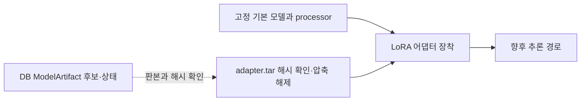

# toy-tune

웹소설 문체 학습 실험용 독립 Python 프로젝트. 실행 머신·학습 엔진·지식 DB·산출물 저장소를 분리한다.

현재 구현: CPU 기반 프로젝트 경계, runtime 설정, 환경 inventory, 명시적 원문 bundle 또는 DB에서 내보낸 검토 완료 `gemma_style` packet의 분할 유지·동결·검증, 파일 저장소와 run 상태 계약. H200에서 고정 Gemma 4 E2B 리비전으로 실제 문체 packet 90건의 토큰 경계를 점검하고, train 두 건만 2 step LoRA 학습·저장·새 프로세스 재로드했다. 이 작은 시험은 문체 향상이나 집필 채택을 뜻하지 않는다. MLX와 범용 SQLite/PostgreSQL 연결은 구현되지 않았다.

## 설치와 테스트

프로젝트 디렉터리에서 실행한다. 모노레포 루트의 기존 venv는 사용하지 않는다.

```sh
python3 -m venv .venv
.venv/bin/python -m pip install -e '.[test]'
.venv/bin/python -m unittest discover -s tests -v
.venv/bin/toy-tune --help
```

Python 3.11 이상. 기본 설치에는 외부 runtime 의존성이 없으며 JSON Schema 테스트만 선택 의존성이다. PyTorch/CUDA/MLX 설치는 이 명령에 포함되지 않는다.

## 합성 데이터로 실행

다음 명령은 Git 밖 임시 디렉터리에 데이터셋을 만든다. 이 경로는 연습용이며 장기 보존용이 아니다.

```sh
TOY_WORKSPACE=$(mktemp -d)
.venv/bin/toy-tune doctor --runtime configs/runtimes/local-cpu.toml
.venv/bin/toy-tune prepare \
  --runtime configs/runtimes/local-cpu.toml \
  --workspace "$TOY_WORKSPACE" \
  --source tests/fixtures/synthetic-source.json \
  --split configs/datasets/synthetic.toml
```

출력의 artifact_id를 사용해 확인한다.

```sh
.venv/bin/toy-tune verify-dataset \
  --runtime configs/runtimes/local-cpu.toml \
  --workspace "$TOY_WORKSPACE" \
  --dataset-id <artifact-id>
```

`verified: true`는 파일 checksum 검증이다. CPU 준비 manifest의 tokenizer·assistant loss mask 표시는 그 단계에서 `pending`이며, 이후 H200 실제 검사 결과와 문체 품질 평가는 별개다.

## DB 검토판에서 만든 문체 packet 준비

제품 CLI의 [`DatasetRelease` 사용법](../src/novel_factory/README.md#i2-문체-학습용-고정-릴리스)에 따라 `gemma_style` packet을 새 private 파일로 내보낸 뒤 다음 명령을 쓴다. `sota_planning`은 이 경로의 입력이 아니다.

```sh
.venv/bin/toy-tune prepare --runtime configs/runtimes/local-cpu.toml \
  --workspace PRIVATE/toy-artifacts --frozen-packet PRIVATE/frozen-style-packet.json
.venv/bin/toy-tune verify-dataset --runtime configs/runtimes/local-cpu.toml \
  --workspace PRIVATE/toy-artifacts --dataset-id PREPARED_DATASET_ID
```

검토판의 `train`·`development_validation`·`development_holdout`을 그대로 보존한다. `development_holdout`은 새로 정의한 최종 미공개 시험셋이 아니다. CPU 검사는 prompt에 정답 전체가 들어가는 경우와 split 사이 동일 정답을 차단하고 파일 SHA를 확인한다. 준비 metadata의 `pending_real_tokenizer`는 당시 CPU 단계 기록으로 보존한다. 이후 H200에서 90건 실제 Gemma 토큰 경계를 검사하고 train 두 건만 LoRA 학습·재로드했으며, 요청·보고서·어댑터 해시가 맞는 결과를 집필 비적격 후보로 반입했다. 자세한 결과는 아래 I2 기록을 따른다.

## 경계와 다음 단계

- [아키텍처](docs/architecture.md)
- [데이터 계약](docs/data-contract.md)
- [로컬 실행·복구](docs/runbook.md)
- [Backend.AI 접속·실행](ops/backendai/README.md)
- [다른 서버로 코드 반입](ops/ssh/README.md)
- [환경 분리](environments/README.md)

`train-lora`와 `verify-lora`는 별도 CUDA 환경의 제한된 시험 경로다. 먼저 고정 source archive와 검토된 packet·준비 artifact·제품의 real run request를 비공개 원격 폴더에 반입하고 SHA를 확인한다. `train-lora`는 `google/gemma-4-E2B-it`의 고정 revision `3e22461f65e89153144f8adb70e3b8c2cc9845a7`만 받고, 실제 processor 토큰 ID에서 prompt가 답안 포함 chat의 정확한 접두일 때만 prompt label을 `-100`으로 만든다. 학습할 train ID 1–4개와 순서를 request 및 `--sample-id`에 명시하고, 일치하지 않거나 실제 토큰 제한을 넘으면 실패한다. 개발·홀드아웃은 optimizer에 들어가지 않는다. `verify-lora`는 **별도 프로세스**에서 adapter를 다시 읽고 짧은 합성 문장으로 생성 여부를 확인한다. 제품 DB는 같은 시도의 요청·학습·재로드 보고서와 어댑터 SHA가 맞는 real 완료만 후보로 반입하며 `writing_eligible=0`을 유지한다.

```sh
.venv/bin/toy-tune train-lora --runtime configs/runtimes/backendai-cuda.toml \
  --workspace /home/work/novel-toy-tune/workspace \
  --dataset-id PREPARED_DATASET_ID --request PRIVATE/run-request.json \
  --sample-id TRAIN_SAMPLE_ID_1 --sample-id TRAIN_SAMPLE_ID_2 --max-steps 2 --max-tokens 2048 \
  --output-dir /home/work/novel-toy-tune/workspace/attempt-1
.venv/bin/toy-tune verify-lora --runtime configs/runtimes/backendai-cuda.toml \
  --workspace /home/work/novel-toy-tune/workspace \
  --output-dir /home/work/novel-toy-tune/workspace/attempt-1
```

실제 H200 시험은 명시한 두 train ID에 한정해 성공했고, 결과는 [제품 I2 검증 기록](../data/analysis/product-i2-training-verification.json)에 있다. 첫 시도는 optimizer 전에 text q/v 탐색 오류로 실패한 기록을 보존하고, 두 번째 시도의 학습 소스와 별도 재로드 소스 SHA를 구분한다. 시험 결과는 제품 DB의 `writing_eligible=0` 후보이며 작품 집필용 모델 채택이 아니다. `mac-mlx` profile은 머신 설정 경계를 보여주는 예시이며 MLX 학습 엔진 구현을 의미하지 않는다.

## 저장된 LoRA 모델 재사용

이번 시험에서 저장한 것은 Gemma 기본 모델 전체가 아니라 **LoRA 어댑터**다. 기본 모델과 processor를 같은 판으로 준비한 뒤 어댑터를 장착하면 이후 추론에 재사용할 수 있다. 이때 학습용 소설 packet을 다시 보내거나 LoRA를 재학습할 필요는 없다.

| 보관 대상 | 위치와 의미 |
| --- | --- |
| 어댑터 묶음 | 로컬 비공개 [`adapter.tar`](../data/analysis/private/i2/remote-results/h200-a2/adapter.tar), 2,713,600바이트, SHA-256 `99988871b5e62b279ce40fc5b85a7ba579ae4673551cbdebcd603029ab5b8e77`. `adapter/README.md`, `adapter/adapter_config.json`, `adapter/adapter_model.safetensors` 세 파일을 담는다. 원격 시험 결과는 `/home/work/novel-toy-tune/workspace/h200-a2`에 남겼다. |
| 기본 모델·processor | `google/gemma-4-E2B-it`의 revision `3e22461f65e89153144f8adb70e3b8c2cc9845a7`. 어댑터 archive에는 둘 다 없으므로 별도 보존하거나 사용 시 이 고정판을 다시 받아야 한다. `adapter_config.json`의 revision은 `null`이므로 최신판을 자동 선택하지 말고 `train-report.json`·`run-request.json`의 고정 revision을 사용한다. |
| 제품 DB 기록 | `ModelArtifact` 후보 `model-f2638e4194ec1c3057276497`가 학습 데이터·실행 시도·모델판, 어댑터 경로·SHA, 결과판과 `writing_eligible=0`을 가리킨다. 가중치 바이트는 DB에 저장하지 않는다. |



재사용할 때는 (1) DB의 후보 ID와 archive SHA를 대조하고, (2) 기록된 revision의 기본 모델·processor를 준비하고, (3) 검증한 archive의 `adapter/`를 그 기본 모델에 장착한다. 현재 CLI에는 자유 프롬프트 추론이나 작품 집필 UI가 없다. `verify-lora`는 고정된 짧은 시험이다. 첫 실행에서 실제 새 프로세스 재로드·생성을 검증했지만, 같은 결과 폴더에 `reload-report.json`이 이미 있으면 기존 증명과 archive 해시를 검사해 반환할 뿐 모델을 다시 로드하지 않는다. 이 2 step 후보는 문체 품질 평가와 집필 채택을 거치지 않았으며 `writing_eligible=0`이다.
