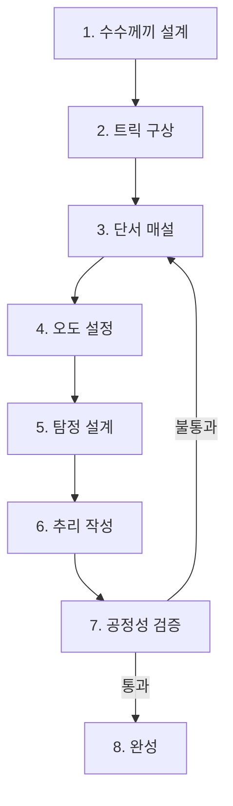

# 본격 추리 핵심 요소 (Core Elements of Fair-Play Mystery)

> **핵심 원칙**: 본격 추리의 본질은 "독자와 탐정의 지적 게임"이다 — 모든 단서는 공정하게 제시되어야 하고, 진실은 추론 가능해야 한다.

---

## 1. 본격 추리란?

### 정의
**본격 추리(Honkaku Mystery)**: "정통 추리" 또는 "공정 경쟁 추리"라고도 하며, **논리적 추리**와 **단서 공정성**을 강조한다. 독자와 탐정이 같은 정보 출발선에 서서, 이론적으로 밝혀지기 전에 진실을 추론할 수 있다.

### 사회파/하드보일드와의 차이
| 유형 | 핵심 | 중점 | 예시 |
|------|------|------|------|
| **본격 추리** | 수수께끼 해결 | 밀실/트릭/논리 | 《폭풍설 산장》 |
| **사회파** | 인간성/동기 | 범죄 원인/사회 비판 | 《백야행》 |
| **하드보일드** | 분위기/폭력 | 탐정 모험/누아르 | 《말타의 매》 |

---

## 2. 본격 추리의 "십계" (개량판 녹스 십계)

### 원래 녹스 십계(Knox's Ten Commandments, 1929)
클래식 규칙이지만, 일부는 이미 시대에 뒤떨어짐. 이하는 **웹소설 적합 버전**:

**계율1**: 범인은 반드시 이야기 초반에 등장해야 함
**계율2**: 초자연적 힘은 진실 해설에 사용 금지 (오도에는 사용 가능)
**계율3**: 밀실에는 최대 1개의 비밀 통로만 가능
**계율4**: 미지의 독약이나 긴 과학 설명이 필요한 장치 금지
**계율5**: ~~원래는 인종차별 조항, **폐기됨**~~ → **변경: 전혀 등장하지 않은 미지의 인물을 범인으로 할 수 없음**
**계율6**: 탐정은 우연이나 육감에 의존하여 사건을 풀면 안 됨
**계율7**: 탐정 본인이 범인이면 안 됨 (이중 탐정 설정 제외)
**계율8**: 탐정은 반드시 독자에게 모든 단서를 공개해야 함
**계율9**: 탐정의 조수(왓슨 역할)의 사고는 독자에게 투명해야 함
**계율10**: 쌍둥이/분신은 반드시 전반에 명시해야 함

---

## 3. 본격 추리의 4대 기둥

### 기둥1: 공정성(Fair Play)
**정의**: 독자와 탐정이 같은 정보를 가지며, 이론적으로 진실을 추리할 수 있음.

**구현 방법**:
```
✅ 올바른 예시
10화: 탐정이 꽃병 파편을 발견 (독자가 동시에 봄)
20화: 탐정이 추리: "꽃병은 내부에서 깨진 것이다"
→ 독자가 10화를 돌아보며 검증 가능

❌ 잘못된 예시
10화: 탐정이 어떤 단서를 발견 (내용 미묘사)
20화: 탐정: "나는 진작부터 이 핵심 증거를 발견했었다!"
→ 독자가 검증 불가, 공정하지 않음
```

---

### 기둥2: 논리성(Logic)
**정의**: 추리 과정이 반드시 논리에 맞아야 하며, 직감이나 우연에 의존하면 안 됨.

**논리 체인 예시**:
```markdown
## 사례: 밀실 살인
**이미 알고 있는 단서**:
1. 피해자가 잠긴 방 안에 있음
2. 창문이 내부에서 잠김
3. 피해자가 열쇠를 들고 있음

**잘못된 추리**:
"직감적으로, 범인은 옆집 장삼이다"
→ 논리적 근거 없음

**올바른 추리**:
1. 피해자가 열쇠를 들고 있음 → 스스로 문을 잠갔을 수 있음
2. 창문 내부 잠금 → 범인이 창문으로 도주하지 않음
3. 방이 잠김 → 범인이 피해자가 잠그기 전에 이미 떠났을 수 있음
4. → 추측: 피해자가 문 잠근 후, 미리 방 안에 숨어있던 범인에게 살해됨
5. → 방 안에 숨을 수 있는 곳 찾기 (옷장/침대 아래/천장)
```

---

### 기둥3: 해결 가능성(Solvability)
**정의**: 진실은 반드시 독자가 **추리해낼 수 있는** 것이어야, 완전히 의외여서는 안 됨.

**해결 가능성 기준**:
- ✅ 독자가 사후에 깨달음: "그랬구나!"
- ❌ 독자가 사후에도 혼란: "뭐? 이게 가능해?"

---

### 기둥4: 의외성(Surprise)
**정의**: 진실이 논리에 맞으면서도, 예상 밖이어야.

**균형 공식**:
```
공정성(80% 단서) + 숨김(20% 오도) = 의외성
```

---

## 4. 본격 추리의 5대 요소

### 요소1: 수수께끼(Mystery)
**정의**: 핵심 서스펜스, 독자를 계속 읽게 하는 원동력.

**흔한 수수께끼 유형**:
| 유형 | 질문 | 예시 |
|------|------|------|
| **Who(누구)** | 범인은 누구? | 폐쇄 공간에서 범인 찾기 |
| **How(어떻게)** | 어떻게 했나? | 밀실 살인, 어떻게 탈출 |
| **Why(왜)** | 동기는? | 원한도 없는데 왜 살인 |
| **When(언제)** | 사건 시간? | 알리바이 위조 |
| **Where(어디)** | 사건 장소? | 시체 이동, 진짜 현장은 어디 |

---

### 요소2: 단서(Clues)
**정의**: 진실을 가리키는 증거, 반드시 **공정하게 제시**해야.

**단서 매설 기법**:
```
1. 사전 매설: 사건 전 챕터에서 "무심코" 핵심 물품 언급
2. 배경으로 위장: 단서를 환경 묘사에 숨김
3. 여러 번 언급: 중요 단서를 2-3번 등장시켜 인상 강화
```

---

### 요소3: 레드 헤링(Red Herring, 오도)
**정의**: 의도적으로 설정한 가짜 단서, 독자를 잘못된 추리로 유도.

**주의**: 레드 헤링은 반드시 **사후 설명 가능**해야, 논리 없이 만들면 안 됨.

---

### 요소4: 탐정(Detective)
**정의**: 추리의 실행자, 독자의 시각을 대표.

**탐정 유형**:
| 유형 | 특징 | 예시 |
|------|------|------|
| **천재형** | 초월적 논리, 냉정 이성적 | 셜록 홈즈 |
| **성실형** | 상식과 꼼꼼한 조사에 의존 | 브라운 신부 |
| **아마추어형** | 비직업 탐정, 우연히 사건에 말려듦 | 제시카 플레처 |

**웹소설 흔한 설정**:
- 환생 탐정 (부분적 진실을 알지만, 다시 추리 필요)
- 시스템 보조 탐정 (단서 힌트 획득)
- 이중 탐정 (하나는 양지, 하나는 음지, 최종 협력)

---

### 요소5: 진실 밝히기(Revelation)
**정의**: 탐정이 추리 과정을 공개하여, 모든 의문점을 설명.

**밝히기 기법**:
```
✅ 점진적 상승: 작은 수수께끼를 먼저 풀고, 핵심을 밝힘
✅ 반전 만들기: 먼저 A를 가리키다가, 갑자기 B로 전환
✅ 서스펜스 남기기: 80%를 설명하고, 20%는 독자가 스스로 생각

❌ 한꺼번에 쏟아내기: 모든 정보를 한 번에 말함
❌ 전지적 탐정: 탐정이 미리 알면서 말 안 함
```

---

## 5. 본격 추리의 창작 흐름

### 흐름도


---

### Step 1-7 핵심 질문:
1. 독자에게 무엇을 맞추게 할 것인가?
2. 진실은 무엇인가? 어떻게 했는가?
3. 어떻게 독자가 추리할 수 있게 할 것인가?
4. 어떻게 너무 쉽게 맞추지 못하게 할 것인가?
5. 누가 추리하는가? 성격은?
6. 탐정이 어떻게 진실에 접근하는가?
7. 공정성 검증 - 모든 단서 제시? 논리 정합? 레드 헤링 설명 가능?

---

## 6. 본격 추리의 흔한 함정

### 함정1: 정보 불균등
탐정이 알면서 독자에게 안 알려줌 → 불공정

### 함정2: 논리 비약
단서에서 결론으로 바로 건너뜀, 중간 과정 없음

### 함정3: 우연 의존
탐정이 운으로 해결 → 논리가 아닌 운으로 해결

### 함정4: 진실이 너무 복잡
독자가 전혀 이해 못 함 → 간단하지만 교묘한 것이 좋음

---

## 7. 자가 점검 리스트

- [ ] 수수께끼가 충분히 매력적인가?
- [ ] 모든 단서가 공정하게 제시되었는가?
- [ ] 추리 논리가 치밀한가?
- [ ] 레드 헤링이 사후 설명 가능한가?
- [ ] 진실이 의외이면서도 합리적인가?
- [ ] 탐정의 추리 과정이 명확한가?
- [ ] "십계"를 위반하지 않았는가?
- [ ] 독자가 진실을 추리할 **가능성**이 있는가?

---

## 본격 추리 빠른 참조표

| 요소 | 핵심 포인트 | 흔한 오류 | 올바른 방법 |
|------|--------|---------|---------|
| **수수께끼** | 매력적 서스펜스 | 너무 단순 | 다층 수수께끼 |
| **단서** | 공정 제시 | 핵심 단서 숨김 | 최소 2번 제시 |
| **트릭** | 교묘하면서 해결 가능 | 너무 복잡 | 단순한 원리 |
| **추리** | 논리 치밀 | 비약 추리 | 단계적 추론 |
| **밝히기** | 점진적 상승 | 한꺼번에 쏟기 | 단계별 공개 |

---

## 총결

**본격 추리 = 공정성 + 논리성 + 해결 가능성 + 의외성**

기억하자: 본격 추리의 핵심은 "과시"가 아니라, "공정한 경쟁"이다. 독자와 탐정이 같은 출발선에 서서, 추리의 즐거움을 누린다.
